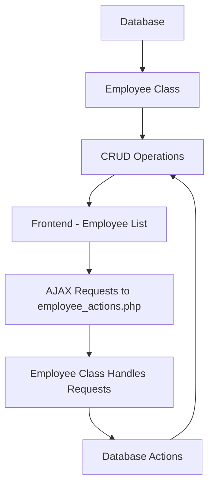

# Employee Management System - A Simple CRUD using AJAX

This step-by-step guide walks through the creation of an employee management system that supports Create, Read, Update, and Delete (CRUD) operations. We'll use PHP with Object-Oriented Programming (OOP), MySQL for the database, jQuery for AJAX requests, and Bootstrap 5 for styling.

## Project Structure

```bash
employee-crud/
│
├── config/
│   └── database.php
│
├── assets/
│   └── css
|        └── styles.css
|        └── bootstrap.min.css
│   └── js
|        └── script.js
|        └── jquery.min.js
├── ajax/
│   └── employee_actions.php
│   └── fetch_employees.php
├── classes/
│    └── employee.php
│   
├── public/
│   └── index.php
|
```
## Step 1: Setting Up the Project
1. `Create Project Folder:` Start by creating a folder named `employee-crud` for the project.

2. Create Files and Folders:

  - **config/:** Contains the database connection file.
  - **ajax/:** Contains `employee_actions.php` which handles all AJAX requests.
  - **classes/:** Contains the `employee.php` class to handle OOP logic.
  - **CSS folder:** Contains the styling.
  - **index.php:** The main page where the employees will be listed.
 

## Step 2: Database Configuration

   **1. Database Structure**

   ```sql
        CREATE DATABASE employee_management;
        USE employee_management;

        CREATE TABLE employees (
            id INT(11) AUTO_INCREMENT PRIMARY KEY,
            name VARCHAR(100) NOT NULL,
            email VARCHAR(100) NOT NULL,
            address VARCHAR(255) NOT NULL,
            phone VARCHAR(20) NOT NULL
        );
   ```

   **2. Database Connection (config/database.php)**
   ```php
      <?php
        class Database {
            private $host = "localhost";
            private $db_name = "employee_management";
            private $username = "root";
            private $password = "";
            public $conn;

            public function getConnection() {
                $this->conn = null;
                try {
                    $this->conn = new PDO("mysql:host=" . $this->host . ";dbname=" . $this->db_name, $this->username, $this->password);
                    $this->conn->exec("set names utf8");
                } catch (PDOException $exception) {
                    echo "Connection error: " . $exception->getMessage();
                }
                return $this->conn;
            }
        }
    ?>
```
## Step 3: Create Employee Class (classes/employee.php)

 ```php
    <?php
        class Employee {
            private $conn;
            private $table_name = "employees";

            public $id;
            public $name;
            public $email;
            public $address;
            public $phone;
            public $created_at;

            public function __construct($db) {
                $this->conn = $db;
            }

            // Create Employee
            public function create() {
                $query = "INSERT INTO " . $this->table_name . " (name, email, address, phone) VALUES (:name, :email, :address, :phone)";
                $stmt = $this->conn->prepare($query);

                $stmt->bindParam(':name', $this->name);
                $stmt->bindParam(':email', $this->email);
                $stmt->bindParam(':address', $this->address);
                $stmt->bindParam(':phone', $this->phone);

                return $stmt->execute();
            }

            // Read Employees
            public function read() {
                $query = "SELECT * FROM " . $this->table_name . " ORDER BY created_at";
                $stmt = $this->conn->prepare($query);
                $stmt->execute();
                return $stmt;
            }

            // Update Employee
            public function update() {
                // SQL query to update employee data
                $query = "UPDATE " . $this->table_name . " 
                        SET name = :name, email = :email, address = :address, phone = :phone 
                        WHERE id = :id";
            
                // Prepare the SQL statement
                $stmt = $this->conn->prepare($query);
            
                // Bind parameters to prevent SQL injection
                $stmt->bindParam(':id', $this->id, PDO::PARAM_INT);
                $stmt->bindParam(':name', $this->name);
                $stmt->bindParam(':email', $this->email);
                $stmt->bindParam(':address', $this->address);
                $stmt->bindParam(':phone', $this->phone);
            
                // Execute the query and check if the update was successful
                if ($stmt->execute()) {
                    return true;  // Successfully updated
                } else {
                    // Print error if any issue occurs
                    print_r($stmt->errorInfo());
                    return false;  // Failed to update
                }
            }
            

            // Delete Employee
            public function delete() {
                $query = "DELETE FROM " . $this->table_name . " WHERE id = :id";
                $stmt = $this->conn->prepare($query);

                // Bind the ID parameter
                $stmt->bindParam(':id', $this->id);

                // Execute the query
                return $stmt->execute();
            }

            public function getEmployeeById(){
                // Prepare the SQL query with a placeholder for the ID
                $query = "SELECT * FROM " . $this->table_name . " WHERE id = :id";
                
                // Prepare the statement
                $stmt = $this->conn->prepare($query);
                
                // Bind the ID parameter securely
                $stmt->bindParam(':id', $this->id, PDO::PARAM_INT);
                
                // Execute the query
                $stmt->execute();
                
                // Return the fetched employee record as an associative array
                return $stmt->fetch(PDO::FETCH_ASSOC);
            }

        }  
            
        ?>
```

## Step 4: Frontend - Employee List (index.php)
```php
        <?php
        include_once '../config/Database.php';
        include_once '../classes/Employee.php';

        $database = new Database();
        $db = $database->getConnection();

        $employee = new Employee($db);
        ?>

        <!DOCTYPE html>
        <html lang="en">
        <head>
            <meta charset="UTF-8">
            <meta name="viewport" content="width=device-width, initial-scale=1, shrink-to-fit=no">
            <title>Employee Management System</title>
            <link href="../assets/css/bootstrap.min.css" rel="stylesheet">
            <link href="https://cdn.jsdelivr.net/npm/bootstrap@5.0.2/dist/css/bootstrap.min.css" rel="stylesheet" integrity="sha384-EVSTQN3/azprG1Anm3QDgpJLIm9Nao0Yz1ztcQTwFspd3yD65VohhpuuCOmLASjC" crossorigin="anonymous">
        </head>
        <body>
            <div class="container">
                <h2 class="mt-4 mb-4">Employee Management System</h2>
                <div class="row">
                    <div class="col-lg-12">
                        <button class="btn btn-success" id="addEmployeeBtn">Add Employee</button>
                        <table class="table table-striped mt-3">
                            <thead>
                                <tr>
                                    <th>ID</th>
                                    <th>Name</th>
                                    <th>Email</th>
                                    <th>Address</th>
                                    <th>Phone</th>
                                    <th>Actions</th>
                                </tr>
                            </thead>
                            <tbody id="employeeTableBody">
                                <!-- Data will be loaded using Ajax -->
                            </tbody>
                        </table>
                    </div>
                </div>
            </div>

            <script src="../assets/js/jquery.min.js"></script>
            <script src="https://cdn.jsdelivr.net/npm/bootstrap@5.0.2/dist/js/bootstrap.bundle.min.js" integrity="sha384-MrcW6ZMFYlzcLA8Nl+NtUVF0sA7MsXsP1UyJoMp4YLEuNSfAP+JcXn/tWtIaxVXM" crossorigin="anonymous"></script>
            <script>
        $(document).ready(function() {
            fetchEmployees();
            // Open modal for adding employee
            $('#addEmployeeBtn').click(function() {
                $('#addEmployeeModal').modal('show');
            });

            // Handle form submission
            $('#addEmployeeForm').submit(function(e) {
                e.preventDefault(); // Prevent the default form submission
                var formData = $(this).serialize(); // Serialize form data

                $.ajax({
                    url: "../ajax/employee_actions.php",
                    type: "POST",
                    data: formData + "&action=add",
                    success: function(response) {
                        alert(response); // Alert the response from server
                        $('#addEmployeeModal').modal('hide'); // Hide the modal
                        $('#addEmployeeForm')[0].reset(); // Reset the form
                        fetchEmployees(); // Refresh the employee list
                    },
                    error: function(err) {
                        console.log(err);
                    }
                });
            });
            // Open edit modal and load employee data
            $(document).on('click', '.edit', function() {
                //alert("edit"); // Debugging to check if the click event is triggered
                
                var employeeId = $(this).data('id'); // Getting the employee ID from the clicked button
                
                $.ajax({
                    url: "../ajax/employee_actions.php",
                    type: "POST",
                    data: {
                        id: employeeId, 
                        action: "edit" // Correctly pass the action as a string
                    },
                    success: function(response) {
                        //console.log(response);
                        var employee = JSON.parse(response); // Parse JSON data from the server
                    
                        // Populate the modal form fields with employee data
                        $('#editEmployeeId').val(employee.id);
                        $('#editName').val(employee.name);
                        $('#editEmail').val(employee.email);
                        $('#editAddress').val(employee.address);
                        $('#editPhone').val(employee.phone);
                        
                        // Show the modal (make sure Bootstrap's JavaScript is properly loaded)
                        $('#editEmployeeModal').modal('show');
                    },
                    error: function(err) {
                        console.log(err); // Log any errors in the console
                    }
                });
            });
            

            // Handle form submission for editing employee
            $('#editEmployeeForm').submit(function(e) {
                e.preventDefault(); // Prevent the default form submission
                var formData = $(this).serialize(); // Serialize form data
                $.ajax({
                    url: '../ajax/employee_actions.php',
                    type: 'POST',
                    data: formData + '&action=update',
                    success: function(response) {
                        alert(response); // Display the response
                        $('#editEmployeeModal').modal('hide'); // Hide the modal
                        fetchEmployees(); // Refresh the employee list
                    },
                    error: function(err) {
                        console.log(err);
                    }
                });
            });

            // Delete employee event
            $(document).on('click', '.delete', function() {
                var employeeId = $(this).data('id');
                alert('delete');
                // Show confirmation dialog
                var confirmDelete = confirm("Are you sure you want to delete this employee?");
                if (confirmDelete) {
                    // Send AJAX request to delete the employee
                    $.ajax({
                        url: "../ajax/employee_actions.php", // Adjust the URL as per your structure
                        type: "POST",
                        data: {id: employeeId, action: 'delete'},
                        success: function(response) {
                            // Parse JSON response
                            var result = JSON.parse(response);

                            if (result.success) {
                                // Remove the employee row from the table if successful
                                $('button[data-id="' + employeeId + '"]').closest('tr').remove();
                                alert("Employee deleted successfully.");
                            } else {
                                alert("Error deleting employee: " + result.message);
                            }
                        },
                        error: function(err) {
                            console.log(err);
                            alert("An error occurred while deleting the employee.");
                        }
                    });
                }
            });

            // Fetch employees after adding the employee
            function fetchEmployees() {
                $.ajax({
                    url: "../ajax/fetch_employees.php",
                    type: "GET",
                    success: function(data) {
                        $('#employeeTableBody').html(data);
                    }
                });
            }


        });
        </script>

            
        <!-- Add Employee Modal -->
        <div class="modal fade" id="addEmployeeModal" tabindex="-1" aria-labelledby="exampleModalLabel" aria-hidden="true">
            <div class="modal-dialog">
                <div class="modal-content">
                    <div class="modal-header">
                        <h5 class="modal-title" id="exampleModalLabel">Add New Employee</h5>
                        <button type="button" class="btn-close" data-bs-dismiss="modal" aria-label="Close"></button>
                    </div>
                    <div class="modal-body">
                        <form id="addEmployeeForm">
                            <div class="mb-3">
                                <label for="name" class="form-label">Name</label>
                                <input type="text" class="form-control" id="name" name="name" required>
                            </div>
                            <div class="mb-3">
                                <label for="email" class="form-label">Email</label>
                                <input type="email" class="form-control" id="email" name="email" required>
                            </div>
                            <div class="mb-3">
                                <label for="address" class="form-label">Address</label>
                                <textarea class="form-control" id="address" name="address" required></textarea>
                            </div>
                            <div class="mb-3">
                                <label for="phone" class="form-label">Phone</label>
                                <input type="text" class="form-control" id="phone" name="phone" required>
                            </div>
                            <button type="submit" class="btn btn-primary">Add Employee</button>
                        </form>
                    </div>
                </div>
            </div>
        </div>
        <!-- Edit Employee Modal -->
        <div class="modal fade" id="editEmployeeModal" tabindex="-1" aria-labelledby="editEmployeeModalLabel" aria-hidden="true">
            <div class="modal-dialog">
                <div class="modal-content">
                    <div class="modal-header">
                        <h5 class="modal-title" id="editEmployeeModalLabel">Edit Employee</h5>
                        <button type="button" class="btn-close" data-bs-dismiss="modal" aria-label="Close"></button>
                    </div>
                    <div class="modal-body">
                        <form id="editEmployeeForm">
                            <input type="hidden" id="editEmployeeId" name="id">
                            <div class="mb-3">
                                <label for="editName" class="form-label">Name</label>
                                <input type="text" class="form-control" id="editName" name="name" required>
                            </div>
                            <div class="mb-3">
                                <label for="editEmail" class="form-label">Email</label>
                                <input type="email" class="form-control" id="editEmail" name="email" required>
                            </div>
                            <div class="mb-3">
                                <label for="editAddress" class="form-label">Address</label>
                                <textarea class="form-control" id="editAddress" name="address" required></textarea>
                            </div>
                            <div class="mb-3">
                                <label for="editPhone" class="form-label">Phone</label>
                                <input type="text" class="form-control" id="editPhone" name="phone" required>
                            </div>
                            <button type="submit" class="btn btn-primary">Update Employee</button>
                        </form>
                    </div>
                </div>
            </div>
        </div>

        <!-- Delete Confirmation Modal -->
        <div class="modal fade" id="deleteModal" tabindex="-1" aria-labelledby="deleteModalLabel" aria-hidden="true">
        <div class="modal-dialog">
            <div class="modal-content">
            <div class="modal-header">
                <h5 class="modal-title" id="deleteModalLabel">Confirm Delete</h5>
                <button type="button" class="btn-close" data-bs-dismiss="modal" aria-label="Close"></button>
            </div>
            <div class="modal-body">
                Are you sure you want to delete this employee?
            </div>
            <div class="modal-footer">
                <button type="button" class="btn btn-secondary" data-bs-dismiss="modal">Cancel</button>
                <button type="button" class="btn btn-danger" id="confirmDeleteBtn">Delete</button>
            </div>
            </div>
        </div>
        </div>


        </body>
        </html>

```
## Step 5: AJAX Handler (ajax/employee_actions.php)

```php
        <?php
        include_once '../config/database.php';
        include_once '../objects/employee.php';

        $database = new Database();
        $db = $database->getConnection();

        $employee = new Employee($db);

        if ($_POST['action'] == 'create') {
            $employee->name = $_POST['name'];
            $employee->email = $_POST['email'];
            $employee->address = $_POST['address'];
            $employee->phone = $_POST['phone'];
            if ($employee->create()) {
                echo json_encode(['success' => true]);
            } else {
                echo json_encode(['success' => false]);
            }
        }

        if ($_POST['action'] == 'update') {
            $employee->id = $_POST['id'];
            $employee->name = $_POST['name'];
            $employee->email = $_POST['email'];
            $employee->address = $_POST['address'];
            $employee->phone = $_POST['phone'];
            if ($employee->update()) {
                echo json_encode(['success' => true]);
            } else {
                echo json_encode(['success' => false]);
            }
        }

        if ($_POST['action'] == 'delete') {
            $employee->id = $_POST['id'];
            if ($employee->delete()) {
                echo json_encode(['success' => true]);
            } else {
                echo json_encode(['success' => false]);
            }
        }
        ?>
```

# Step 6: jQuery and AJAX Logic (js/script.js)

```javascript
$(document).ready(function () {
    // Delete employee
    $('.delete').click(function () {
        var employeeId = $(this).data('id');
        if (confirm('Are you sure you want to delete this employee?')) {
            $.ajax({
                url: 'ajax/employee_actions.php',
                type: 'POST',
                data: {action: 'delete', id: employeeId},
                success: function (response) {
                    alert('Employee deleted successfully!');
                    location.reload();
                }
            });
        }
    });

    // Add or Edit employee logic can be implemented similarly
});
```

## Step 7: Visualizing the Flow


## Step 8: Styling (css/styles.css)

```css
body {
    font-family: Arial, sans-serif;
}

.container {
    margin-top: 50px;
}

h2 {
    color: #007BFF;
}
```

## Conclusion
In this guide, we have built a complete Employee CRUD system using PHP OOP principles, structured the project for scalability, used Bootstrap 5 for the frontend, and AJAX with jQuery to make the interface dynamic. The use of OOP ensures modular and maintainable code.
