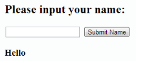

### 1. Write a PHP script to get the PHP version and configuration information.

```php
<?php
// Display information about the PHP configuration and settings
phpinfo();
?>
```
### 2. Write a PHP script to display the following strings.

        Sample String :<br/>
        'Tomorrow I \'ll learn PHP global variables.'<br/>
        'This is a bad command : del c:\\*.*'<br/>
        Expected Output :<br/>
        Tomorrow I 'll learn PHP global variables.<br/>
        This is a bad command : del c:\*.*<br/>

```php
<?php
// Display the string "Tomorrow I'll learn PHP global variables." and move to the next line
echo "Tomorrow I'll learn PHP global variables." . "\n";

// Display the string "This is a bad command : del c:\*.*" and move to the next line
echo "This is a bad command : del c:\\*.*" . "\n";
?>
```
### 3. $var = 'PHP Tutorial'. Put this variable into the title section, h3 tag and as an anchor text within an HTML document.

        Sample Output :
        PHP Tutorial
        PHP, an acronym for Hypertext Preprocessor, is a widely-used open source general-purpose scripting language. It is a cross-platform, HTML embedded server-side scripting language and is especially suited for web development.
       
```php

<?php
// Declare and initialize a variable with the value 'PHP Tutorial'
$var = 'PHP Tutorial';
?>
<!DOCTYPE html>
<html>
<head>

  <meta http-equiv="content-type" content="text/html; charset=utf-8">
  
  <title><?php echo $var; ?> - W3resource!</title>
  </head>
  <body>
  
  <h3><?php echo $var; ?></h3>
    
  <p>PHP, an acronym for Hypertext Preprocessor, is a widely-used open source general-purpose scripting language. It is a cross-platform, HTML embedded server-side scripting language and is especially suited for web development.</p>
    
  <p><a href="https://www.w3resource.com/php/php-home.php">Go to the <?php echo $var; ?></a>.</p>
</body>
</html>

?>
```

### 4. Create a simple HTML form and accept the user name and display the name through PHP echo statement.


```php
        <?php
        <!DOCTYPE html>
<html>
<head>
   <title></title>
   <meta http-equiv="Content-Type" content="text/html; charset=UTF-8">
</head>
<body>
   <!-- HTML form with POST method -->
   <form method='POST'>
      <h2>Please input your name:</h2>
      <!-- Text input field for the name -->
      <input type="text" name="name">
      <!-- Submit button to submit the form -->
      <input type="submit" value="Submit Name">
   </form>
   <?php
   // Check if the form is submitted and 'name' is set in $_POST
   if ($_SERVER["REQUEST_METHOD"] == "POST" && isset($_POST['name'])) {
      // Retrieve name from the form and store it in a local variable
      $name = $_POST['name'];
      // Display a greeting message with the entered name
      echo "<h3> Hello $name </h3>";
   }
   ?>
</body>
</html>

        ?>
        ```

 ### 5. Write a PHP script to get the client IP address.
   ```php
   <?php

// Check if the IP is from shared internet
if (!empty($_SERVER['HTTP_CLIENT_IP'])) {
    $ip_address = $_SERVER['HTTP_CLIENT_IP'];
}
// Check if the IP is from a proxy
elseif (!empty($_SERVER['HTTP_X_FORWARDED_FOR'])) {
    $ip_address = $_SERVER['HTTP_X_FORWARDED_FOR'];
}
// If not from shared internet or proxy, consider it as the remote address
else {
    $ip_address = $_SERVER['REMOTE_ADDR'];
}

// Display the determined IP address
echo $ip_address;


?>
```
    
    
 ### 6.Write a simple PHP browser detection script.

        
```php
<?php
        
// Display the text "Your User Agent is :" followed by the user agent string from the HTTP request
echo "Your User Agent is :" . $_SERVER['HTTP_USER_AGENT'];

?>
```
### 7. Write a PHP script to get the current file name.

```php
<?php
// Get the base name of the currently executing PHP script file
$current_file_name = basename($_SERVER['PHP_SELF']);
// Display the current file name followed by a newline character
echo $current_file_name . "\n";
?>
```
### 8. Write a PHP script, which will return the following components of the url 'https://www.w3resource.com/php-exercises/php-basic-exercises.php'.

```php
<?php
// Define the URL to be parsed
$url = 'https://www.w3resource.com/php-exercises/php-basic-exercises.php';

// Parse the URL and store its components in the $url variable
$url = parse_url($url);

// Display the scheme (protocol) of the parsed URL
echo 'Scheme : ' . $url['scheme'] . "\n";

// Display the host (domain) of the parsed URL
echo 'Host : ' . $url['host'] . "\n";

// Display the path of the parsed URL
echo 'Path : ' . $url['path'] . "\n";
?>
```
### 9. Write a PHP script, which changes the color of the first character of a word.

```php
<?php
// Define a text string
$text = 'PHP Tutorial';

// Use a regular expression to replace the first letter of each word with a span element with red color
$text = preg_replace('/(\b[a-z])/i', '\1', $text);

// Display the modified text with styled first letters
echo $text;
?>
```
### 10. Write a PHP script, to check whether the page is called from 'https' or 'http'.

```php
<?php
// Check if the HTTPS (secure) protocol is enabled in the server environment
if (!empty($_SERVER['HTTPS'])) {
  // Display a message if HTTPS is enabled
  echo 'https is enabled';
} else {
  // Display a message if HTTPS is not enabled, followed by a newline character
  echo 'http is enabled' . "\n";
}
?>
```


### 11. Write a PHP script to redirect a user to a different page .

```php
<?php
// Use the header function to send a raw HTTP header
// In this case, the header function is used to perform a redirection
// The 'Location' header specifies the URL to which the user will be redirected
header('Location: https://www.w3resource.com/');
?>
```

### 12. Write a simple PHP program to check that emails are valid.

 ```php
<?php
// Specify an email address (valid or invalid)
$email = "mail@example.com";

// Use the filter_var function with FILTER_VALIDATE_EMAIL to check if the email is valid
if (filter_var($email, FILTER_VALIDATE_EMAIL)) 
{
    // If the email is valid, print a message indicating it is valid
    echo '"' . $email . '" = Valid'."\n";
}
else 
{
    // If the email is invalid, print a message indicating it is invalid
    echo '"' . $email . '" = Invalid'."\n";
}
?>
```

### 13. Write a e PHP script to display string, values within a table.


```php
<?php
// Assign salary values to variables
$a=1000;
$b=1200;
$c=1400;
// Display a table with salary information using echo
echo "<table border=1 cellspacing=0 cellpading=0>
<tr> <td><font color=blue>Salary of Mr. A is</td> <td>$a$</font></td></tr> 
<tr> <td><font color=blue>Salary of Mr. B is</td> <td>$b$</font></td></tr>
<tr> <td><font color=blue>Salary of Mr. C is</td> <td>$c$</font></td></tr>
</table>";
?>
```

### 14. Write a PHP script to display source code of a webpage (e.g. "http://www.example.com/").

```php
<?php
// Read all lines from the specified URL and store them in an array
$all_lines = file('https://www.w3resource.com/');

// Iterate through each line in the array
foreach ($all_lines as $line_num => $line)
{
    // Display the line number and the HTML-escaped content of the line
    echo "Line No.-{$line_num}: " . htmlspecialchars($line) . "\n";
}
?>
```
### 15. Write a PHP script to get last modified information of a file.

```php
<?php
// Get the current file name using basename and $_SERVER['PHP_SELF']
$current_file_name = basename($_SERVER['PHP_SELF']);

// Get the last modification time of the current file
$file_last_modified = filemtime($current_file_name);

// Display the last modified time in a human-readable format
echo "Last modified " . date("l, dS F, Y, h:ia", $file_last_modified) . "\n";
?>
```

### 16. Write a PHP script to count number of lines in a file.

    
  ```php
  <?php
// Get the base name of the current PHP script file
$file = basename($_SERVER['PHP_SELF']); 

// Count the number of lines in the current PHP script file
$no_of_lines = count(file($file)); 

// Display the result indicating the number of lines in the file
echo "There are $no_of_lines lines in $file"."\n";
  ?>
  ```  

  ### 17. Write a PHP script to print current PHP version.

    

```php
<?php
// Output the current PHP version
echo 'Current PHP version : ' . phpversion();

// Output the version of the Tidy extension, or nothing if the extension isn't enabled
echo phpversion('tidy')."\n";
?>
```         
### 18. Write a PHP script to delay the program execution for the given number of seconds.

```php
<?php
// Output the current time in the 'hour:minute:second' format
echo date('h:i:s') . "\n";

// Sleep for 5 seconds
sleep(5);

// Output the current time again after waking up
echo date('h:i:s')."\n";
?>
```

### 19. Arithmetic operations on character variables : $d = 'A00'. Using this variable print the following numbers.

```php
<?php
// Initialize variable $d with value 'A00'
$d = 'A00';

// Loop through 5 iterations
for ($n = 0; $n < 5; $n++) {
    // Increment $d and echo the result
    echo ++$d . "\n";
}
?>
```

### 20. Write a PHP  script to get the last occurred error.
```php
<?php
// Attempt to echo the variable $x (which is not defined)
echo $x;

// Print the details of the last error that occurred using error_get_last()
print_r(error_get_last());
?>
```

### 21. Write a PHP function to test whether a number is greater than 30, 20 or 10 using ternary operator.
```php
<?php
// Function to test a given number using ternary operators
function trinary_Test($n){
    // Ternary operators used to check the value of $n and assign a corresponding message to $r
    $r = $n > 30
        ? "greater than 30"
        : ($n > 20
            ? "greater than 20"
            : ($n > 10
                ? "greater than 10"
                : "Input a number at least greater than 10!"));

    // Display the result with the input number
    echo $n . " : " . $r . "\n";
}

// Test the function with different input values
trinary_Test(32);
trinary_Test(21);
trinary_Test(12);
trinary_Test(4);
?>
```

### 22. Write a PHP script to get the full URL.

```php
<?php
// Constructing the full URL using $_SERVER variables
$full_url = "http://$_SERVER[HTTP_HOST]$_SERVER[REQUEST_URI]";

// Display the constructed full URL
echo $full_url . "\n";
?>
```
### 23. Write a PHP script to compare the PHP version.

    

```php
 <?php
// Check if PHP version is at least 6.0.0
if (version_compare(PHP_VERSION, '6.0.0') >= 0) {
    echo 'I am at least PHP version 6.0.0, my version: ' . PHP_VERSION . "\n";
}

// Check if PHP version is at least 5.3.0
if (version_compare(PHP_VERSION, '5.3.0') >= 0) {
    echo 'I am at least PHP version 5.3.0, my version: ' . PHP_VERSION . "\n";
}

// Check if PHP version is at least 5.0.0
if (version_compare(PHP_VERSION, '5.0.0', '>=')) {
    echo 'I am using PHP 5, my version: ' . PHP_VERSION . "\n";
}

// Check if PHP version is less than 5.0.0
if (version_compare(PHP_VERSION, '5.0.0', '<')) {
    echo 'I am using PHP 4, my version: ' . PHP_VERSION . "\n";
}
?>
```

### 24. Write a PHP script to get the name of the owner of the current PHP script.

```php
<?php
// Get and echo the current script owner
echo 'Current script owner: ' . get_current_user() . "\n";
?>
```

### 25. Write a PHP script to get the document root directory under which the current script is executing, as defined in the server's configuration file.

```php
<?php
// getenv() gets the value of an environment variable named 'DOCUMENT_ROOT'
$rd = getenv('DOCUMENT_ROOT');

// Echo the value of the 'DOCUMENT_ROOT' environment variable
echo $rd . "\n";
?>
```
### 26. Write a PHP script to get the information about the operating system PHP is running on.

```php
<?php
// Get and echo the system name, version, and machine type using php_uname()
echo php_uname() . "\n";

// Echo the operating system PHP is running on
echo PHP_OS . "\n";

// Check if the operating system is Windows using the PHP_OS constant
if (strtoupper(substr(PHP_OS, 0, 3)) === 'WIN') {
    echo 'This is a server using Windows!';
} else {
    echo 'This is a server not using Windows!' . "\n";
}
?>
```

### 27. Write a PHP script to print out all the credits for PHP.

```php
<?php
<!DOCTYPE html>
<html>
<head>
<title>My credits page</title>
</head>
<body>
<?php
// Call the phpcredits function with the specified credits constant
phpcredits(CREDITS_ALL - CREDITS_FULLPAGE);
// This part may contain some additional PHP code specific to your needs
// For example, you can include more PHP code or HTML content here
?>
</body>
</html>
?>
```
### 28. Write a PHP script to get the directory path used for temporary files.

```php
<?php
// Generate a temporary file with a unique filename
// The tempnam() function creates a temporary file with a unique name in the system's temporary directory
$temp_file = tempnam(sys_get_temp_dir(), 'Tux');
// Output the path of the created temporary file
echo $temp_file."\n";
?>
```
### 29. Write a PHP script to get the names of the functions of a module.

   
```php
<?php
// Get the names of all functions provided by the JSON extension
$json_extension_funcs = get_extension_funcs("JSON");
// Print the list of JSON extension functions
print_r($json_extension_funcs);
echo "\n";

// Get the names of all functions provided by the XML extension
$xml_extension_funcs = get_extension_funcs("XML");
// Print the list of XML extension functions
print_r($xml_extension_funcs);
echo "\n";
?>    
```

### 30. Write a PHP script to get the time of the last modification of the current page.

```php
<?php
// Get the last modification time of the current script using getlastmod()
$last_modified_time = getlastmod();
// Format the last modification time and print it
echo "Last modified: " . date("F d Y H:i:s.", $last_modified_time) . "\n";
?>
```

### 31. Write a PHP program to swap two variables.
```php
<?php
// Declare and initialize two variables
$a = 15;
$b = 27;

// Display the original values of the variables
echo "\nThe number before swapping is:\n";
echo "Number a =" . $a . " and b=" . $b;

// Swap Logic
$temp = $a;
$a = $b;
$b = $temp;

// Display the values after swapping
echo "\nThe number after swapping is: \n";
echo "Number a =" . $a . " and b=" . $b . "\n";
?>
```

### 32.Write a PHP program to check whether a number is an Armstrong number or not. Return true if the number is Armstrong otherwise return false.

    
```php
<?php
// Function to check if a number is an Armstrong number
function armstrong_number($num) {
  // Calculate the length of the number
  $sl = strlen($num);
  
  // Initialize a variable to store the sum of digits raised to the power of length
  $sum = 0;
  
  // Convert the number to a string for individual digit access
  $num = (string)$num;
  
  // Iterate over each digit of the number
  for ($i = 0; $i < $sl; $i++) {
    // Add the current digit raised to the power of length to the sum
    $sum = $sum + pow((string)$num{$i}, $sl);
  }
  
  // Check if the sum is equal to the original number
  if ((string)$sum == (string)$num) {
    return "True";
  } else {
    return "False";
  }
}

// Test cases
echo "Is 153 Armstrong number? " . armstrong_number(153);
echo "\nIs 21 Armstrong number? " . armstrong_number(21);
echo "\nIs 4587 Armstrong number? " . armstrong_number(4587) . "\n";
?>
```

### 33. Write a PHP program to convert word to digit.
    Input: zero;three;five;six;eight;one
    Output: 035681
```php
<?php
// Function to convert words to digits
function word_digit($word) {
    // Explode the input string into an array based on the delimiter ';'
    $warr = explode(';', $word);
    
    // Initialize a variable to store the result
    $result = '';

    // Iterate over each word in the array
    foreach ($warr as $value) {
        // Switch statement to convert each word to its corresponding digit
        switch (trim($value)) {
            case 'zero':
                $result .= '0';
                break;
            case 'one':
                $result .= '1';
                break;
            case 'two':
                $result .= '2';
                break;
            case 'three':
                $result .= '3';
                break;
            case 'four':
                $result .= '4';
                break;
            case 'five':
                $result .= '5';
                break;
            case 'six':
                $result .= '6';
                break;
            case 'seven':
                $result .= '7';
                break;
            case 'eight':
                $result .= '8';
                break;
            case 'nine':
                $result .= '9';
                break;    
        }
    }
    
    // Return the final result
    return $result;
}

// Test cases
echo word_digit("zero;three;five;six;eight;one") . "\n";
echo word_digit("seven;zero;one") . "\n";
?>
```

### 34. Write a PHP program to check the bits of the two given positions of a number are same or not.

       
```php
<?php
// Function to test if bits at two specified positions are equal
function test_bit_position($num, $pos1, $pos2) {
    // Adjust positions to start from 0 (as arrays in PHP are 0-indexed)
    $pos1--;
    $pos2--;
    
    // Convert the decimal number to a binary string and reverse it
    $bin_num = strrev(decbin($num));

    // Check if the bits at the specified positions are equal
    if ($bin_num[$pos1] == $bin_num[$pos2]) {
        return "true";
    } else {
        return "false";
    }
}

// Test case
echo test_bit_position(112, 5, 6) . "\n";
?>
```

### 35. Write a PHP program to remove duplicates from a sorted list.

        

```php
<?php
// Function to remove duplicates from a list and return unique values
function remove_duplicates_list($list1) {
    // Use array_unique to get unique values and array_values to re-index the array
    $nums_unique = array_values(array_unique($list1));
    return $nums_unique;
}

// Example usage with an array containing duplicate values
$nums = array(1, 1, 2, 2, 3, 4, 5, 5);
// Call the function and print the result
print_r(remove_duplicates_list($nums));
?>
```

### 36. Write a PHP program to test if a given string occurs at the end of another given string.
```php
<?php
// Function to check if str2 is at the end of str1
function str2_in_str1($str1, $str2) {
    // Calculate the length of str2
    $p_len = strlen($str2);
    // Calculate the length of str1
    $w_len = strlen($str1);
    // Calculate the starting index for str2 in str1
    $w_start = $w_len - $p_len - 1;

    // Check if the substring at the calculated index in str1 is equal to str2
    if (substr($str1, $w_len - $p_len, $p_len) == $str2) {
        return "true";
    } else {
        return "false";
    }
}

// Example usage with different strings
echo str2_in_str1("Python", "on") . "\n";        // Output: true
echo str2_in_str1("JavaScript", "php") . "\n";   // Output: false
?>
```

### 37.Write a PHP program to compute the sum of the prime numbers less than 100.

   
```php
<?php
// Array to store prime numbers
$primes = array();
// Flag to check if a number is prime
$is_prime_no = false;

// Loop to find the first 100 prime numbers
for ($i = 2; $i < 100; $i++) {
    $is_prime_no = true; 

    // Nested loop to check if $i is divisible by any number from 2 to $i/2
    for ($j = 2; $j <= ($i/2); $j++) {
        if ($i % $j == 0) {
            // If $i is divisible, it's not a prime number
            $is_prime_no = false;
            break;
        }
    }

    // If $i is a prime number, add it to the $primes array
    if ($is_prime_no) {
        array_push($primes, $i);
    }

    // If 100 prime numbers are found, exit the loop
    if (count($primes) == 100) {
        break;
    }
}

// Output the sum of the first 100 prime numbers
echo array_sum($primes) . "\n";
?>
```     

### 38. Write a PHP program to valid an email address.

```php
<?php
// Function to validate an email address
function valid_email($email)
{
    // Trim any leading or trailing whitespaces from the email
    $result = trim($email);

    // Check if the trimmed email is a valid email address
    if (filter_var($result, FILTER_VALIDATE_EMAIL)) 
    {
        // If valid, return "true"
        return "true";
    } 
    else 
    {
        // If not valid, echo "false"
        echo "false";
    }
}

// Test the function with valid and invalid email addresses
echo valid_email("abc@example.com") . "\n";
echo valid_email("abc#example.com") . "\n";
?>
```

### 39. Write a PHP program to get the size of a file.

```php
<?php
// Open a file "/home/students/ppp.txt" for writing, or display an error message if unable to open
$myfile = fopen("/home/students/ppp.txt", "w") or die("Unable to open file!");

// Text to be written to the file
$txt = "PHP Exercises\n";
// Write the first line to the file
fwrite($myfile, $txt);

// Additional text to be written to the file
$txt = "from\n";
// Write the second line to the file
fwrite($myfile, $txt);

// More text to be written to the file
$txt = "w3resource\n";
// Write the third line to the file
fwrite($myfile, $txt);

// Close the file after writing
fclose($myfile);

// Display the size of the created file "/home/students/ppp.txt"
echo "Size of the file: " . filesize("/home/students/ppp.txt") . "\n";
?>
```

### 40. Write a PHP program to calculate the mod of two given integers without using any inbuilt modulus operator.

```php
<?php
// Function to calculate the remainder without using the modulus operator
function without_mod($m, $n)
{
    // Calculate how many times $n divides into $m
    $divides = (int) ($m / $n);
    
    // Calculate the remainder without using the modulus operator
    return $m - $n * $divides;
}

// Example usage of the function with inputs (13, 2)
echo without_mod(13, 2) . "\n";

// Example usage of the function with inputs (81, 3)
echo without_mod(81, 3) . "\n";
?>
```

### 41. Write a PHP program to print out the multiplication table upto 6*6.
   
```php
<?php
// Outer loop for rows
for ($i = 1; $i < 7; $i++) {
    // Inner loop for columns
    for ($j = 1; $j < 7; $j++) {
        // Check if it's the first column
        if ($j == 1) {
            // Display the product of $i and $j, left-padded to 2 characters
            echo str_pad($i * $j, 2, " ", STR_PAD_LEFT);
        } else {
            // Display the product of $i and $j, left-padded to 4 characters
            echo str_pad($i * $j, 4, " ", STR_PAD_LEFT);
        }
    }
    // Move to the next line after each row is printed
    echo "\n";
}
?>
```

### 42. Write a PHP program to find the first non-repeated character in a given string.

    

```php
<?php
// Define a function to find the first non-repeating character in a word
function find_non_repeat($word) {
    $chr = null;

    // Iterate through each character in the word
    for ($i = 0; $i <= strlen($word); $i++) {
        // Check if the count of the current character is 1 (non-repeating)
        if (substr_count($word, substr($word, $i, 1)) == 1) {
            // Return the first non-repeating character found
            return substr($word, $i, 1);
        }
    }
}

// Test the function with different words
echo find_non_repeat("Green")."\n";    // Output: G
echo find_non_repeat("abcdea")."\n";   // Output: b
?>
```
### 43. Write a PHP program that multiplies corresponding elements of two given lists.

```php
<?php
// Define a function to multiply two lists of numbers
function multiply_two_lists($x, $y)
{
    // Explode the input strings into arrays using spaces as delimiters
    $a = explode(' ', trim($x));
    $b = explode(' ', trim($y));

    // Initialize an empty array to store the multiplied values
    $output = array();

    // Iterate through each element of the arrays and multiply corresponding elements
    foreach ($a as $key => $value) {
        $output[$key] = $a[$key] * $b[$key];
    }

    // Return the result by imploding the array into a string
    return implode(' ', $output);
}

// Test the function with example lists
echo multiply_two_lists(("10 12 3"), ("1 3 3"))."\n";
?>
```

### 44. Write a PHP program to print out the sum of pairs of numbers of a given sorted array of positive integers which is equal to a given number.

```php
<?php
// Define a function to find pairs in an array that sum up to a given value
function find_Pairs($nums, $pair_sum) {
    // Initialize an empty string to store pairs
    $nums_pairs = "";

    // Iterate through each element in the array
    for ($i = 0; $i < count($nums); $i++) {
        // Iterate through subsequent elements to find pairs
        for ($j = $i + 1; $j < count($nums); $j++) {
            // Check if the sum of the current pair equals the target sum
            if ($nums[$i] + $nums[$j] == (int)$pair_sum) {
                // Concatenate the pair to the result string
                $nums_pairs .= $nums[$i] . "," . $nums[$j] . ";";
            }
        }
    }

    // Return the string containing pairs
    return $nums_pairs;
}

// Test the function with example array and pair sums
$nums = array(0, 1, 2, 3, 4, 5, 6);
echo find_Pairs($nums, 7)."\n";
echo find_Pairs($nums, 5)."\n";
?>
```

### 45. Write a PHP program to compute the sum of the digits of a number.
```php
<?php
// Define a function to calculate the sum of digits in a given number
function sum_of_digits($nums) {
    // Initialize a variable to store the sum of digits
    $digits_sum = 0;

    // Iterate through each digit in the number
    for ($i = 0; $i < strlen($nums); $i++) {
        // Add the current digit to the sum
        $digits_sum += $nums[$i];
    }

    // Return the sum of digits
    return $digits_sum;
}

// Test the function with example numbers
echo sum_of_digits("12345")."\n";
echo sum_of_digits("9999")."\n";
?>
```
### 46. Write a PHP program to find heights of the top three building in descending order from eight given buildings.

   

 ```php
 <?php
// Create an empty array to store building heights
$heights = array();

// Read input from STDIN until end-of-file
while ($line = fgets(STDIN)) {
    // Remove newline characters and convert to integer, then push to the heights array
    rtrim($line, "\n");
    array_push($heights, (int)$line);
}

// Sort the heights array in descending order
rsort($heights);

// Print the top three building heights
print("Heights of the top three buildings:\n");
echo $heights[0]."\n"; // Print the height of the tallest building
echo $heights[1]."\n"; // Print the height of the second tallest building
echo $heights[2]."\n"; // Print the height of the third tallest building
 ?>
 ```   

 ### 47. Write a PHP program to compute the digit number of sum of two given integers.

 ```php
 <?php
// Infinite loop to continuously read input from STDIN
while (true) {
    // Read and split the input line into an array of strings
    $inputs = explode(' ', trim(fgets(STDIN))); 

    // Check if the input is not an array or has fewer than 2 elements
    if (!is_array($inputs) || count($inputs) < 2) {
        exit; // Exit the program if conditions are met
    }

    // Extract the first and second elements from the input array
    $a = $inputs[0];
    $b = $inputs[1]; 

    // Call the numDigits function to calculate the number of digits in the sum
    $d = numDigits($a + $b);

    // Print the result with a descriptive message
    echo("Digit number of sum of two given integers: ");
    echo $d . "\n";
} 

// Function to calculate the number of digits in a given number
function numDigits($n) {
    return (int)(log10($n) + 1);
}
 ?>
 ```

 ### 48. Write a PHP program to check whether three given lengths (integers) of three sides form a right triangle. Print "Yes" if the given sides form a right triangle otherwise print "No".
```php
<?php
// Assign values to variables representing the sides of a triangle
$a = 5;
$b = 3;
$c = 4;

// Square each side by multiplying it by itself
$a *= $a;
$b *= $b;
$c *= $c;

// Check if the sum of the squares of two sides equals the square of the third side
if ($a + $b == $c || $a + $c == $b || $b + $c == $a) {
    // Print "YES" if the condition is true
    echo "YES\n";
} else {
    // Print "NO" if the condition is false
    echo "NO\n";
}
?>
```
### 49.  Write a PHP program which solve the equation:
 
       
 
 ```php
<?php
// Function to convert an input to a float
function to_f($e) {
    return (float)$e;
} 

// Read input from standard input (STDIN) line by line
while ($line = fgets(STDIN)) {
    // Explode the line into an array using space as the delimiter
    $a = explode(" ", $line);

    // Convert each element of the array to a float using the "to_f" function
    $a = array_map("to_f", $a);

    // Calculate the values of x and y using the provided formulas
    $x = ($a[2] * $a[4] - $a[1] * $a[5]) / ($a[0] * $a[4] - $a[3] * $a[1]);
    $y = ($a[2] * $a[3] - $a[0] * $a[5]) / ($a[1] * $a[3] - $a[0] * $a[4]);

    // Print the values of x and y with three decimal places
    print("Values of x and y:\n");
    printf("%.3f %.3f\n", $x, $y);
}
?>
```

### 50. Write a PHP program to compute the amount of the debt in n months. The borrowing amount is $100,000 and the loan adds 5% interest of the debt and rounds it to the nearest 1,000 above month by month.

        

```php
<?php
// Read an integer from standard input representing the number of years
fscanf(STDIN, '%d', $n);

// Initialize the initial debt amount
$debt = 100000;

// Loop through each year to calculate the debt amount after each year
for ($i = 0; $i < $n; $i++) {
    // Calculate the new debt amount after applying a 5% increase and rounding to the nearest thousand
    $debt = ceil(($debt * 1.05) / 1000) * 1000;
}

// Print the final amount of debt
echo "\nAmount of debt: ";
echo $debt . PHP_EOL;
?>
```

### 51. Write a PHP program which reads an integer n and find the number of combinations. of a,b,c and d (0 ≤ a,b,c,d ≤ 9) where (a + b + c + d) will be equal to n.

       

 ```php
<?Php
// Continue reading input until an empty line is encountered
while (($input = trim(fgets(STDIN))) !== '') {
    // Convert the input string to an integer
    $input = intval($input);

    // Initialize a counter for the number of combinations
    $count = 0;

    // Nested loops to iterate over all possible combinations of a, b, c, and d
    for ($i = 0; $i < 10; $i++) {
        for ($j = 0; $j < 10; $j++) {
            for ($k = 0; $k < 10; $k++) {
                for ($l = 0; $l < 10; $l++) {
                    // Check if the sum of a, b, c, and d equals the input
                    if ($i + $j + $k + $l === $input) {
                        // Increment the counter for each valid combination
                        $count++;
                    }
                }
            }
        }
    }

    // Print the number of combinations for the given input
    echo "\nNumber of combinations of a, b, c, and d: ";
    echo $count . "\n";
}
?>
```

### 52. Write a PHP program to print the number of prime numbers which are less than or equal to a given integer.

      
```php
<?php
// Initialize an array to mark numbers as prime or not (Sieve of Eratosthenes)
$a = array_fill(0, 1000000, true);
$a[0] = $a[1] = false;

// Iterate through numbers and mark multiples as non-prime
for ($i = 2; $i * $i < 1000000; $i++) {
    if (!$a[$i]) continue;
    for ($j = $i * $i; $j < 1000000; $j += $i) {
        $a[$j] = false;
    }
}

// Initialize an array to store the cumulative count of prime numbers
$sum = array_fill(0, 1000000, 0);

// Calculate the cumulative count of prime numbers up to each index
for ($i = 1; $i < 1000000; $i++) {
    $sum[$i] += $sum[$i - 1];
    if ($a[$i]) $sum[$i]++;
}

// Read input from standard input until the end of file
while (fscanf(STDIN, "%d", $n)) {
    // Print the number of prime numbers which are less than or equal to n
    echo "Number of prime numbers which are less than or equal to n: ";
    echo $sum[$n] . "\n";
}
?>
```

### 53. Write a PHP program to compute the radius and the central coordinate (x, y) of a circle which is constructed by three given points on the plane surface.

```php
<?php
// Define the coordinates of three points
$x1 = 0; $y1 = 0; $x2 = 2; $y2 = 0; $x3 = 2; $y3 = 2;

// Calculate coefficients for the equations of two perpendicular bisectors
$a1 = 2 * ($x2 - $x1);
$b1 = 2 * ($y2 - $y1);
$c1 = $x1 * $x1 - $x2 * $x2 + $y1 * $y1 - $y2 * $y2;

$a2 = 2 * ($x3 - $x1);
$b2 = 2 * ($y3 - $y1);
$c2 = $x1 * $x1 - $x3 * $x3 + $y1 * $y1 - $y3 * $y3;

// Calculate the coordinates of the center (x, y) and the radius (r) of the circle
$x = ($b1 * $c2 - $b2 * $c1) / ($a1 * $b2 - $a2 * $b1);
$y = ($c1 * $a2 - $c2 * $a1) / ($a1 * $b2 - $a2 * $b1);
$r = sqrt(($x - $x1) * ($x - $x1) + ($y - $y1) * ($y - $y1));

// Print the central coordinate (x, y) and the radius of the circle
printf("Central coordinate(x, y) and radius of the circle:\n");
printf("(%.3f %.3f) %.3f\n", $x, $y, $r);
?>
``` 

### 54. Write a PHP program to compute and print sum of two given integers (more than or equal to zero). If given integers or the sum have more than 80 digits, print "overflow".

```php
<?Php
// Read the number of test cases
fscanf(STDIN, '%d', $N);

// Loop through each test case
for ($i = 0; $i < $N; $i++) {
    // Read two numbers as strings
    fscanf(STDIN, '%s', $a);
    fscanf(STDIN, '%s', $b);

    // Check if the length of either number is greater than 80
    if (max(strlen($a), strlen($b)) > 80) {
        echo "overflow\n";
        continue; // Skip to the next iteration if overflow occurs
    }

    // Initialize an array to store the result
    $arr = array_fill(0, 81, 0);

    // Pad the numbers with leading zeros to make them of length 81
    $a = sprintf('%081s', $a);
    $b = sprintf('%081s', $b);

    // Perform addition of the two numbers
    for ($j = 80; $j > 0; $j--) {
        $n = $arr[$j] + $a[$j] + $b[$j];

        // Check for carry
        if ($n >= 10) {
            $arr[$j] = substr($n, 1);
            $arr[$j - 1] += 1;
        } else {
            $arr[$j] = $n;
        }
    }

    // Remove leading zeros and check for overflow
    $result = preg_replace('/^0+(\d+)$/', '$1', implode('', $arr));

    // Output the result or indicate overflow
    if (strlen($result) > 80) {
        echo "overflow\n";
    } else {
        echo $result, PHP_EOL;
    }
}
?>
```

### 55. Write a PHP program that accepts six numbers as input and sorts them in descending order.  

       
```php
<?php
// Read a line of input from STDIN and trim any leading or trailing whitespace
$stdin = trim(fgets(STDIN));

// Explode the input string into an array of integers using space as the delimiter
$nums = explode(" ", $stdin);

// Sort the array of integers in descending order
rsort($nums);

// Print a message indicating the result
print("After sorting the said integers:\n");

// Implode the sorted array into a string, separating elements with a space, and echo the result
echo implode(' ', $nums);
?>
```

### 56. Write a PHP program to test whether two lines PQ and RS are parallel.

        
```php
<?php
// Read the number of test cases from standard input
fscanf(STDIN, '%d', $n);

// Loop through each test case
for ($i = 0; $i < $n; $i++) {
    // Read the coordinates of two points (x1, y1) and (x2, y2) for segment PQ
    fscanf(STDIN, '%f %f %f %f', $x1, $y1, $x2, $y2);

    // Read the coordinates of two points (x3, y3) and (x4, y4) for segment RS
    fscanf(STDIN, '%f %f %f %f', $x3, $y3, $x4, $y4);

    // Calculate the slopes of segments PQ and RS
    $pq = INF;
    if ($x2 - $x1 !== 0.0) {
        $pq = ($y2 - $y1) / ($x2 - $x1);
    }

    $rs = INF;
    if ($x4 - $x3 !== 0.0) {
        $rs = ($y4 - $y3) / ($x4 - $x3);
    } 

    // Check if the slopes are equal to determine if PQ and RS are parallel
    echo $pq === $rs ? 'PQ and RS are parallel.' : 'PQ and RS are not parallel.';
    echo PHP_EOL;
}
?>
```

### 57. Write a PHP program to find the maximum sum of a contiguous subsequence from a given sequence of numbers a1, a2, a3, ... an. A subsequence of one element is also a continuous subsequence.

       

```php
<?php
// Loop to read input until a line with '0' is encountered
while ($line = fgets(STDIN)) {
    // Convert the input to an integer
    $n = intval($line);

    // Check if the value of $n is 0, and break the loop if true
    if ($n == 0) {
        break;
    }

    // Initialize arrays to store cumulative sums and maximum values
    $arr = array();
    $max_val = array();

    // Loop through each input value
    for ($i = 0; $i < $n; $i++) {
        // Read the next integer from standard input
        $x = intval(fgets(STDIN));

        // Initialize values for the current iteration
        $arr[$i] = 0;
        $max_val[$i] = -1000000;

        // Loop through the array to update cumulative sums and find maximum values
        for ($j = 0; $j <= $i; $j++) {
            // Update cumulative sum
            $arr[$j] += $x;

            // Update maximum value if the current cumulative sum is greater
            if ($max_val[$j] < $arr[$j]) {
                $max_val[$j] = $arr[$j];
            }
        }
    }

    // Output the maximum value among the calculated maximum values
    echo max($max_val) . "\n";
}
?>
```     

### 58. There are two circles C1 with radius r1, central coordinate (x1, y1) and C2 with radius r2 and central coordinate (x2, y2).

        
```php
<?php
// Read the number of test cases from standard input
$n = intval(fgets(STDIN));

// Loop through each test case
for ($i = 0; $i < $n; $i++) {
    // Read the coordinates and radii of two circles from standard input
    fscanf(STDIN, "%lf %lf %lf %lf %lf %lf", $xa, $ya, $ra, $xb, $yb, $rb);

    // Calculate the distance between the centers of the two circles
    $r = sqrt(($xb - $xa) * ($xb - $xa) + ($yb - $ya) * ($yb - $ya));

    // Check if one circle is completely inside the other
    if ($r + $ra < $rb) {
        echo "C1 is in C2\n";
        continue;
    }

    if ($r + $rb < $ra) {
        echo "C2 is in C1.\n";
        continue;
    }

    // Check if the circumferences of the circles intersect
    if ($r <= $ra + $rb) {
        echo "Circumference of C1 and C2 intersect.\n";
        continue;
    }

    // Circles do not overlap or intersect
    echo "C1 and C2 do not overlap.\n";
}
?>
```

### 59. Write a PHP program to that reads a date (from 2016/1/1 to 2016/12/31) and prints the day of the date. Jan. 1, 2016, is Friday. Note that 2016 is a leap year.

```php
<?php
// Define an array of days in a non-leap year
$days = explode(',', '0,31,60,91,121,152,182,213,244,274,305,335');
// Define an array of corresponding day names
$format = explode(',', 'Wednesday,Thursday,Friday,Saturday,Sunday,Monday,Tuesday');

// Continue reading lines from standard input until an empty line is encountered
while (($line = trim(fgets(STDIN))) !== '') {
    // Extract month and day values from the input line
    sscanf($line, '%d %d', $m, $d);

    // Check if the month is 0, which indicates the end of input
    if ($m === 0) {
        break;
    }

    // Calculate the day of the year using the pre-defined array
    $n = $days[$m - 1] + $d;

    // Determine the day of the week using the pre-defined array of day names
    $today = $format[$n % 7];

    // Output the result
    echo "The day is: " . $today, PHP_EOL;
}
?>
```  

### 60. Write a PHP program to print mode values from a given a sequence of integers. The mode value is the element which occurs most frequently. If there are several mode values, print them in ascending order.

       

```php
<?php
// Initialize an empty array to store input values
$hoge = array();

// Continue reading lines from standard input until an empty line is encountered
while ($hoge[] = trim(fgets(STDIN))) {}

// Count the occurrences of each unique value in the array
$hage = array_count_values($hoge);

// Find the maximum occurrence count
$max = max($hage);

// Find the keys (values) that have the maximum occurrence count
$koge = array_keys($hage, $max);

// Output the result
echo "Mode values (in ascending order):\n";

// Sort the keys in ascending order
sort($koge, SORT_ASC);

// Iterate through the sorted keys and output each value
foreach ($koge as $val) {
    echo $val . PHP_EOL;
}
?>
```  

### 61. Write a PHP program which reads a text (only alphabetical characters and spaces.) and prints two words. The first one is the word which is arise most frequently in the text. The second one is the word which has the maximum number of letters.


```php
<?php
// Read a line from standard input and remove leading/trailing whitespaces
$str = trim(fgets(STDIN));

// Explode the input line into an array of words
$arr = explode(' ', $str);

// Count the occurrences of each unique word in the array
$arr2 = array_count_values($arr);

// Find the word with the maximum occurrence count
$word1 = array_search(max($arr2), $arr2);

// Initialize an empty string to store the word with the maximum length
$word2 = '';

// Iterate through the array to find the word with the maximum length
foreach ($arr as $s) {
    if (strlen($s) > strlen($word2)) {
        $word2 = $s;
    }
}

// Output the results, including the word with the maximum occurrence count and the word with the maximum length
printf("%s %s\n", $word1, $word2);
?>
```

#### 62. Write a PHP program which reads the two adjoined sides and the diagonal of a parallelogram and check whether the parallelogram is a rectangle or a rhombus.

```php
<?php
// Given values for the sides of a quadrilateral
$e1 = 3; 
$e2 = 4;
$di = 5;

// Uncomment the lines below to test with different values
// $e1 = 5; 
// $e2 = 5;
// $di = 8;

// Initialize counters for rectangles and rhombuses
$rec = 0;
$dia = 0;

// Check if the given sides form a rectangle using the Pythagorean theorem
if ($e1 * $e1 + $e2 * $e2 === $di * $di) {
    $rec++;
}

// Check if the given sides form a rhombus by checking if both sides are equal
if ($e1 === $e2) {
    $dia++;
}

// Output the result based on the counts of rectangles and rhombuses
if ($rec > 0) {
    echo "This is rectangles.";
}
if ($dia > 0) {
    echo "This is rhombus.";
}
?>
```
### 63. Write a PHP program to replace a string "Python" with "PHP" and "Python" with "PHP" in a given string.

```php
<?php
// Read input from standard input and remove leading/trailing whitespaces
$str = trim(fgets(STDIN));

// Replace occurrences of 'Python' with '@ython' and 'PHP' with 'Python'
$str = str_replace(array('Python', 'PHP'), array('@ython', 'Python'), $str);

// Replace '@ython' with 'PHP' to get the final result
echo str_replace('@ython', 'PHP', $str), PHP_EOL;
?>
```

### 64. Write a PHP program to find the difference between the largest integer and the smallest integer which are created by 8 numbers from 0 to 9. The number that can be rearranged shall start with 0 as in 00135668.

```php
<?php
// Read the number of test cases from standard input
fscanf(STDIN, '%d', $n);

// Loop through each test case
for ($i = 0; $i < $n; $i++) {
    // Read the string from standard input
    fscanf(STDIN, '%s', $s);

    // Convert the string to an array of characters
    $s = str_split($s);

    // Sort the array of characters in descending order
    rsort($s);

    // Convert the sorted array back to an integer to get the largest number
    $a = (int) implode('', $s);

    // Sort the array of characters in ascending order
    sort($s);

    // Convert the sorted array back to an integer to get the smallest number
    $b = (int) implode('', $s);

    // Output the difference between the largest and smallest integers
    echo "Difference between the largest integer and the smallest integer:\n";
    echo $a - $b;
    echo PHP_EOL;
}
?>
```

### 65. Write a PHP program to compute the sum of first n given prime numbers.

```php
<?php
// Set the maximum value for prime numbers
$max = 105000;

// Create a fixed-size array to store prime flags
$arr = new \SplFixedArray($max + 1);

// Initialize the array with 1 (considering all numbers as prime initially)
for ($i = 2; $i <= $max; $i++) {
    $arr[$i] = 1;
}

// Sieve of Eratosthenes algorithm to mark non-prime numbers
for ($i = 2, $len = sqrt($max); $i <= $len; $i++) {
    if (!$arr[$i]) {
        continue;
    }
    for ($j = $i, $len2 = $max / $i; $j <= $len2; $j++) {
        $arr[$i * $j] = 0;
    }
} 

// Process input until '0' is entered
while (($line = trim(fgets(STDIN))) !== '0') {
    // Convert the input to an integer
    $n = (int)$line;

    // Initialize variables for result and count
    $result = 0;
    $cnt = 0;

    // Find and sum the first N prime numbers
    for ($i = 2; $i <= $max; $i++) {
        if ($cnt === $n) {
            break;
        } elseif ($arr[$i]) {
            $result += $i;
            $cnt++;
        }
    }

    // Output the result
    echo "Sum of first " . $n . " prime numbers:";
    echo $result, PHP_EOL;
}
?>
```

### 66. Write a PHP program that accept an even number (n should be greater than or equal to 4 and less than or equal to 50000, Goldbach number) from the user and create a combinations that express the given number as a sum of two prime numbers. Print the number of combinations.

```php
<?php
// Define constants for maximum value and count
define('MAX', 50001);
define('COUNT', 5133);

// Create a fixed-size array for the prime table
$table = new SplFixedArray(MAX);
$table[0] = $table[1] = false;

// Create a fixed-size array to store prime numbers
$primes = new SplFixedArray(COUNT);
$p_i = 0;
$i = 2;

// Sieve of Eratosthenes algorithm to find prime numbers up to MAX
while ($i < MAX) {
    $primes[$p_i++] = $i;
    $table[$i] = true;

    // Mark multiples of the current prime as non-prime
    for ($j = $i * 2; $j < MAX; $j += $i) {
        $table[$j] = false;
    }

    // Move to the next prime
    while (++$i < MAX && $table[$i] === false);
}

// Process input until '0' is entered
while (true) {
    // Read an integer from the standard input
    fscanf(STDIN, '%d', $n);

    // Break the loop if '0' is entered
    if ($n === 0) {
        break;
    }

    // Initialize a counter for combinations
    $c = 0;

    // Check combinations of primes up to n/2
    for ($i = 0; $i < COUNT; $i++) {
        // Break if the prime is greater than n/2
        if ($primes[$i] > $n / 2) {
            break;
        }

        // Check if the complement is also a prime
        if ($table[$n - $primes[$i]]) {
            $c++;
        }
    }

    // Output the result
    echo "Number of combinations: ";
    echo $c . PHP_EOL;
}
?>
```

### 67. if you draw a straight line on a plane, the plane is divided into two regions. For example, if you pull two straight lines in parallel, you get three areas, and if you draw vertically one to the other you get 4 areas. Write a PHP program to create maximum number of regions obtained by drawing n given straight lines.

       
```php
<?php
// Read input from standard input until an empty line is encountered
while (($line = trim(fgets(STDIN))) !== '') {
    // Convert the input to an integer
    $n = (int)$line;
    
    // Initialize the result with the minimum number of regions (2)
    $result = 2;

    // Calculate the maximum number of regions based on the formula
    for ($i = 2; $i <= $n; $i++) {
        $result += $i;
    }

    // Output the result
    echo 'Maximum number of regions: ';
    echo $result, PHP_EOL;
}
?>
```

### 68. There are four different points on a plane, P(xp,yp), Q(xq, yq), R(xr, yr) and S(xs, ys). Write a PHP program to test whether AB and CD are orthogonal or not.

     

```php
<?php
// Define a constant for a small epsilon value for numerical comparisons
define('EPS', 1e-8);

// Read input values as floating-point numbers
$a = fscanf(STDIN, '%f %f %f %f %f %f %f %f');

// Initialize an array to store the slopes of the two lines
$line = array();

// Calculate the slope of the first line, handling vertical line case
$line[] = $a[1] - $a[3] === 0.0 ? INF : ($a[0] - $a[2]) / ($a[1] - $a[3]);

// Calculate the slope of the second line, handling vertical line case
$line[] = $a[5] - $a[7] === 0.0 ? INF : ($a[4] - $a[6]) / ($a[5] - $a[7]);

// Check if the lines are orthogonal (perpendicular)
if (max($line) === INF && min($line) === 0 || abs($line[0] * $line[1] + 1.0) < EPS) {
    echo 'Orthogonal';
} else {
    echo 'Not orthogonal';
}

// Output a new line
echo PHP_EOL;
?>
```

### 69. Write a PHP program to sum of all numerical values (positive integers) embedded in a sentence.

```php
<?php
// Initialize a variable to store the sum of numeric values
$sum = 0;

// Read a line of input and remove trailing whitespaces
$s = rtrim(fgets(STDIN));

// Use a regular expression to find all numeric values in the input string
if (preg_match_all('/[0-9]+/', $s, $a)) {
    // Iterate through the matched numeric values and add them to the sum
    foreach ($a[0] as $v) {
        $sum += (int) $v;
    }
}

// Output the sum of the numeric values
echo "Sum of the numeric values: " . $sum . PHP_EOL;
?>
```  

### 70. Record section of ABC company records the customer number and the trading date for each month. Write a PHP program to find the customer number that has traded for the second consecutive for the second consecutive month from last month and the number of transactions.

```php
<?php
// Initialize an array to store the count of transactions for each customer
$x = array();

// Read input until an empty line is encountered
while (true) {
    // Read a line of input and remove trailing whitespaces
    $a = rtrim(fgets(STDIN));

    // Break the loop if an empty line is encountered
    if ($a === '') {
        break;
    }

    // Split the input line into customer number and transaction amount
    list($n, $d) = explode(',', $a);

    // Initialize the transaction count for a customer if not set
    if (!isset($x[$n])) {
        $x[$n] = 0;
    }

    // Increment the transaction count for the customer
    $x[$n]++;
}

// Initialize an array to store the updated transaction count for each customer
$y = array();

// Read input until an empty line is encountered
while (true) {
    // Read a line of input and remove trailing whitespaces
    $a = rtrim(fgets(STDIN));

    // Break the loop if an empty line is encountered
    if ($a === '') {
        break;
    }

    // Split the input line into customer number and transaction amount
    list($n, $d) = explode(',', $a);

    // Skip if the customer number is not present in the original transactions
    if (!isset($x[$n])) {
        continue;
    }

    // Initialize the updated transaction count for a customer if not set
    if (!isset($y[$n])) {
        $y[$n] = $x[$n];
    }

    // Increment the updated transaction count for the customer
    $y[$n]++;
}

// Output customer number and the number of transactions in ascending order
echo "Customer number and the number of transactions:\n";
ksort($y);
foreach ($y as $k => $v) {
    echo sprintf('%d %d', $k, $v) . PHP_EOL;
}
?>
```

### 71.There are 10 vertical and horizontal squares on a plane. Each square is painted blue and green. Blue represents the sea, and green represents the land. When two green squares are in contact with the top and bottom, or right and left, they are said to be ground. The area created by only one green square is called "island". For example, there are five islands in the figure below.

```php
<?php
// Function to perform Depth-First Search (DFS)
function dfs(&$field, $s) {
    // Initialize a stack with the starting position
    $stack = array($s);

    // Define movement directions: right, left, down, up
    $dx = array(1, -1, 0, 0);
    $dy = array(0, 0, 1, -1);

    // Continue DFS until the stack is empty
    while (count($stack)) {
        // Pop a node from the stack
        $node = array_pop($stack);

        // Mark the current node as visited
        $field[$node[0]][$node[1]] = '0';

        // Explore neighbors in all four directions
        for ($i = 0; $i < 4; $i++) {
            $nx = $node[1] + $dx[$i];
            $ny = $node[0] + $dy[$i];

            // Check if the neighbor is within the field and is unvisited
            if (!isset($field[$ny][$nx]) || $field[$ny][$nx] === '0') {
                continue;
            }

            // Push the neighbor onto the stack for further exploration
            $stack[] = array($ny, $nx);
        }
    }
}

// Main code block
{ 
    // Initialize a 2D array to represent the field
    $field = array();
    for ($i = 0; $i < 12; $i++) {
        $field[] = str_split(rtrim(fgets(STDIN)));
    }

    // Read an extra line to handle any remaining newline characters
    fscanf(STDIN, '');

    // Initialize a counter for the number of islands
    $c = 0;

    // Iterate through the field
    for ($i = 0; $i < 10; $i++) {
        for ($j = 0; $j < 10; $j++) {
            // If an unvisited '1' is found, perform DFS and increment the island counter
            if ($field[$i][$j] === '1') {
                dfs($field, array($i, $j));
                $c++;
            }
        }
    }

    // Output the number of islands
    echo "Number of islands: \n";
    echo $c . PHP_EOL;
}
?>
```

### 2. When character are consecutive in a string , it is possible to shorten the character string by replacing the character with a certain rule. For example, in the case of the character string YYYYY, if it is expressed as # 5 Y, it is compressed by one character.

```php
<?php
// Input string containing "@" symbols with repetition information
$str = "@88 + 1 = 1@80";

// Initialize index for traversing the input string
$index = 0;

// Initialize an array to store the resulting characters
$result = array();

// Loop through each character in the input string
while ($index < strlen($str)) {
    // Get the current character
    $t = $str[$index++];

    // Check if the current character is "@"
    if ($t == "@") {
        // Extract the length and character information for repetition
        $len = $str[$index++];
        $char = $str[$index++];

        // Initialize an empty string to store repeated characters
        $run = "";

        // Repeat the character for the specified length
        for ($i = 0; $i < $len; $i++) {
            $run .= $char;
        }

        // Add the repeated characters to the result array
        $result[] = $run;
    } else {
        // If the character is not "@", add it directly to the result array
        $result[] = $t;
    }
}

// Output the final result by concatenating the characters in the result array
echo implode("", $result);
?>
```


### 73.Write a PHP program that compute the area of the polygon . The vertices have the names vertex 1, vertex 2, vertex 3, ... vertex n according to the order of edge connections. However, n is 3 or more and 20 or less. You can also use the following formula to calculate the area S from the lengths a, b, and c of the triangle's three sides.

```php
<?php
// Call the calc function to initiate the program
calc();

// Function to calculate the area of a polygon using the Shoelace formula
function calc() {
    // Initialize an array to store Point objects
    $points = array();

    // Read input from standard input (stdin) and create Point objects
    while ($line = trim(fgets(STDIN))) {
        list($x, $y) = explode(',', $line);
        $points[] = new Point($x, $y);
    }

    // Initialize variables for the sum and the origin point
    $sum = 0;
    $o = $points[0];

    // Loop through the points to calculate the area of the polygon
    for ($i = 1; $i < count($points) - 1; $i++) {
        $p1 = $points[$i];
        $p2 = $points[$i+1];

        // Create a Triangle object using the origin and two consecutive points
        $T = new Triangle($o, $p1, $p2);

        // Add the area of the triangle to the total sum
        $sum += $T->getArea();
    }

    // Display the calculated area of the polygon
    echo "Area of the polygon:\n";
    echo $sum . "\n";
}

// Class representing a Triangle with three Point objects
class Triangle {
    public $A, $B, $C;
    public $a, $b, $c;

    // Constructor to initialize the Triangle with three Point objects
    public function __construct(Point $A, Point $B, Point $C) {
        $this->A = $A;
        $this->B = $B;
        $this->C = $C;

        // Calculate the lengths of the sides of the triangle
        $this->a = $B->distanceFrom($C);
        $this->b = $C->distanceFrom($A);
        $this->c = $A->distanceFrom($B);
    }

    // Method to calculate the area of the triangle using Heron's formula
    public function getArea() {
        $z = ($this->a + $this->b + $this->c) / 2;
        return sqrt($z * ($z - $this->a) * ($z - $this->b) * ($z - $this->c));
    }
}

// Class representing a Point with x and y coordinates
class Point {
    public $x, $y;

    // Constructor to initialize the Point with x and y coordinates
    public function __construct($x, $y) {
        $this->x = $x;
        $this->y = $y;
    }

    // Method to calculate the distance between two Point objects
    public function distanceFrom(Point $p) {
        $dx = $this->x - $p->x;
        $dy = $this->y - $p->y;
        return sqrt($dx * $dx + $dy * $dy);
    }
}
?>
```

### 74.Write a PHP program to cut out words of 3 to 6 characters length from a given sentence not more than 1024 characters.

```php
<?php
// Read input from standard input (stdin) and trim leading/trailing whitespaces
$stdin = trim(fgets(STDIN));

// Display the original string
echo "Original string: " . $stdin;

// Split the string into an array of words using regular expression (words are separated by spaces, commas, or periods)
$words = preg_split("/[\s,\.]/", $stdin);

// Initialize an array to store words with lengths between 3 and 6 characters
$compWords = array();

// Loop through the array of words
for ($i = 0; $i < count($words); $i++) {
    // Check if the length of the current word is greater than 2 and less than 7
    if (strlen($words[$i]) > 2 && strlen($words[$i]) < 7) {
        // If the condition is met, add the word to the array
        $compWords[] = $words[$i];
    }
}

// Display the filtered words with lengths between 3 and 6 characters
echo "\nWords of 3 to 6 characters length: ";
// Print the filtered words separated by a space and add a newline
print implode(' ', $compWords) . PHP_EOL;
?>
```

### 75. Write a PHP program that compute the maximum value of the sum of the passing integers.

```php
<?php
// Definition of the Node class with properties for left and right child nodes, node value, and a cache for the largest sum
class Node {
    public $left_part;
    public $right_part;
    public $value;
    public $largest;
    
    // Constructor to initialize the node with a given value
    public function __construct($value) {
        $this->value = $value;
    }
    
    // Method to calculate and return the maximum sum of values in the subtree rooted at this node
    public function max_value() {
        // If the largest sum is already calculated, return it
        if ($this->largest !== null) {
            return $this->largest;
        }
        
        // If the node is a leaf node, return its value
        if (is_null($this->left_part) && is_null($this->right_part)) {
            return $this->value;
        }
        
        // Recursively calculate the maximum sum for left and right subtrees
        $left_part  = is_null($this->left_part)  ? -1 : $this->left_part->max_value();
        $right_part = is_null($this->right_part) ? -1 : $this->right_part->max_value();
        
        // Calculate the largest sum including the current node's value
        return $this->largest = $this->value + max($left_part, $right_part);
    }
}

// Initialize an empty array to store the diamond structure
$diamond = array();

// Read input from standard input (stdin) and populate the diamond array
while ($line = trim(fgets(STDIN))) {
    $diamond[] = explode(',', $line);
}

// Initialize an array of Node objects based on the diamond structure
$nodes = array();
for ($i = 0; $i < count($diamond); $i++) {
    for ($j = 0; $j < count($diamond[$i]); $j++) {
        $nodes[$i][$j] = new Node($diamond[$i][$j]);
    }
}

// Connect the nodes to form a diamond-shaped structure
for ($i = 0; $i < count($nodes); $i++) {
    for ($j = 0; $j < count($nodes[$i]); $j++) {
        $n = $nodes[$i][$j];
        // Assign left and right child nodes based on diamond structure
        if ($i < count($diamond)/2 - 1) {
            $n->left_part  = isset($nodes[$i + 1][$j])     ? $nodes[$i + 1][$j]     : null;
            $n->right_part = isset($nodes[$i + 1][$j + 1]) ? $nodes[$i + 1][$j + 1] : null;
        } else {
            $n->left_part  = isset($nodes[$i + 1][$j - 1]) ? $nodes[$i + 1][$j - 1] : null;
            $n->right_part = isset($nodes[$i + 1][$j])     ? $nodes[$i + 1][$j]     : null;
        }
    }
}

// Get the top node of the diamond structure
$top = $nodes[0][0];

// Display the maximum sum of values in the diamond structure
echo $top->max_value() . "\n";
?>
```

### 76.Write a PHP program which adds up columns and rows of given table as shown in the following figure:


```php
<?php
// Continuous loop to read input lines until '0' is entered
while (($line = trim(fgets(STDIN))) !== '0') {
    // Convert the input line to an integer representing the size of the square matrix
    $n = (int)$line;

    // Create a 2D array (matrix) filled with zeros, with dimensions ($n + 1) x ($n + 1)
    $arr = array_fill(0, $n + 1, array_fill(0, $n + 1, 0));

    // Loop through each row of the matrix to populate values and calculate row and column sums
    for ($i = 0; $i < $n; $i++) {
        // Read a line from standard input and trim leading/trailing whitespaces
        $line = trim(fgets(STDIN));

        // Iterate through the elements of the current row
        foreach (explode(' ', $line) as $j => $m) {
            // Convert the element to an integer
            $m = (int)$m;

            // Assign the value to the matrix and update row and column sums
            $arr[$i][$j] = $m;
            $arr[$i][$n] += $m;  // Update row sum
            $arr[$n][$j] += $m;  // Update column sum
        }
    }

    // Calculate and assign the sum of all values in the last row and last column
    $arr[$n][$n] = array_sum($arr[$n]);

    // Display a message indicating the table with the sum of rows and columns
    echo "The table with sum of rows and columns:\n";
    
    // Loop through each row and column to print the matrix
    for ($i = 0; $i <= $n; $i++) {
        for ($j = 0; $j <= $n; $j++) {
            // Format and print each matrix element
            printf('%5d', $arr[$i][$j]);
        }
        // Move to the next line after printing a row
        echo PHP_EOL;
    }
}
?>
```

### 77. Write a PHP program which reads a list of pairs of a word and a page number, and prints the word and a list of the corresponding page numbers.

```php
<?php
// Initialize an empty array to store page numbers associated with words
$page = array();

// Continuously read lines from standard input until there are no more lines
while($line = fgets(STDIN)){
    // Extract word and page number from the line
    list($a, $b) = explode(" ", trim($line));

    // Check if the word is already in the array, if not, initialize an empty array for it
    if(!isset($page[$a])){
        $page[$a] = array();
    }

    // Add the page number to the array associated with the word
    $page[$a][] = $b;
} 

// Sort the array based on the keys (words)
ksort($page);

// Display a message indicating the output format
echo "The word and a list of the corresponding page numbers:\n";

// Iterate through each word and associated array of page numbers
foreach($page as $word => $arr){
    // Sort the array of page numbers in ascending order
    sort($arr, SORT_NUMERIC);

    // Display the word followed by a newline
    echo $word."\n";

    // Display the sorted list of page numbers separated by spaces followed by a newline
    echo implode($arr, " ")."\n";
}
?>
```

### 78. Write a PHP program to create a function that returns true for all elements of an array, false otherwise.

  ```php
  <?php
// Function definition for 'test_all' that takes an array of items and a custom function as parameters
function test_all($items, $my_func)
{
    // Check if the count of items passing the custom function is equal to the total count of items
    if (count(array_filter($items, $my_func)) === count($items))
        // If all items pass the condition, return 1 (true)
        return 1;
    else
        // If at least one item fails the condition, return 0 (false)
        return 0;
}

// Call 'test_all' with an array of positive numbers and a custom function checking if each item is greater than 0
echo test_all([2, 3, 4, 5], function ($item) {return $item > 0;});
// Display a newline
echo "\n";

// Call 'test_all' with an array of negative numbers and a custom function checking if each item is greater than 0
echo test_all([-2, -3, -4, -5], function ($item) {return $item > 0;});
// Display a newline
echo "\n";

// Call 'test_all' with an array of mixed positive and negative numbers and a custom function checking if each item is greater than 0
echo test_all([-2, 3, 4, -5], function ($item) {return $item > 0;});
 ?>
 ```

### 79. Write a PHP program to deep flatten an given array.

```php
<?php
// Function definition for 'deep_flatten' that takes an array of items as a parameter
function deep_flatten($items)
{
    // Initialize an empty array to store the flattened result
    $result = [];

    // Iterate through each item in the array
    foreach ($items as $item) {
        // Check if the current item is not an array
        if (!is_array($item)) {
            // If not an array, add the item to the result array
            $result[] = $item;
        } else {
            // If the current item is an array, recursively call 'deep_flatten' on the item and merge the result with the current result array
            $result = array_merge($result, deep_flatten($item));
        }
    }

    // Return the flattened result array
    return $result;
}

// Call 'deep_flatten' with a nested array as a parameter and assign the result to the variable '$result'
$result = deep_flatten([1, [2], [[3], 4], 5, 6]); 

// Display the result using 'print_r'
print_r($result);
?>
```

### 80.Write a PHP program to create  a new array with n elements removed from the left.

```php
<?php
// Function definition for 'drop_from_left' that takes an array of items and an optional parameter '$n' (default value is 1)
function drop_from_left($items, $n = 1)
{
    // Use 'array_slice' to remove the first '$n' elements from the array
    return array_slice($items, $n);
}

// Call 'drop_from_left' with an array and display the result using 'print_r'
print_r(drop_from_left([1, 2, 3]));

// Call 'drop_from_left' with an array and a specified number of elements to drop, then display the result using 'print_r'
print_r(drop_from_left([1, 2, 3, 4], 2));
?>
```

### 81. Write a PHP program to get the last element for which the given function returns a truth value.

```php
<?php
// Function definition for 'find_Last' that takes an array of items and a filtering function as parameters
function find_Last($items, $func)
{
    // Use 'array_filter' to filter the items based on the given function
    $filteredItems = array_filter($items, $func);

    // Use 'array_pop' to retrieve and return the last element from the filtered array
    return array_pop($filteredItems);
}

// Call 'find_Last' with an array and an anonymous function checking for odd numbers, then display the result using 'echo'
echo find_Last([1, 2, 3, 4], function ($n) {
    return ($n % 2) === 1;
});

// Display a newline
echo "\n";

// Call 'find_Last' with an array and an anonymous function checking for even numbers, then display the result using 'echo'
echo find_Last([1, 2, 3, 4], function ($n) {
    return ($n % 2) === 0;
});
?>
```
### 82. Write a PHP program to get the index of the last element for which the given function returns a truth value.

```php
<?php
// Function definition for 'find_last_Index' that takes an array of items and a filtering function as parameters
function find_last_Index($items, $func)
{
    // Use 'array_filter' to filter the items based on the given function and retrieve the keys of the filtered items
    $keys = array_keys(array_filter($items, $func));

    // Use 'array_pop' to retrieve and return the last key from the array of filtered keys
    return array_pop($keys);
}

// Call 'find_last_Index' with an array and an anonymous function checking for odd numbers, then display the result using 'echo'
echo find_last_Index([1, 2, 3, 4], function ($n) {
    return ($n % 2) === 1;
});

// Display a newline
echo "\n";

// Call 'find_last_Index' with an array and an anonymous function checking for even numbers, then display the result using 'echo'
echo find_last_Index([1, 2, 3, 4], function ($n) {
    return ($n % 2) === 0;
});
?>
```
### 83. Write a PHP program to group the elements of an array based on the given function.

```php
<?php
// License: https://bit.ly/2CFA5XY

// Function definition for 'groupBy' that takes an array of items and a grouping function as parameters
function groupBy($items, $func)
{
    // Initialize an empty associative array to store the grouped items
    $group = [];

    // Iterate through each item in the array
    foreach ($items as $item) {
        // Check if the grouping function is a callable function or a valid function name
        if ((!is_string($func) && is_callable($func)) || function_exists($func)) {
            // If callable, use 'call_user_func' to get the key and group the item
            $key = call_user_func($func, $item);
            $group[$key][] = $item;
        } 
        // Check if the item is an object
        elseif (is_object($item)) {
            // If an object, use the property specified by the grouping function as the key and group the item
            $group[$item->{$func}][] = $item;
        } 
        // Check if the item has a key specified by the grouping function
        elseif (isset($item[$func])) {
            // If set, use the specified key as the grouping key and group the item
            $group[$item[$func]][] = $item;
        }
    }

    // Return the associative array containing the grouped items
    return $group;
}

// Call 'groupBy' with an array of strings and a grouping function based on string length, then display the result using 'print_r'
print_r(groupBy(['one', 'two', 'three', 'four'], 'strlen'));
?>
```

### 84. Write a PHP program to check a flat list for duplicate values. Returns true if duplicate values exists and false if values are all unique.

```php
<?php
// Function definition for 'has_Duplicates' that takes an array of items as a parameter
function has_Duplicates($items)
{
    // Check if the count of items is greater than the count of unique items
    if (count($items) > count(array_unique($items)))
        // If duplicates are found, return 1 (true)
        return 1;
    else
        // If no duplicates are found, return 0 (false)
        return 0;
}

// Call 'has_Duplicates' with an array containing duplicates and display the result using 'print_r'
print_r(has_Duplicates([1, 2, 3, 4, 5, 5])); 

// Display a newline
echo "\n";

// Call 'has_Duplicates' with an array without duplicates and display the result using 'print_r'
print_r(has_Duplicates([1, 2, 3, 4, 5])); 
?>
```

### 85. Write a PHP program to get the head of a given list.

```php
<?php
// Function definition for 'head' that takes an array of items as a parameter
function head($items)
{
    // Use 'reset' to retrieve the first element of the array
    return reset($items);
}

// Call 'head' with an array and display the result using 'print_r'
print_r(head([1, 2, 3]));

// Display a newline
echo "\n";

// Call 'head' with another array and display the result using 'print_r'
print_r(head([2, 1, 3, -4, 5, 1, 2]));
?>
```

### 86. Write a PHP program to get the last element of a given list.

```php
<?php
// Function definition for 'last' that takes an array of items as a parameter
function last($items)
{
    // Use 'end' to retrieve the last element of the array
    return end($items);
}

// Call 'last' with an array and display the result using 'print_r'
print_r(last([1, 2, 3]));

// Display a newline
echo "\n";

// Call 'last' with another array and display the result using 'print_r'
print_r(last([2, 1, 3, -4, 5, 1, 2]));
?>
```
### 87. Write a PHP program to retrieve all of the values for a given key.

```php
<?php
// Function definition for 'pluck' that takes an array of items and a key as parameters
function pluck($items, $key)
{
    // Use 'array_map' to apply a callback function to each element of the array
    return array_map( function($item) use ($key) {
        // Check if the item is an object, and if so, access the property specified by the key
        // If the item is an array, access the array element specified by the key
        return is_object($item) ? $item->$key : $item[$key];
    }, $items);
}

// Call 'pluck' with an array of associative arrays and a key, then display the result using 'print_r'
print_r(pluck([
    ['product_id' => 'p100', 'name' => 'Computer'],
    ['product_id' => 'p200', 'name' => 'Laptop'],
], 'name'));
?>
```

### 88. Write a PHP program to mutate the original array to filter out the values specified.

```php
<?php
// Licence: https://bit.ly/2CFA5XY

// Function definition for 'reject' that takes an array of items and a filtering function as parameters
function reject($items, $func)
{
    // Use 'array_filter' to filter the items based on the given function
    // Use 'array_diff' to get the items that are not present in the filtered array
    // Use 'array_values' to reindex the resulting array
    return array_values(array_diff($items, array_filter($items, $func)));
}

// Call 'reject' with an array and an anonymous function filtering items with a length greater than 4, then display the result using 'print_r'
print_r(reject(['Green', 'Red', 'Black', 'White'], function ($item) {
    return strlen($item) > 4;
}));
?>
```

### 89. Write a PHP program to filter the collection using the given callback.

```php
<?php
// Licence: https://bit.ly/2CFA5XY

// Function definition for 'reject' that takes an array of items and a filtering function as parameters
function reject($items, $func)
{
    // Use 'array_filter' to filter the items based on the given function
    // Use 'array_diff' to get the items that are not present in the filtered array
    // Use 'array_values' to reindex the resulting array
    return array_values(array_diff($items, array_filter($items, $func)));
}

// Call 'reject' with an array and an anonymous function filtering items with a length greater than 4, then display the result using 'print_r'
print_r(reject(['Green', 'Red', 'Black', 'White'], function ($item) {
    return strlen($item) > 4;
}));
?>
```

### 90. Write a PHP program to return all elements in a given array except for the first one.

```php
<?php
// Licence: https://bit.ly/2CFA5XY

// Function definition for 'tail' that takes an array of items as a parameter
function tail($items)
{
    // Use 'count' to check if the array has more than one element
    // If true, use 'array_slice' to return all elements except the first one, otherwise return the original array
    return count($items) > 1 ? array_slice($items, 1) : $items;
}

// Call 'tail' with an array and display the result using 'print_r'
print_r(tail([1, 2, 3]));
?>
```

### 91. Write a PHP program to get an array with n elements removed from the beginning of a given array.


```php
<?php
// Licence: https://bit.ly/2CFA5XY

// Function definition for 'take' that takes an array of items and an optional parameter '$n' (default value is 1)
function take($items, $n = 1)
{
    // Use 'array_slice' to return the first '$n' elements of the array
    return array_slice($items, 0, $n);
}

// Call 'take' with an array and a specified number of elements to take, then display the result using 'print_r'
print_r(take([1, 2, 3], 1));

// Display a newline
echo "\n";

// Call 'take' with another array and a specified number of elements to take, then display the result using 'print_r'
print_r(take([1, 2, 3, 4, 5], 2));
?>
```

### 92. Write a PHP program to filter out the elements of a given array, that have one of the specified values. 

```php
<?php
// Licence: https://bit.ly/2CFA5XY

// Function definition for 'without' that takes an array reference and a variable number of parameters as input
function without($items, ...$params)
{
    // Use 'array_diff' to remove elements specified by the parameters from the array
    // Use 'array_values' to reindex the array after removal
    return array_values(array_diff($items, $params));
}

// Call 'without' with an array and specified values to be removed, then display the result using 'print_r'
print_r(without([2, 1, 2, 3], 1, 2));
?>
```

### 93. Write a PHP program to sort a collection of given arrays or objects by key.


```php
<?php
// Licence: https://bit.ly/2CFA5XY

// Function definition for 'orderBy' that takes an array of items, an attribute, and an order ('asc' or 'desc') as parameters
function orderBy($items, $attr, $order)
{
    // Initialize an empty associative array to store the items with keys based on the specified attribute
    $sortedItems = [];

    // Iterate through each item in the array
    foreach ($items as $item) {
        // Determine the key based on whether the item is an object or an array
        $key = is_object($item) ? $item->{$attr} : $item[$attr];

        // Assign the item to the associative array using the calculated key
        $sortedItems[$key] = $item;
    }

    // Check if the order is 'desc' and use 'krsort' to sort the array in descending order based on keys
    // If the order is not 'desc', use 'ksort' to sort the array in ascending order based on keys
    if ($order === 'desc') {
        krsort($sortedItems);
    } else {
        ksort($sortedItems);
    }

    // Use 'array_values' to reindex the array after sorting
    return array_values($sortedItems);
}

// Call 'orderBy' with an array of associative arrays, an attribute ('id'), and an order ('desc')
// Display the result using 'print_r'
print_r(orderBy(
    [
        ['id' => 2, 'name' => 'Red'],
        ['id' => 3, 'name' => 'Black'],
        ['id' => 1, 'name' => 'Green']
    ],
    'id',
    'desc'
));
?>
```

### 94. Write a PHP program to check if two numbers are approximately equal to each other.

```php
<?php
// Licence: https://bit.ly/2CFA5XY

// Function definition for 'approximatelyEqual' that takes two numbers and an optional epsilon value as parameters
function approximatelyEqual($number1, $number2, $epsilon = 0.001)
{
    // Check if the absolute difference between the numbers is less than the epsilon value
    if (abs($number1 - $number2) < $epsilon)
        // If approximately equal, return 1 (true)
        return 1;
    else
        // If not approximately equal, return 0 (false)
        return 0;
}

// Call 'approximatelyEqual' with two numbers and display the result using 'print_r'
print_r(approximatelyEqual(10.0, 10.00001));

// Display a newline
echo("\n");

// Call 'approximatelyEqual' with two different numbers and display the result using 'print_r'
print_r(approximatelyEqual(10.0, 10.01));
?>
```

### 96. Write a PHP program to count number of vowels in a given string.

```php
<?php
// Licence: https://bit.ly/2CFA5XY

// Function definition for 'count_Vowels' that takes a string as a parameter
function count_Vowels($string)
{
    // Use 'preg_match_all' with a regular expression to find all vowels (case-insensitive) in the string
    preg_match_all('/[aeiou]/i', $string, $matches);

    // Return the count of matched vowels found in the string
    return count($matches[0]);
}

// Call 'count_Vowels' with a string and display the result using 'print_r'
print_r(count_Vowels('sampleInput'));
?>
```

### 97. Write a PHP program to decapitalize the first letter of the string and then adds it with rest of the string.

```php
<?php
// Licence: https://bit.ly/2CFA5XY

// Function definition for 'decapitalize' that takes a string and an optional parameter '$upperRest' (default is false)
function decapitalize($string, $upperRest = false)
{
    // Use 'lcfirst' to convert the first character of the string to lowercase
    // Use 'strtoupper' if '$upperRest' is true, otherwise keep the string as it is
    return lcfirst($upperRest ? strtoupper($string) : $string);
}

// Call 'decapitalize' with a string and display the result using 'print_r'
print_r(decapitalize('Python'));
?>
```

### 98. Write a PHP program to create a new function that composes multiple functions into a single callable.

```php
<?php
// Licence: https://bit.ly/2CFA5XY

// Function definition for 'compose' that takes a variable number of functions as parameters
function compose(...$functions)
{
    // Use 'array_reduce' to iterate through the functions and create a composition
    return array_reduce(
        $functions,
        function ($carry, $function) {
            // Return a new function that applies the current function to the result of the previous function
            return function ($x) use ($carry, $function) {
                return $function($carry($x));
            };
        },
        // The initial function that simply returns the input
        function ($x) {
            return $x;
        }
    );
}

// Create a composition of two functions: add 2 and multiply by 4
$compose = compose(
    // add 2
    function ($x) {
        return $x + 2;
    },
    // multiply by 4
    function ($x) {
        return $x * 4;
    }
);

// Call the composed function with an argument and display the result using 'print_r'
print_r($compose(2));

// Display a newline
echo("\n");

// Call the composed function with another argument and display the result using 'print_r'
print_r($compose(3));
?>
```

### 99. Write a PHP program to memoize a given function results in memory.

```php
<?php
// Licence: https://bit.ly/2CFA5XY

// Function definition for 'memoize' that takes a function as a parameter
function memoize($func)
{
    // Use an anonymous function to create a closure that captures and persists a static cache variable
    return function () use ($func) {
        // Static cache variable to store memoized results
        static $cache = [];

        // Get the arguments passed to the memoized function
        $args = func_get_args();

        // Serialize the arguments to create a cache key
        $key = serialize($args);

        // Flag to indicate whether the result is retrieved from the cache or calculated
        $cached = true;

        // Check if the result for the current arguments is already in the cache
        if (!isset($cache[$key])) {
            // If not in the cache, calculate the result using the original function and store it in the cache
            $cache[$key] = $func(...$args);
            $cached = false;
        }

        // Return an associative array containing the result and a boolean indicating whether it was cached
        return ['result' => $cache[$key], 'cached' => $cached];
    };
}

// Create a memoized version of the 'add 10' function using 'memoize'
$memoizedAdd = memoize(
    function ($num) {
        return $num + 10;
    }
);

// Call the memoized function with an argument and display the result and cache status using 'var_dump'
var_dump($memoizedAdd(5));

// Call the memoized function with another argument and display the result and cache status using 'var_dump'
var_dump($memoizedAdd(6));

// Call the memoized function with the same argument as before and display the result and cache status using 'var_dump'
var_dump($memoizedAdd(5));
?>
```

### 100. Write a PHP program to curry a function to take arguments in multiple calls.

```php
<?php
// Licence: https://bit.ly/2CFA5XY

// Function definition for 'curry' that takes a function as a parameter
function curry($function)
{
    // Define an accumulator function using a closure
    $accumulator = function ($arguments) use ($function, &$accumulator) {
        // Return a closure that takes a variable number of arguments
        return function (...$args) use ($function, $arguments, $accumulator) {
            // Merge the accumulated arguments with the new arguments
            $arguments = array_merge($arguments, $args);

            // Use Reflection to get information about the original function
            $reflection = new ReflectionFunction($function);

            // Get the total number of required parameters for the original function
            $totalArguments = $reflection->getNumberOfRequiredParameters();

            // Check if the accumulated arguments meet the total required parameters
            if ($totalArguments <= count($arguments)) {
                // If true, call the original function with the accumulated arguments
                return $function(...$arguments);
            }

            // If not enough arguments, continue accumulating by calling the accumulator recursively
            return $accumulator($arguments);
        };
    };

    // Return the initial accumulator with an empty array of arguments
    return $accumulator([]);
}

// Create a curried version of the 'add' function using 'curry'
$curriedAdd = curry(
    function ($a, $b) {
        return $a + $b;
    }
);

// Partially apply the curried function with one argument (10)
$add10 = $curriedAdd(10);

// Call the partially applied function with another argument (15) and display the result using 'var_dump'
var_dump($add10(15)); // 25
?>
```

### 101. Write a PHP program to call a given function only once.

```php
<?php
// Licence: https://bit.ly/2CFA5XY

// Function definition for 'once' that takes a function as a parameter
function once($function)
{
    // Return a closure that encapsulates the original function
    return function (...$args) use ($function) {
        // Static variable to track whether the function has been called
        static $called = false;

        // If the function has been called before, return early without executing the original function
        if ($called) {
            return;
        }

        // Mark the function as called and execute the original function with the provided arguments
        $called = true;
        return $function(...$args);
    };
}

// Anonymous function definition for 'add' that takes two parameters and returns their sum
$add = function ($a, $b) {
    return $a + $b;
};

// Create a 'once' version of the 'add' function
$once = once($add);

// Call the 'once' version of 'add' with arguments and display the result using 'var_dump'
var_dump($once(10, 5));  // Output: int(15)

// Attempt to call the 'once' version of 'add' again with different arguments
// The second call should return early without executing the original function
var_dump($once(20, 10)); // Output: NULL
?>
```

### 102. Write a PHP program to capture a variable number of arguments to a given function.

```php
<?php
// Licence: https://bit.ly/2CFA5XY

// Function definition for 'variadicFunction' that takes an array of operands as a parameter
function variadicFunction($operands)
{
    // Initialize a variable to store the sum of operands
    $sum = 0;

    // Iterate through each operand in the array and add it to the sum
    foreach($operands as $singleOperand) {
        $sum += $singleOperand;
    }

    // Return the final sum
    return $sum;
}

// Call 'variadicFunction' with an array containing two operands and display the result using 'var_dump'
var_dump(variadicFunction([1, 2]));

// Call 'variadicFunction' with an array containing four operands and display the result using 'var_dump'
var_dump(variadicFunction([1, 2, 3, 4]));
?>
```
### 103. Write a PHP program to compute the sum of the two given integer values. If the two values are the same, then returns triple their sum.

```php
<?php
// Define a function named "test" that takes two parameters, $x and $y
function test($x, $y) 
{
    // Use the ternary operator to check if $x is equal to $y
    // If true, return the result of multiplying the sum of $x and $y by 3
    // If false, return the sum of $x and $y
    return $x == $y ? ($x + $y)*3 : $x + $y;
}

// Call the test function with arguments 1 and 2, and echo the result
echo test(1, 2) . "\n";

// Call the test function with arguments 3 and 2, and echo the result
echo test(3, 2) . "\n";

// Call the test function with arguments 2 and 2, and echo the result
echo test(2, 2) . "\n";
?>
```

### 104.Write a PHP program to get the absolute difference between n and 51. If n is greater than 51 return triple the absolute difference.

```php
<?php
// Define a function named "test" that takes a parameter $n
function test($n) 
{
    // Declare a variable $x and assign it the value 51
    $x = 51;

    // Check if $n is greater than $x
    if ($n > $x)
    {
        // If true, return the result of multiplying the difference between $n and $x by 3
        return ($n - $x) * 3;
    }

    // If false, return the difference between $x and $n
    return $x - $n;
}

// Call the test function with argument 53 and echo the result
echo test(53) . "\n";

// Call the test function with argument 30 and echo the result
echo test(30) . "\n";

// Call the test function with argument 51 and echo the result
echo test(51) . "\n";
?>
```

### 105.Write a PHP program to check two given integers, and return true if one of them is 30 or if their sum is 30.
```php
<?php
// Define a function named "test" that takes two parameters, $x and $y
function test($x, $y) 
{
    // Use the logical OR operator to check if $x is equal to 30, $y is equal to 30, or the sum of $x and $y is equal to 30
    return ($x == 30) || ($y == 30) || ($x + $y == 30);
}

// Use var_dump to print the result of calling test with arguments 30 and 0
var_dump(test(30, 0));

// Use var_dump to print the result of calling test with arguments 25 and 5
var_dump(test(25, 5));

// Use var_dump to print the result of calling test with arguments 20 and 30
var_dump(test(20, 30));

// Use var_dump to print the result of calling test with arguments 20 and 25
var_dump(test(20, 25));
?> 
``` 
### 106. Write a PHP program to check a given integer and return true if it is within 10 of 100 or 200.

```php
<?php
// Define a function named "test" that takes a parameter $x
function test($x) 
{
    // Use the absolute value function (abs) to check if the absolute difference between $x and 100 is less than or equal to 10
    // OR if the absolute difference between $x and 200 is less than or equal to 10
    if (abs($x - 100) <= 10 || abs($x - 200) <= 10)
        // If true, return true
        return true;

    // If false, return false
    return false;
}

// Use var_dump to print the result of calling test with argument 103
var_dump(test(103));

// Use var_dump to print the result of calling test with argument 90
var_dump(test(90));

// Use var_dump to print the result of calling test with argument 89
var_dump(test(89));
?>
```
### 107.Write a PHP program to create a new string where 'if' is added to the front of a given string. If the string already begins with 'if', return the string unchanged.

```php
<?php
// Define a function named "test" that takes a parameter $s
function test($s)
{
    // Check if the length of $s is greater than or equal to 2 AND if the substring of $s from index 0 to 1 is equal to "if"
    if (strlen($s) >= 2 && substr($s, 0, 2) == "if")
    {
        // If true, return $s as it is
        return $s;
    }

    // If false, prepend "if " to $s and return the result
    return "if " . $s;
}

// Call the test function with argument "if else" and echo the result
echo test("if else") . "\n";

// Call the test function with argument "else" and echo the result
echo test("else") . "\n";

// Call the test function with argument "if" and echo the result
echo test("if") . "\n";
?>
```

### 108.Write a PHP program to remove the character in a given position of a given string. The given position will be in the range 0..string length -1 inclusive.

```php
<?php
// Define a function named "test" that takes two parameters, $s and $n
function test($s, $n) 
{
    // Use the substr function to concatenate the substring of $s from index 0 to $n-1
    // with the substring of $s from index $n+1 to the end of the string
    return substr($s, 0, $n) . substr($s, $n + 1, strlen($s) - $n);
}

// Call the test function with arguments "Python" and 1, then echo the result
echo test("Python", 1) . "\n";

// Call the test function with arguments "Python" and 0, then echo the result
echo test("Python", 0) . "\n";

// Call the test function with arguments "Python" and 4, then echo the result
echo test("Python", 4) . "\n";
?>
```
### 109. Write a PHP program to exchange the first and last characters in a given string and return the new string.

```php
<?php
// Define a function named "test" that takes a parameter $str
function test($str) 
{
    // Use a ternary operator to check if the length of $str is greater than 1
    // If true, concatenate the last character with the substring from index 1 to length-2
    // and then concatenate the first character at the end
    // If false, return $str as it is
    return strlen($str) > 1 ? substr($str, strlen($str) - 1) . substr($str, 1, strlen($str) - 2) . substr($str, 0, 1) : $str;
}

// Call the test function with argument "abcd" and echo the result
echo test("abcd") . "\n";

// Call the test function with argument "a" and echo the result
echo test("a") . "\n";

// Call the test function with argument "xy" and echo the result
echo test("xy") . "\n";
?>
```
### 110. Write a PHP program to create a new string which is 4 copies of the 2 front characters of a given string. If the given string length is less than 2 return the original string.

```php
<?php
// Define a function named "test" that takes a parameter $str
function test($str) 
{
    // Use a ternary operator to check if the length of $str is less than 2
    // If true, return $str as it is
    // If false, concatenate the substring from index 0 to 1 four times and return the result
    return strlen($str) < 2 ? $str : substr($str, 0, 2) . substr($str, 0, 2) . substr($str, 0, 2) . substr($str, 0, 2);
}

// Call the test function with argument "C Sharp" and echo the result
echo test("C Sharp") . "\n";

// Call the test function with argument "JS" and echo the result
echo test("JS") . "\n";

// Call the test function with argument "a" and echo the result
echo test("a") . "\n";
?>
```

### 111. Write a PHP program to create a new string with the last char added at the front and back of a given string of length 1 or more.

```php
<?php
// Define a function named "test" that takes a parameter $str
function test($str) 
{
    // Use the substr function to get the last character of $str
    $s = substr($str, strlen($str) - 1);
    
    // Concatenate the last character, $str, and the last character again, then return the result
    return $s . $str . $s;
}

// Call the test function with argument "Red" and echo the result
echo test("Red") . "\n";

// Call the test function with argument "Green" and echo the result
echo test("Green") . "\n";

// Call the test function with argument "1" and echo the result
echo test("1") . "\n";
?>
```

### 112.Write a PHP program to check if a given positive number is a multiple of 3 or a multiple of 7.

```php
<?php
// Define a function named "test" that takes a parameter $n
function test($n) 
{
    // Use the modulo operator to check if $n is divisible by 3 or 7
    return $n % 3 == 0 || $n % 7 == 0;
}

// Call the test function with argument 3 and var_dump the result
var_dump(test(3));

// Call the test function with argument 14 and var_dump the result
var_dump(test(14));

// Call the test function with argument 12 and var_dump the result
var_dump(test(12));

// Call the test function with argument 37 and var_dump the result
var_dump(test(37));
?>
```
### 113. Write a PHP program to create a new string taking the first 3 characters of a given string and return the string with the 3 characters added at both the front and back. If the given string length is less than 3, use whatever characters are there.

```php
<?php
// Define a function named "test" that takes a parameter $str
function test($str) 
{
    // Use an if-else statement to check if the length of $str is less than 3
    if (strlen($str) < 3) {
        // If true, concatenate $str with itself twice and return the result
        return $str . $str . $str;
    } else {
        // If false, use substr to get the first three characters of $str
        $front = substr($str, 0, 3);
        
        // Concatenate $front, $str, and $front, then return the result
        return $front . $str . $front;
    }
}

// Call the test function with argument "Python" and echo the result
echo test("Python") . "\n";

// Call the test function with argument "JS" and echo the result
echo test("JS") . "\n";

// Call the test function with argument "Code" and echo the result
echo test("Code") . "\n";
?>
```
### 114.Write a PHP program to check if a given string starts with 'C#' or not.

```php
<?php
// Define a function named "test" that takes two parameters: $temp1 and $temp2
function test($temp1, $temp2) 
{
    // Check if $temp1 is less than 0 and $temp2 is greater than 100,
    // or if $temp2 is less than 0 and $temp1 is greater than 100.
    return $temp1 < 0 && $temp2 > 100 || $temp2 < 0 && $temp1 > 100;
}

// Call the test function with arguments 120 and -1, and var_dump the result
var_dump(test(120, -1));

// Call the test function with arguments -1 and 120, and var_dump the result
var_dump(test(-1, 120));

// Call the test function with arguments 2 and 120, and var_dump the result
var_dump(test(2, 120));
?>
```
### 115. Write a PHP program to check two given integers whether either of them is in the range 100..200 inclusive.
```php
<?php
// Define a function named "test" that takes two parameters: $x and $y
function test($x, $y) 
{
    // Check if $x is between 100 and 200 (inclusive) or if $y is between 100 and 200 (inclusive)
    return ($x >= 100 && $x <= 200) || ($y >= 100 && $y <= 200);
}

// Call the test function with arguments 100 and 199, and var_dump the result
var_dump(test(100, 199));

// Call the test function with arguments 250 and 300, and var_dump the result
var_dump(test(250, 300));

// Call the test function with arguments 105 and 190, and var_dump the result
var_dump(test(105, 190));
?>
```
### 116. Write a PHP program to check whether three given integer values are in the range 20..50 inclusive. Return true if 1 or more of them are in the said range otherwise false.

```php
<?php
// Define a function that checks if at least one of the given values is in the range [20, 50]
function test($x, $y, $z) 
{
    return ($x >= 20 && $x <= 50) || ($y >= 20 && $y <= 50) || ($z >= 20 && $z <= 50);
}

// Test the function with various sets of values
var_dump(test(11, 20, 12));
var_dump(test(30, 30, 17));
var_dump(test(25, 35, 50));
var_dump(test(15, 12, 8));
?>
```

### 117.Write a PHP program to check whether two given integer values are in the range 20..50 inclusive. Return true if one or other is in the said range otherwise false.

```php
<?php
// Define a function that checks if at least one of the given integer values is in the range 20 to 50 inclusive
function test($x, $y) 
{
    // Check if either $x or $y is within the range [20, 50] inclusive
    return ($x >= 20 && $x <= 50) || ($y >= 20 && $y <= 50);
}

// Test the function with various pairs of values
var_dump(test(20, 84)); // true: 20 is within the range
var_dump(test(14, 50)); // true: 50 is within the range
var_dump(test(11, 45)); // true: 45 is within the range
var_dump(test(25, 40)); // true: both 25 and 40 are within the range
var_dump(test(10, 19)); // false: neither 10 nor 19 is within the range

?>
```
### 118.Write a PHP program to check if a string 'yt' appears at index 1 in a given string. If it appears return a string without 'yt' otherwise return the original string.

```php
<?php
// Define a function that checks if the substring starting from the second position (index 1) is "yt"
// If true, the function returns a modified string excluding the character at index 1
// If false, the function returns the original string
function test($s) 
{
   return substr($s, 1, 2) == "yt" ? substr($s, 0, 1).substr($s, 3, strlen($s)-2) : $s;
}

// Test the function with various strings
echo test("Python")."\n";
echo test("ytade")."\n";
echo test("jsues")."\n";
?>
```

### 119.Write a PHP program to check the largest number among three given integers.

```php
<?php
// Define a function that takes three parameters and returns the maximum value among them
function test($x, $y, $z) 
{
  // Find the maximum value using the max function, first comparing $x and $y, and then comparing the result with $z
  $max = max($x, max($y, $z));
  return $max;
}

// Test the function with different sets of values
echo test(1, 2, 3)."\n";
echo test(1, 3, 2)."\n";
echo test(1, 1, 1)."\n";
echo test(1, 2, 2)."\n";
?>
```
 ### 120 Write a PHP program to check which number nearest to the value 100 among two given integers. Return 0 if the two numbers are equal.

```php
<?php
// Define a function that takes two parameters and returns the one closer to the value 100
function test($x, $y) 
{
   // Define the target value
   $n = 100;
   
   // Calculate the absolute difference between $x and $n
   $val = abs($x - $n);
   
   // Calculate the absolute difference between $y and $n
   $val2 = abs($y - $n);
   
   // Compare the absolute differences and return the value closer to $n
   return $val == $val2 ? 0 : ($val < $val2 ? $x : $y);
}

// Test the function with different sets of values
echo test(78, 95)."\n";
echo test(95, 95)."\n";
echo test(99, 70)."\n";
?>
```

### 121.Write a PHP program to check whether two given integers are in the range 40..50 inclusive, or they are both in the range 50..60 inclusive.

```php
<?php
// Define a function that checks if a point is within one of two rectangular regions
function test($x, $y) 
{
    // Check if the point is within the first rectangular region
    $condition1 = ($x >= 40 && $x <= 50 && $y >= 40 && $y <= 50);
    
    // Check if the point is within the second rectangular region
    $condition2 = ($x >= 50 && $x <= 60 && $y >= 50 && $y <= 60);
    
    // Return true if the point is within either region, otherwise false
    return $condition1 || $condition2;
}

// Test the function with different sets of coordinates
var_dump(test(78, 95));
var_dump(test(25, 35));
var_dump(test(40, 50));
var_dump(test(55, 60));
?>
```
### 122.Write a PHP program to find the larger value from two positive integer values that is in the range 20..30 inclusive, or return 0 if neither is in that range.

```php
<?php
// Define a function that compares two values based on certain conditions
function test($x, $y) 
{
    // Check if both $x and $y are within the range of 20 to 30
    if ($x >= 20 && $x <= 30 && $y >= 20 && $y <= 30) {
        // Compare $x and $y, return the greater value
        if ($x >= $y) {
            return $x;
        } else {
            return $y;
        }
    } elseif ($x >= 20 && $y <= 30) {
        // Check if only $x is within the range, return $x
        return $x;
    } elseif ($y >= 20 && $y <= 30) {
        // Check if only $y is within the range, return $y
        return $y;
    } else {
        // Return 0 if neither condition is met
        return 0;
    }
}

// Test the function with different sets of coordinates
echo test(78, 95)."\n";
echo test(20, 30)."\n";
echo test(21, 25)."\n";
echo test(28, 28)."\n";
?>
```
### 123. Write a PHP program to check if a given string contains between 2 and 4 'z' character.

```php
<?php
// Define a function that checks if a string contains the character 'z' 2 to 3 times
function test($s) 
{
    // Initialize a counter variable
    $ctr = 0;

    // Loop through each character in the string
    for ($i = 0; $i < strlen($s); $i++)
    {
        // Check if the current character is 'z' and increment the counter if true
        if (substr($s, $i, 1) == 'z')
        {
            $ctr++;
        }
    }

    // Return true if the counter is greater than 1 and less than 4, indicating 'z' occurs 2 to 3 times
    return $ctr > 1 && $ctr < 4;
}

// Test the function with different strings
var_dump(test("frizz"));
var_dump(test("zane"));
var_dump(test("Zazz"));
var_dump(test("false"));
?>
```
### 124. Write a PHP program to check if two given non-negative integers have the same last digit.

```php
<?php
// Define a function that checks if the last digits of two numbers have the same absolute value
function test($x, $y) 
{
    // Check if the absolute value of the last digit of both numbers is the same
    return abs($x % 10) == abs($y % 10);
}

// Test the function with different number pairs
var_dump(test(123, 456));
var_dump(test(12, 512));
var_dump(test(7, 87));
var_dump(test(12, 45));
?>
```
### 125.Write a PHP program to convert the last 3 characters of a given string in upper case. If the length of the string has less than 3 then uppercase all the characters.

```php
<?php
// Define a function that modifies a string based on its length
function test($s) 
{
    // Check if the length of the string is less than 3
    return strlen($s) < 3 ? strtoupper($s) : substr($s, 0, strlen($s) - 3) . strtoupper(substr($s, strlen($s) - 3));
}

// Test the function with different strings
echo test("Python") . "\n";
echo test("Javascript") . "\n";
echo test("js") . "\n";
echo test("PHP") . "\n";
?>
```

### 126 Write a PHP program to create a new string which is n (non-negative integer) copies of a given string.

```php
<?php
// Define a function that repeats a string $n times
function test($s, $n) 
{
    // Initialize an empty string to store the result
    $result = "";

    // Iterate $n times and concatenate the input string to the result
    for ($i = 0; $i < $n; $i++) {
        $result = $result . $s;
    }

    // Return the final result
    return $result;
}

// Test the function with different inputs
echo test("JS", 2) . "\n";
echo test("JS", 3) . "\n";
echo test("JS", 1) . "\n";
?>
```
### 127.Write a PHP program to create a new string which is n (non-negative integer) copies of the the first 3 characters of a given string. If the length of the given string is less than 3 then return n copies of the string.

```php
<?php
// Define a function that repeats the front part of a string $n times
function test($s, $n)
{
    // Initialize an empty string to store the result
    $result = "";

    // Define the number of characters from the front of the string to repeat
    $frontOfString = 3;

    // Adjust $frontOfString if it exceeds the length of the input string
    if ($frontOfString > strlen($s)) {
        $frontOfString = strlen($s);
    }

    // Extract the front part of the string
    $front = substr($s, 0, $frontOfString);

    // Concatenate the front part to the result $n times
    for ($i = 0; $i < $n; $i++) {
        $result = $result . $front;
    }

    // Return the final result
    return $result;
}

// Test the function with different inputs
echo test("Python", 2) . "\n";
echo test("Python", 3) . "\n";
echo test("JS", 3) . "\n";
?>
```
### 128 Write a PHP program to count the string "aa" in a given string and assume "aaa" contains two "aa".

```php
<?php
// Define a function that counts the occurrences of the substring "aa" in the input string
function test($s)
{
    // Initialize a counter for occurrences of "aa"
    $ctr_aa = 0;

    // Iterate through the string, checking for occurrences of "aa"
    for ($i = 0; $i < (strlen($s) - 1); $i++) {
        if (substr($s, $i, 2) == "aa") {
            $ctr_aa++;
        }
    }

    // Return the count of occurrences
    return $ctr_aa;
}

// Test the function with different input strings
echo test("bbaaccaag") . "\n";
echo test("jjkiaaasew") . "\n";
echo test("JSaaakoiaa") . "\n";
?>
```
### 129  Write a PHP program to check if the first appearance of "a" in a given string is immediately followed by another "a".

```php
<?php
// Define a function that checks for the presence of at least two consecutive 'a's in a string
function test($s)
{
    // Initialize a counter for 'a' occurrences
    $counter = 0;

    // Iterate through the string
    for ($i = 0; $i < strlen($s) - 1; $i++) {
        // Check for 'a' and increment the counter
        if (substr($s, $i, 1) == 'a') {
            $counter++;
        }

        // Check for 'aa' and if counter is less than 2, return true
        if ((substr($s, $i, 2) == 'aa') && $counter < 2) {
            return true;
        }
    }

    // If no condition met, return false
    return false;
}

// Test the function with different input strings
var_dump(test("caabb"));
var_dump(test("babaaba"));
var_dump(test("aaaaa"));
?>
```

### 130 Write a PHP program to create a new string made of every other character starting with the first from a given string.

```php
<?php
// Define a function that extracts characters at even positions in a string
function test($s)
{
    // Initialize an empty string to store the result
    $result = "";

    // Iterate through the string
    for ($i = 0; $i < strlen($s); $i++) {
        // Check if the index is even and append the character to the result
        if ($i % 2 == 0) {
            $result .= substr($s, $i, 1);
        }
    }

    // Return the final result
    return $result;
}

// Test the function with different input strings
echo test("Python")."\n";
echo test("PHP")."\n";
echo test("JS")."\n";
?>
```

### 131  Write a PHP program to create a string like "aababcabcd" from a given string "abcd".

```php
<?php
// Define a function that generates a string by concatenating substrings from the input string
function test($s)
{
    // Initialize an empty string to store the result
    $result = "";

    // Iterate through the string
    for ($i = 0; $i < strlen($s); $i++) {
        // Append substrings from the beginning up to the current index
        $result .= substr($s, 0, $i + 1);
    }

    // Return the final result
    return $result;
}

// Test the function with different input strings
echo test("abcd")."\n";
echo test("abc")."\n";
echo test("a")."\n";
?>
```
### 132 Write a PHP program to count a substring of length 2 appears in a given string and also as the last 2 characters of the string. Do not count the end substring.

```php
<?php
// Define a function that counts the occurrences of the last two characters in substrings of the input string
function test($s)
{
    // Extract the last two characters of the input string
    $last_two_char = substr($s, strlen($s)-2, 2);

    // Initialize a counter variable
    $ctr = 0;

    // Iterate through the string (excluding the last two characters)
    for ($i = 0; $i < strlen($s)-2; $i++) {
        // Check if the current substring matches the last two characters
        if (substr($s, $i, 2) == $last_two_char) {
            // Increment the counter
            $ctr = $ctr + 1;
        }
    }

    // Return the final count
    return $ctr;
}

// Test the function with different input strings
echo test("abcdsab")."\n";
echo test("abcdabab")."\n";
echo test("abcabdabab")."\n";
echo test("abcabd")."\n";
?>
```

### 133 Write a PHP program to check a specified number is present in a given array of integers.

```php
<?php
// Define a function that checks if a given number is present in an array of numbers
function test($nums, $n)
{
    // Use in_array function to check if the number is present in the array
    if (in_array($n, $nums)) {
        return true;
    }

    // Return false if the number is not found in the array
    return false;
}

// Test the function with different arrays and numbers
var_dump(test(array(1,2,9,3), 3));
var_dump(test(array(1,2,2,3), 2));
var_dump(test(array(1,2,2,3), 9));
?>
```
### 134. Write a PHP program to check if one of the first 4 elements in an array of integers is equal to a given element.

```php

<?php
// Define a function that checks if a given number is present in an array of numbers
function test($nums, $n)
{
    // Use the sizeof function to check the size of the array and determine the range for in_array
    return sizeof($nums) < 4 ? in_array($n, $nums) : in_array($n, array_slice($nums, 0, 4));
}

// Test the function with different arrays and numbers
var_dump(test(array(1,2,9,3), 3));
var_dump(test(array(1,2,3,4,5,6), 2));
var_dump(test(array(1,2,2,3), 9));
?>
```
### 135 Write a PHP program to check whether the sequence of numbers 1, 2, 3 appears in a given array of integers somewhere.

```php
<?php
// Define a function that checks if the sequence 1, 2, 3 appears in an array
function test($nums)
{
    // Iterate through the array to find the sequence
    for ($i = 0; $i < sizeof($nums)-2; $i++)
    {
        // Check if the current, next, and next-next elements form the sequence 1, 2, 3
        if ($nums[$i] == 1 && $nums[$i + 1] == 2 && $nums[$i + 2] == 3)
            return true;
    }
    
    // If the sequence is not found, return false
    return false;
}

// Test the function with different arrays
var_dump(test(array(1,1,2,3,1)));
var_dump(test(array(1,1,2,4,1)));
var_dump(test(array(1,1,2,1,2,3)));
?>
```
### 136  Write a PHP program to compare two given strings and return the number of the positions where they contain the same length 2 substring.

```php
<?php
// Define a function that counts the number of common two-character substrings between two strings
function test($s1, $s2)
{
    // Initialize a counter variable
    $ctr = 0;

    // Iterate through substrings of the first string
    for ($i = 0; $i < strlen($s1)-1; $i++)
    {
        // Extract a two-character substring from the first string
        $firstString = substr($s1, $i, 2);

        // Iterate through substrings of the second string
        for ($j = 0; $j < strlen($s2)-1; $j++)
        {
            // Extract a two-character substring from the second string
            $secondString = substr($s2, $j, 2);

            // Check if the two substrings are equal, and increment the counter if they are
            if ($firstString == $secondString) 
                $ctr++;
        }
    }

    // Return the final count of common two-character substrings
    return $ctr;
}

// Test the function with different pairs of strings
echo (test("abcdefgh", "abijsklm"))."\n";
echo (test("abcde", "osuefrcd"))."\n";
echo (test("pqrstuvwx", "pqkdiewx"))."\n";
?>
```
### 137 Write a PHP program to create a new string of the characters at indexes 0,1,4,5,8,9 ... from a given string.

```php
<?php
// Define a function that extracts substrings from a given string
function test($s)
{
    // Initialize an empty string to store the result
    $result = "";

    // Iterate through the characters of the input string with a step size of 4
    for ($i = 0; $i < strlen($s); $i = $i + 4)
    {
        // Calculate the end index of the substring
        $c = $i + 2;

        // Initialize a variable to store the substring length
        $n = 0;

        // Determine if the calculated end index is beyond the length of the string
        $z = $c > strlen($s) ? 1 : 2;

        // Update the substring length based on the condition
        $n = $n + $z;

        // Append the extracted substring to the result
        $result = $result . substr($s, $i, $n);
    }

    // Return the final result
    return $result;
}

// Test the function with different input strings
echo (test("Python"))."\n";
echo (test("JavaScript"))."\n";
echo (test("HTML"))."\n";
?>
```
### 138  Write a PHP program to count the number of two 5's are next to each other in an array of integers. Also count the situation where the second 5 is actually a 6.
```php
<?php
// Define a function that counts the occurrences of specific patterns in an array
function test($numbers)
{
    // Initialize a counter variable
    $ctr = 0;

    // Iterate through the array up to the second-to-last element
    for ($i = 0; $i < sizeof($numbers) - 1; $i++)
    {
        // Check if the current and next elements form a specific pattern
        if (($numbers[$i] == 5) && ($numbers[$i + 1] == 5) || ($numbers[$i + 1] == 6))
        {
            // Increment the counter if the pattern is found
            $ctr++;
        }
    }

    // Return the final count
    return $ctr;
}

// Test the function with different arrays
echo test([5, 5, 2])."\n";
echo test([5, 5, 2, 5, 5])."\n";
echo test([5, 6, 2, 9])."\n";
?>
```

### 139  Write a PHP program to check if a triple is presents in an array of integers or not. If a value appears three times in a row in an array it is called a triple.

```php
<?php
// Define a function that checks for consecutive identical elements in an array
function test($nums)
{
    // Calculate the length of the array
    $arra_len = sizeof($nums) - 1;

    // Initialize a variable to store the current element
    $n = 0;

    // Iterate through the array up to the second-to-last element
    for ($i = 0; $i < $arra_len; $i++)
    {
        // Retrieve the current element
        $n = $nums[$i];

        // Check if the current, next, and next-next elements are identical
        if ($n == $nums[$i + 1] && $n == $nums[$i + 2])
        {
            // Return true if the condition is met
            return true;
        }
    }

    // Return false if the condition is not met
    return false;
}

// Test the function with different arrays
var_dump(test(array(1, 1, 2, 2, 1)));
var_dump(test(array(1, 1, 2, 1, 2, 3)));
var_dump(test(array(1, 1, 1, 2, 2, 2, 1)));
?>
```

### 140  Write a PHP program to compute the sum of the two given integers. If the sum is in the range 10..20 inclusive return 30.

```php
<?php
// Define a function that checks the sum of two numbers
function test($a, $b)
{
    // Check if the sum of $a and $b is between 10 and 20 (inclusive)
    // If true, return 30; otherwise, return the actual sum
    return $a + $b >= 10 && $a + $b <= 20 ? 30 : $a + $b;
}

// Test the function with different pairs of numbers
echo test(12, 17)."\n";
echo test(2, 17)."\n";
echo test(22, 17)."\n";
echo test(20, 0)."\n";
?>
```
### 141 Write a PHP program that accept two integers and return true if either one is 5 or their sum or difference is 5.

```php
<?php
// Define a function that checks conditions related to the numbers
function test($x, $y)
{
    // Check if $x is 5 or $y is 5 or the sum of $x and $y is 5
    // or the absolute difference between $x and $y is 5
    return $x == 5 || $y == 5 || $x + $y == 5 || abs($x - $y) == 5;
}

// Test the function with different pairs of numbers
var_dump(test(5, 4));
var_dump(test(4, 3));
var_dump(test(1, 4));
?>
```
### 142 Write a PHP program to test if a given non-negative number is a multiple of 13 or it is one more than a multiple of 13.

```php
<?php
// Define a function that checks if a number satisfies a certain condition related to modulo 13
function test($n)
{
    // Check if the remainder of $n divided by 13 is 0 or 1
    return $n % 13 == 0 || $n % 13 == 1;
}

// Test the function with different values
var_dump(test(13));
var_dump(test(14));
var_dump(test(27));
var_dump(test(41));
?>
```

### 143  Write a PHP program to check if a given non-negative given number is a multiple of 3 or 7, but not both.

```php
<?php
// Define a function that checks if a number satisfies an exclusive OR (^) condition involving modulo operations
function test($n)
{
    // Check if the remainder of $n divided by 3 is 0 XOR the remainder of $n divided by 7 is 0
    return ($n % 3 == 0) ^ ($n % 7 == 0);
}

// Test the function with different values
var_dump(test(3));
var_dump(test(7));
var_dump(test(21));
?>
```
### 144 Write a PHP program to check if a given number is within 2 of a multiple of 10.


```php
<?php
// Define a function that checks if the last digit of a number is less than or equal to 2 OR greater than or equal to 8
function test($n)
{
    // Check if the remainder of $n divided by 10 is less than or equal to 2 OR greater than or equal to 8
    return $n % 10 <= 2 || $n % 10 >= 8;
}

// Test the function with different values
var_dump(test(3));
var_dump(test(7));
var_dump(test(8));
var_dump(test(21));
?>
```
### 145  Write a PHP program to compute the sum of the two given integers. If one of the given integer value is in the range 10..20 inclusive return 18.

```php
<?php
// Define a function that checks if either $x or $y is in the range [10, 20], and returns 18 if true, otherwise returns the sum of $x and $y
function test($x, $y)
{
    // Check if $x is in the range [10, 20] OR $y is in the range [10, 20]
    // If true, return 18; otherwise, return the sum of $x and $y
    return ($x >= 10 && $x <= 20) || ($y >= 10 && $y <= 20) ? 18 : $x + $y;
}

// Test the function with different pairs of numbers
echo test(3, 7)."\n";
echo test(10, 11)."\n";
echo test(10, 20)."\n";
echo test(21, 220)."\n";
?>
```
### 146 Write a PHP program to check whether a given string starts with "F" or ends with "B". If the string starts with "F" return "Fizz" and return "Buzz" if it ends with "B" If the string starts with "F" and ends with "B" return "FizzBuzz". In other cases return the original string.

```php
<?php
// Define a function that checks the given string for specific conditions and returns corresponding values
function test($s)
{
    // Check if the first character is "F" AND the last character is "B"
    // If true, return "FizzBuzz"
    if ((substr($s, 0, 1) == "F") && (substr($s, strlen($s) - 1, 1) == "B")) {
        return "FizzBuzz";
    }
    // Check if the first character is "F"
    // If true, return "Fizz"
    else if (substr($s, 0, 1) == "F") {
        return "Fizz";
    }
    // Check if the last character is "B"
    // If true, return "Buzz"
    else if (substr($s, strlen($s) - 1, 1) == "B") {
        return "Buzz";
    }
    // If none of the conditions are met, return the original string
    else {
        return $s;
    }
}

// Test the function with different strings
echo test("FizzBuzz")."\n";
echo test("Fizz")."\n";
echo test("Buzz")."\n";
echo test("Founder")."\n";
?>
```

### 147 Write a PHP program to check if it is possible to add two integers to get the third integer from three given integers.
```php
    <?php
// Define a function that checks if any two numbers add up to the third number
function test($x, $y, $z)
{
    // Check if $x is equal to the sum of $y and $z
    // OR if $y is equal to the sum of $x and $z
    // OR if $z is equal to the sum of $x and $y
    return $x == $y + $z || $y == $x + $z || $z == $x + $y;
}

// Test the function with different sets of numbers
var_dump(test(1, 2, 3))."\n";
var_dump(test(4, 5, 6))."\n";
var_dump(test(-1, 1, 0))."\n";
?>
```
### 148  Write a PHP program to check if y is greater than x, and z is greater than y from three given integers x,y,z.

```php
<?php
// Define a function that checks if $x is less than $y and $y is less than $z
function test($x, $y, $z)
{
    // Check if $x is less than $y AND $y is less than $z
    return $x < $y && $y < $z;
}

// Test the function with different sets of numbers
var_dump(test(1, 2, 3))."\n";
var_dump(test(4, 5, 6))."\n";
var_dump(test(-1, 1, 0))."\n";
?>
```
### 149  Write a PHP program to check if three given numbers are in strict increasing order, such as 4 7 15, or 45, 56, 67, but not 4 ,5, 8 or 6, 6, 8.However,if a fourth parameter is true, equality is allowed, such as 6, 6, 8 or 7, 7, 7.


```php
<?php
// Define a function that checks the order of $x, $y, and $z based on the value of $flag
function test($x, $y, $z, $flag)
{
    // If $flag is true, check if $x is less than or equal to $y and $y is less than or equal to $z
    // If $flag is false, check if $x is less than $y and $y is less than $z
    return $flag ? $x <= $y && $y <= $z : $x < $y && $y < $z;
}

// Test the function with different sets of numbers and flags
var_dump(test(1, 2, 3, false))."\n";
var_dump(test(1, 2, 3, true))."\n";
var_dump(test(10, 2, 30, false))."\n";
var_dump(test(10, 10, 30, true))."\n";
?>
```
### 150 Write a PHP program to check if two or more non-negative given integers have the same rightmost digit.

```php
<?php
// Define a function that checks if the last digit of $x, $y, or $z is the same
function test($x, $y, $z)
{
    // Check if the last digit of $x is equal to the last digit of $y or $z,
    // or if the last digit of $y is equal to the last digit of $z
    return $x % 10 == $y % 10 || $x % 10 == $z % 10 || $y % 10 == $z % 10;
}

// Test the function with different sets of numbers
var_dump(test(11, 21, 31))."\n";
var_dump(test(11, 22, 31))."\n";
var_dump(test(11, 22, 33))."\n";
?>
```
### 151 Write a PHP program to check three given integers and return true if one of them is 20 or more less than one of the others.

```php
<?php
// Define a function that checks if the absolute difference between two numbers is greater than or equal to 20
function test($x, $y, $z)
{
    // Check if the absolute difference between $x and $y is greater than or equal to 20,
    // or if the absolute difference between $x and $z is greater than or equal to 20,
    // or if the absolute difference between $y and $z is greater than or equal to 20
    return abs($x - $y) >= 20 || abs($x - $z) >= 20 || abs($y - $z) >= 20;
}

// Test the function with different sets of numbers
var_dump(test(11, 21, 31))."\n";
var_dump(test(11, 22, 31))."\n";
var_dump(test(10, 20, 15))."\n";
?>
```
### 152 . Write a PHP program to find the larger from two given integers. However if the two integers have the same remainder when divided by 7, then the return the smaller integer. If the two integers are the same, return 0.

```php
<?php
// Define a function named 'test' that compares two numbers and returns the result
function test($x, $y)
{
    // Check if $x is equal to $y
    if ($x == $y)
    {
        // Return 0 if $x is equal to $y
        return 0;
    }
    // Check if $x is not equal to $y and satisfies another condition
    else if (($x % 7 == $y % 7 && $x < $y) || $x > $y)
    {
        // Return $x if the condition is met
        return $x;
    }
    // If none of the above conditions are met
    else
    {
        // Return $y
        return $y;
    }
}

// Test the 'test' function with different input values and display the results
echo test(11, 21)."\n";
echo test(11, 20)."\n";
echo test(10, 10)."\n";
?>
```
### 153 Write a PHP program to check two given integers, each in the range 10..99. Return true if a digit appears in both numbers, such as the 3 in 13 and 33.

```php
<?php
// Define a function named 'test' that checks if the digits of two numbers have any common digit
function test($x, $y)
{
    // Check if the tens digit of $x is equal to the tens digit of $y or if the tens digit of $x is equal to the units digit of $y
    // or if the units digit of $x is equal to the tens digit of $y or if the units digit of $x is equal to the units digit of $y
    return $x / 10 == $y / 10 || $x / 10 == $y % 10 || $x % 10 == $y / 10 || $x % 10 == $y % 10;
}

// Test the 'test' function with different input values and display the results
var_dump(test(11, 21))."\n";
var_dump(test(11, 20))."\n";
var_dump(test(10, 10))."\n";
?>
```

 ### 154 Write a PHP program to compute the sum of two given non-negative integers x and y as long as the sum has the same number of digits as x. If the sum has more digits than x then return x without y.

```php
 <?php
// Define a function named 'test' that compares the length of the sum of two numbers with the length of the first number
// If the sum has a greater length, return the first number; otherwise, return the sum
function test($x, $y)
{
    // Check if the length of the sum of $x and $y is greater than the length of $x
    // If true, return $x; otherwise, return the sum of $x and $y
    return strlen((string)($x + $y)) > strlen((string)$x) ? $x : $x + $y;
}

// Test the 'test' function with different input values and display the results
echo (test(4, 5))."\n";
echo (test(7, 4))."\n";
echo (test(10, 10))."\n";
?>
```

### 155 Write a PHP program to compute the sum of three given integers. If the two values are same return the third value.

```php
<?php
// Define a function named 'test' that takes three parameters and returns a value based on certain conditions
function test($x, $y, $z)
{
    // Check if all three parameters are equal; if true, return 0
    if ($x == $y && $y == $z) return 0;
    
    // Check if $x is equal to $y; if true, return $z
    if ($x == $y) return $z;
    
    // Check if $x is equal to $z; if true, return $y
    if ($x == $z) return $y;
    
    // Check if $y is equal to $z; if true, return $x
    if ($y == $z) return $x;
    
    // If none of the above conditions are met, return the sum of $x, $y, and $z
    return $x + $y + $z;
}

// Test the 'test' function with different input values and display the results
echo (test(4, 5, 7))."\n";
echo (test(7, 4, 12))."\n";
echo (test(10, 10, 12))."\n";
echo (test(12, 12, 18))."\n";
?>
```

### 156 Write a PHP program to compute the sum of the three integers. If one of the values is 13 then do not count it and its right towards the sum.

```php
<?php
// Define a function named 'test' that takes three parameters and returns a value based on certain conditions
function test($x, $y, $z)
{
    // Check if $x is equal to 13; if true, return 0
    if ($x == 13) return 0;
    
    // Check if $y is equal to 13; if true, return $x
    if ($y == 13) return $x;
    
    // Check if $z is equal to 13; if true, return the sum of $x and $y
    if ($z == 13) return $x + $y;
    
    // If none of the above conditions are met, return the sum of $x, $y, and $z
    return $x + $y + $z;
}

// Test the 'test' function with different input values and display the results
echo (test(4, 5, 7))."\n";
echo (test(7, 4, 12))."\n";
echo (test(10, 13, 12))."\n";
echo (test(13, 12, 18))."\n";
?>
```
### 157  Write a PHP program to compute the sum of the three given integers. However, if any of the values is in the range 10..20 inclusive then that value counts as 0, except 13 and 17.

```php
<?php
// Define a function named 'test' that takes three parameters and returns the sum of fixed numbers
function test($x, $y, $z)
{
    // Call the 'fix_num' function on each input parameter and return the sum of fixed numbers
    return fix_num($x) + fix_num($y) + fix_num($z);
}

// Define a function named 'fix_num' that takes a number as input and returns a fixed number based on conditions
function fix_num($n)
{
    // Check if $n is between 10 and 13 or between 17 and 21 (exclusive)
    // If true, return 0; otherwise, return the original number
    return (($n < 13 && $n > 9) || ($n > 17 && $n < 21)) ? 0 : $n;
}

// Test the 'test' function with different input values and display the results
echo (test(4, 5, 7))."\n";
echo (test(7, 4, 12))."\n";
echo (test(10, 13, 12))."\n";
echo (test(17, 12, 18))."\n";
?>
```

### 158 Write a PHP program to check two given integers and return the value whichever value is nearest to 13 without going over. Return 0 if both numbers go over.
```php
<?php
// Define a function named 'test' that takes two parameters and returns a value based on conditions
function test($x, $y)
{
    // Check if both $x and $y are greater than 13; if true, return 0
    if ($x > 13 && $y > 13) return 0;
    
    // Check if $x is less than or equal to 13 and $y is greater than 13; if true, return $x
    if ($x <= 13 && $y > 13) return $x;
    
    // Check if $y is less than or equal to 13 and $x is greater than 13; if true, return $y
    if ($y <= 13 && $x > 13) return $y;
    
    // If none of the above conditions are met, return the greater of $x and $y
    return $x > $y ? $x : $y;
}

// Test the 'test' function with different input values and display the results
echo (test(4, 5))."\n";
echo (test(7, 12))."\n";
echo (test(10, 13))."\n";
echo (test(17, 33))."\n";
?>
```
### 159 Write a PHP program to check three given integers (small, medium and large) and return true if the difference between small and medium and the difference between medium and large is same. 

```php
<?php
// Define a function named 'test' that takes three parameters and returns a boolean value based on conditions
function test($x, $y, $z)
{
    // Check if the sequence of numbers is in ascending order and the differences are equal
    if ($x > $y && $x > $z && $y > $z) return $x - $y == $y - $z;
    
    // Check if the sequence of numbers is in ascending order and the differences are equal
    if ($x > $y && $x > $z && $z > $y) return $x - $z == $z - $y;
    
    // Check if the sequence of numbers is in ascending order and the differences are equal
    if ($y > $x && $y > $z && $x > $z) return $y - $x == $x - $z;
    
    // Check if the sequence of numbers is in ascending order and the differences are equal
    if ($y > $x && $y > $z && $z > $x) return $y - $z == $z - $x;
    
    // Check if the sequence of numbers is in ascending order and the differences are equal
    if ($z > $x && $z > $y && $x > $y) return $z - $x == $x - $y;
    
    // If none of the above conditions are met, check if the sequence of numbers is in ascending order and the differences are equal
    return $z - $y == $y - $x;
}

// Test the 'test' function with different input values and display the results
var_dump(test(4, 5, 6));
var_dump(test(7, 12, 13));
var_dump(test(-1, 0, 1));
?>
```

### 160 Write a PHP program to create a new string using two given strings s1, s2, the format of the new string will be s1s2s2s1.

```php
<?php
// Define a function named 'test' that concatenates two strings in a specific order
function test($s1, $s2)
{
    // Concatenate the strings in the order: s1 + s2 + s2 + s1
    return $s1 . $s2 . $s2 . $s1;
}

// Test the 'test' function with different input strings and display the results
echo test("Hi", "Hello")."\n";
echo test("whats", "app");
?>
```
### 161 Write a PHP program to insert a given string into middle of the another given string of length 4.

```php 
<?php
// Define a function named 'test' that inserts a word into a string at a specific position
function test($s1, $word)
{
    // Use substr to concatenate the first two characters of s1, followed by the 'word', and then the rest of s1
    return substr($s1, 0, 2) . $word . substr($s1, 2);
}

// Test the 'test' function with different input strings and display the results
echo test("[[]]", "Hello")."\n";
echo test("(())", "Hi");
?>
```
### 162 Write a PHP program to create a new string using three copies of the last two character of a given string of length atleast two.

```php
<?php
// Define a function named 'test' that repeats the last two characters of a string three times
function test($s1)
{
    // Use substr to extract the last two characters of s1
    $last2 = substr($s1, strlen($s1) - 2);
    
    // Concatenate the last2 string repeated three times
    return $last2 . $last2 . $last2;
}

// Test the 'test' function with different input strings and display the results
echo test("Hello")."\n";
echo test("Hi");
?>
```

### 163 Write a PHP program to create a new string using first two characters of a given string. If the string length is less than 2 then return the original string.

```php
<?php
// Define a function named 'test' that extracts the first two characters of a string
function test($s1)
{
    // Check if the length of s1 is less than 2
    if (strlen($s1) < 2)
    {
        // If true, return s1 as is
        return $s1;
    }
    else
    {
        // If false, use substr to extract the first two characters of s1
        return substr($s1, 0, 2);
    }
}

// Test the 'test' function with different input strings and display the results
echo test("Hello")."\n";
echo test("Hi")."\n";
echo test("H")."\n";
echo test("  ")."\n";
?>
```

### 164 Write a PHP program to create a new string of the first half of a given string of even length.
```php
<?php
// Define a function named 'test' that extracts the first half of a string
function test($s1)
{
    // Use substr to extract the substring from the beginning to the middle of s1
    return substr($s1, 0, strlen($s1) / 2);
}

// Test the 'test' function with different input strings and display the results
echo test("Hello")."\n";
echo test("Hi")."\n";
?>
```
### 165 Write a PHP program to create a new string without the first and last character of a given string of length atleast two.

```php
<?php
// Define a function named 'test' that manipulates the substring of s1
function test($s1)
{
    // Use substr to exclude the first character, then another substr to exclude the last two characters
    return substr(substr($s1, 1, strlen($s1) - 1), 0, strlen($s1) - 2);
}

// Test the 'test' function with different input strings and display the results
echo test("Hello")."\n";
echo test("Hi")."\n";
echo test("Python")."\n";
?>
```
### 166 Write a PHP program to create a new string from two given string one is shorter and another is longer. The format of the new string will be long string + short string + long string.

```php
<?php
// Define a function named 'test' that concatenates strings based on their lengths
function test($s1, $s2)
{ 
    // Use a ternary operator to determine the order of concatenation
    return strlen($s1) < strlen($s2) ? $s2 . $s1 . $s2 : $s1 . $s2 . $s1;
}

// Test the 'test' function with different pairs of strings and display the results
echo test("Hello", "Hi")."\n";
echo test("JS", "Python")."\n";
?>
```
### 167 Write a PHP program to concat two given string of length atleast 1, after removing their first character.

```php
<?php
// Define a function named 'test' that concatenates substrings excluding the first character
function test($s1, $s2)
{ 
    // Use substr to extract substrings excluding the first character and concatenate them
    return substr($s1, 1, strlen($s1) - 1) . substr($s2, 1, strlen($s2) - 1);
}

// Test the 'test' function with different pairs of strings and display the results
echo test("Hello", "Hi")."\n";
echo test("JS", "Python")."\n";
?>
```
### 168 Write a PHP program to move the first two characters to the end of a given string of length at least two.

```php
<?php
// Define a function named 'test' that rearranges the characters of a string
function test($s1)
{ 
    // Use substr to extract substrings and rearrange them
    return substr($s1, 2, strlen($s1) - 2) . substr($s1, 0, 2);
}

// Test the 'test' function with different strings and display the results
echo test("Hello")."\n";
echo test("JS");
?>
```

### 169 Write a PHP program to move the last two characters to the start of a given string of length at least two.
```php
<?php
// Define a function named 'test' that rearranges the last two characters of a string with the rest of the string
function test($s1)
{ 
    // Use substr to extract substrings and rearrange them
    return substr($s1, strlen($s1) - 2, 2) . substr($s1, 0, strlen($s1) - 2);
}

// Test the 'test' function with different strings and display the results
echo test("Hello")."\n";
echo test("JS")."\n";
?>
```
### 170 Write a PHP program to create a new string without the first and last character of a given string of any length.
``` php
<?php
// Define a function named 'test' that extracts the middle portion of a string, excluding the first and last characters
function test($s1)
{ 
    // Check if the string has less than 2 characters and return an empty string if true
    return strlen($s1) < 2 ? "" : substr($s1, 1, strlen($s1) - 2);
}

// Test the 'test' function with different strings and display the results
echo test("Hello")."\n";
echo test("JS")."\n";
echo test("  ")."\n";
?>
```

 #### 171 Write a PHP program to create a new string using the two middle characters of a given string of even length (at least 2).

```php 
<?php
// Define a function named 'test' that extracts a substring of two characters from the middle of the input string
function test($s1)
{ 
    // Calculate the starting index to obtain the middle two characters
    return substr($s1, strlen($s1)/2 - 1, 2); 
}

// Test the 'test' function with different strings and display the results
echo test("Hell")."\n";
echo test("JS")."\n";
echo test("  ")."\n";
?>
```

### 172 Write a PHP program to check if a given string ends with "on".

```php
<?php
// Define a function named 'test' that extracts the last two characters from the input string
function test($s1)
{ 
   // Use substr to obtain the last two characters of the input string
   return substr($s1, strlen($s1)-2, 2);
}

// Test the 'test' function with different strings and display the results using var_dump
var_dump(test("Hello"));
var_dump(test("Python"));
var_dump(test("on"));
var_dump(test("o"));
?>
```
### 173 Write a PHP program to create a new string using the first and last n characters from a given string of length at least n.

```php
<?php
// Define a function named 'test' that concatenates the first 'n' characters and the last 'n' characters of the input string
function test($s1, $n)
{ 
   // Use substr to extract the first 'n' characters and concatenate with the last 'n' characters of the input string
   return substr($s1, 0, $n) . substr($s1, strlen($s1) - $n, $n);
}

// Test the 'test' function with different strings and 'n' values, then display the results using echo
echo test("Hello", 1)."\n";
echo test("Python", 2)."\n";
echo test("on", 1)."\n";
echo test("o", 1)."\n";
?>
```

### 174  Write a PHP program to create a new string of length 2 starting at the given index of a given string.

```php
<?php
// Define a function named 'test' that extracts a substring of length 2 starting from the specified index in the input string
// If the index + 2 exceeds the length of the string, extract the first 2 characters
function test($s1, $index)
{ 
   // Use substr to extract a substring of length 2 starting from the specified index
   // If the index + 2 exceeds the length of the string, extract the first 2 characters
   return $index + 2 <= strlen($s1) ? substr($s1, $index, 2) : substr($s1, 0, 2);
}

// Test the 'test' function with different strings and index values, then display the results using echo
echo test("Hello", 1)."\n";
echo test("Python", 2)."\n";
echo test("on", 1)."\n";
?>
```
### 175 Write a PHP program to create a new string of length 2, using first two characters of a given string. If the given string length is less than 2 use '#' as missing characters.

```php
<?php
// Define a function named 'test' that modifies the input string based on its length
function test($s1)
{ 
  // Check if the length of the string is greater than or equal to 2
  if (strlen($s1) >= 2)
     {
       // If true, extract the first two characters from the string
       $s1 = substr($s1, 0, 2);
      }
  // If the length is greater than 0 but less than 2
  else if (strlen($s1) > 0)
      {
       // Extract the first character and concatenate "#" to it
       $s1 = substr($s1, 0, 1) . "#";
      }
  // If the length is 0
  else
      {
       // Set the string to "##"
       $s1 = "##";
      }
   // Return the modified string
   return $s1;
}

// Test the 'test' function with different strings, then display the results using echo
echo test("Hello")."\n";
echo test("Python")."\n";
echo test("a")."\n";
echo test(" ")."\n";
?>
```
### 176 Write a PHP program to create a new string of length 2, using first two characters of a given string. If the given string length is less than 2 use '#' as missing characters.

```php
<?php
// Define a function named 'test' that modifies the input string based on its length
function test($s1)
{ 
  // Check if the length of the string is greater than or equal to 2
  if (strlen($s1) >= 2)
     {
       // If true, extract the first two characters from the string
       $s1 = substr($s1, 0, 2);
      }
  // If the length is greater than 0 but less than 2
  else if (strlen($s1) > 0)
      {
       // Extract the first character and concatenate "#" to it
       $s1 = substr($s1, 0, 1) . "#";
      }
  // If the length is 0
  else
      {
       // Set the string to "##"
       $s1 = "##";
      }
   // Return the modified string
   return $s1;
}

// Test the 'test' function with different strings, then display the results using echo
echo test("Hello")."\n";
echo test("Python")."\n";
echo test("a")."\n";
echo test(" ")."\n";
?>
```
### 177 Write a PHP program to create a new string taking the first character from a given string and the last character from another given string. If the length of any given string is 0, use '#' as its missing character.

```php
<?php
// Define a function named 'test' that extracts the first and last characters from two input strings
function test($s1, $s2)
{ 
    // Initialize an empty string to store the last characters
    $lastChars = "";

    // Check if the first string has a length greater than 0
    if (strlen($s1) > 0)
    {
        // If true, append the first character of $s1 to $lastChars
        $lastChars = $lastChars.substr($s1, 0, 1);
    }
    else
    {
        // If false, append "#" to $lastChars
        $lastChars = $lastChars."#";
    }

    // Check if the second string has a length greater than 0
    if (strlen($s2) > 0)
    {
        // If true, append the last character of $s2 to $lastChars
        $lastChars = $lastChars.substr($s2, strlen($s2) - 1);
    }
    else
    {
        // If false, append "#" to $lastChars
        $lastChars = $lastChars."#";
    }

    // Return the concatenated string containing the last characters
    return $lastChars;
}

// Test the 'test' function with different strings, then display the results using echo
echo test("Hello", "Hi")."\n";
echo test("Python", "PHP")."\n";
echo test("JS", "JS")."\n";
echo test("Csharp", "")."\n";
?>
```
### 178 Write a PHP program to concat two given strings (lowercase). If there are any double character in new string then omit one character.

```php
<?php
// Define a function named 'test' that concatenates two strings based on certain conditions
function test($s1, $s2)
{
    // Check if the length of $s1 is less than 1
    if (strlen($s1) < 1)
    {
        // If true, return $s2
        return $s2;
    }

    // Check if the length of $s2 is less than 1
    if (strlen($s2) < 1)
    {
        // If true, return $s1
        return $s1;
    }

    // Check if the last character of $s1 is not equal to the first character of $s2
    if (substr($s1, strlen($s1) - 1, 1) <> substr($s2, 0, 1))
    {
        // If true, concatenate $s1 and $s2
        return $s1 . $s2;
    }
    else
    {
        // If false, concatenate $s1 and the substring of $s2 from the second character
        return $s1 . substr($s2, 1, strlen($s1) - 1);
    }
}

// Test the 'test' function with different strings, then display the results using echo
echo test("abc", "cat")."\n";
echo test("Python", "PHP")."\n";
echo test("php", "php")."\n";
?>
```
### 179  Write a PHP program to create a new string from a given string after swapping last two characters.

```php
<?php
// Define a function named 'test' that manipulates a string based on its length
function test($s1)
{ 
    // Check if the length of $s1 is greater than 1
    if (strlen($s1) > 1)
    {
        // If true, return a modified string:
        // Concatenate the substring of $s1 from the beginning to the second-to-last character,
        // then append the last character, and finally, append the second-to-last character
        return substr($s1, 0, strlen($s1) - 2) . substr($s1, strlen($s1) - 1, 1) . substr($s1, strlen($s1) - 2, 1);
    }
    else
    {
        // If false (length is less than or equal to 1), return $s1 as is
        return $s1;
    }
}

// Test the 'test' function with different strings, then display the results using echo
echo test("Hello")."\n";
echo test("Python")."\n";
echo test("PHP")."\n";
echo test("JS")."\n";
echo test("C")."\n";
?>
```
### 180 Write a PHP program to check if a given string begins with 'abc' or 'xyz'. If the string begins with 'abc' or 'xyz' return 'abc' or 'xyz' otherwise return the empty string.

```php
<?php
// Define a function named 'test' that checks the prefix of a string
function test($s1)
{ 
    // Check if the first three characters of $s1 are "abc"
    if (substr($s1, 0, 3) == "abc")
    {
        // If true, return "abc"
        return "abc";
    }
    // Check if the first three characters of $s1 are "xyz"
    else if (substr($s1, 0, 3) == "xyz")
    {
        // If true, return "xyz"
        return "xyz";
    }
    // If the conditions are not met, return an empty string
    else
    {
        return "";
    }
}

// Test the 'test' function with different strings, then display the results using echo
echo test("abc")."\n";
echo test("abcdef")."\n";
echo test("C")."\n";
echo test("xyz")."\n";
echo test("xyzsder")."\n";
?>
```
### 181 Write a PHP program to check whether the first two characters and last two characters of a given string are same.

```php
<?php
// Define a function named 'test' that checks if the first two characters of a string
// are equal to the last two characters of the same string
function test($s1)
{ 
    // Use substr to extract the first two characters of $s1
    $firstTwo = substr($s1, 0, 2);
    
    // Use substr to extract the last two characters of $s1
    $lastTwo = substr($s1, strlen($s1) - 2, 2);
    
    // Check if the first two characters are equal to the last two characters
    return $firstTwo == $lastTwo;
}

// Test the 'test' function with different strings, then display the results using var_dump
var_dump(test("abab"));
var_dump(test("abcdef"));
var_dump(test("xyzsderxy"));
?>
```
### 182 . Write a PHP program to concat two given strings. If the given strings have different length remove the characters from the longer string.
```php
<?php
// Define a function named 'test' that concatenates two strings in a specific way
// The resulting string will have the length of the longer input string
function test($s1, $s2)
{ 
    // Check if the length of $s1 is less than the length of $s2
    if (strlen($s1) < strlen($s2))
    {
        // Concatenate $s1 with the end portion of $s2 to make their lengths equal
        return $s1 . substr($s2, strlen($s2) - strlen($s1));
    }
    // Check if the length of $s1 is greater than the length of $s2
    else if (strlen($s1) > strlen($s2))
    {
        // Concatenate the end portion of $s1 with $s2 to make their lengths equal
        return substr($s1, strlen($s1) - strlen($s2)) . $s2;
    }
    // If lengths are equal, simply concatenate the two strings
    else
    {
        return $s1 . $s2;
    }
}

// Test the 'test' function with different pairs of strings, then display the results
echo test("abc", "abcd") . "\n";
echo test("Python", "Python") . "\n";
echo test("JS", "Python") . "\n";
?>
```

### 183 Write a PHP program to create a new string using 3 copies of the first 2 characters of a given string. If the length of the given string is less than 2 use the whole string.

```php
<?php
// Define a function named 'test' that repeats the first two characters of a string
function test($s1)
{ 
    // Initialize a variable to store the repeated characters
    $extra_Front = "";
    
    // Check if the length of $s1 is less than 2
    if (strlen($s1) < 2)
    {
        // If so, concatenate $s1 with itself and return the result
        return $s1 . $s1 . $s1;
    }
    // If the length of $s1 is 2 or more
    else
    {
        // Extract the first two characters of $s1
        $extra_Front = substr($s1, 0, 2);
        // Concatenate the extracted characters with themselves and return the result
        return $extra_Front . $extra_Front . $extra_Front;
    }
}

// Test the 'test' function with different strings, then display the results
echo test("abc") . "\n";
echo test("Python") . "\n";
echo test("J") . "\n";
?>
```
### 184 Write a PHP program to create a new string from a given string. If the two characters of the given string from its beginning and end are same return the given string without the first two characters otherwise return the original string.

```php
<?php
// Define a function named 'test' that checks if the first two characters of a string are equal to the last two characters
function test($s1)
{ 
    // Check if the length of $s1 is greater than 1 and if the first two characters are equal to the last two characters
    if (strlen($s1) > 1 && substr($s1, 0, 2) == substr($s1, strlen($s1) - 2))
    {
        // If the conditions are met, return a substring starting from the third character
        return substr($s1, 2);
    }
    // If the conditions are not met
    else
    {
        // Return the original string
        return $s1;
    }
}

// Test the 'test' function with different strings, then display the results
echo test("abcab") . "\n";
echo test("Python") . "\n";
?>
```
### 185 Write a PHP program to create a new string from a given string without the first and last character if the first or last characters are 'a' otherwise return the original given string.

```php
<?php
// Define a function named 'test' that removes the character 'a' from the beginning and end of a string
function test($s1)
{ 
    // Check if the length of $s1 is greater than 0 and if the last character is 'a'
    if (strlen($s1) > 0 && substr($s1, strlen($s1)-1, 1) == "a")
    {
        // Remove the last character from $s1
        $s1 = substr($s1, 0, strlen($s1) - 1);
    }

    // Check if the length of $s1 is greater than 0 and if the first character is 'a'
    if (strlen($s1) > 0 && substr($s1, 0, 1) == "a")
    {
        // Remove the first character from $s1
        $s1 = substr($s1, 1);
    }

    // Return the modified or original string
    return $s1;
}

// Test the 'test' function with different strings, then display the results
echo test("abcab") . "\n";
echo test("Python") . "\n";
echo test("abcda") . "\n";
echo test("jython") . "\n";
?>
```
### 186 Write a PHP program to create a new string from a given string. If the first or first two characters is 'a', return the string without those 'a' characters otherwise return the original given string.

```php
<?php
// Define a function named 'test' that manipulates a string based on the presence of the character 'a'
function test($s1)
{ 
    // Check if the length of $s1 is 1 and if the character is 'a'
    if (strlen($s1) == 1 && substr($s1, 0, 1) == "a")
    {
        // Remove the character 'a' from $s1
        $s1 = substr($s1, 1);
    }

    // Check if the length of $s1 is greater than 1
    if (strlen($s1) > 1)
    {
        // Check if the second character is 'a'
        if (substr($s1, 1, 1) == "a")
        {
            // Remove the second character from $s1
            $s1 = substr($s1, 0, 1) . substr($s1, 2);
        }

        // Check if the first character is 'a'
        if (substr($s1, 0, 1) == "a")
        {
            // Remove the first character from $s1
            $s1 = substr($s1, 1);
        }
    }

    // Return the modified or original string
    return $s1;
}

// Test the 'test' function with different strings, then display the results
echo test("abcab") . "\n";
echo test("Python") . "\n";
echo test("aacda") . "\n";
echo test("jython") . "\n";
?>
```

### 187 Write a PHP program to check a given array of integers of length 1 or more and return true if 10 appears as either first or last element in the given array.

```php
<?php
// Define a function named 'test' that checks if the first or the last element of an array is equal to 10
function test($nums)
{ 
    // Check if the first element of the array is equal to 10 or the last element is equal to 10
    return $nums[0] == 10 || $nums[sizeof($nums) - 1] == 10;
}

// Test the 'test' function with different arrays, then display the results
var_dump(test([10, 20, 40, 50]));
var_dump(test([5, 20, 40, 10]));
var_dump(test([10, 20, 40, 10]));
var_dump(test([12, 24, 35, 55]));
?>
```
### 188  Write a PHP program to check a given array of integers of length 1 or more and return true if the first element and the last element are equal in the given array.

```php
<?php
// Define a function named 'test' that checks if the first and last element of an array are equal
function test($nums)
{ 
    // Check if the array is not empty and the first element is equal to the last element
    return sizeof($nums) > 0 && $nums[0] == $nums[sizeof($nums) - 1];
}

// Test the 'test' function with different arrays, then display the results
var_dump(test([10, 20, 40, 50]));
var_dump(test([10, 20, 40, 10]));
var_dump(test([12, 24, 35, 55]));
?>
```
### 189  Write a PHP program to check two given arrays of integers of length 1 or more and return true if they have the same first element or they have the same last element.

```php
<?php
// Define a function named 'test' that checks if the first element of either array is equal
// to the first element of the other array, or if the last element of either array is equal
// to the last element of the other array.
function test($a1, $a2)
{ 
    // Check if the first element of either array is equal to the first element of the other array,
    // or if the last element of either array is equal to the last element of the other array.
    return $a1[0] == $a2[0] || $a1[sizeof($a1) - 1] == $a2[sizeof($a2) - 1];
}

// Test the 'test' function with different arrays, then display the results
var_dump(test([10, 20, 40, 50], [10, 20, 40, 50]));
var_dump(test([10, 20, 40, 10], [10, 20, 40, 5]));
var_dump(test([12, 24, 35, 55], [1, 20, 40, 5]));
?>
```
### 190 Write a PHP program to compute the sum of the elements of an given array of integers.

```php    
<?php
// Define a function named 'test' that calculates the sum of the elements in the given array.
function test($a1)
{ 
    // Calculate the sum of the elements in the array.
    return $a1[0] + $a1[1] + $a1[2] + $a1[3] + $a1[4];
}

// Test the 'test' function with different arrays, then display the results
echo test([10, 20, 30, 40, 50]) . "\n";
echo test([10, 20, -30, -40, 50]) . "\n";
?>
```

### 191 Write a PHP program to rotate the elements of a given array of integers (length 4 ) in left direction and return the new array.

```php
<?php
// Define a function named 'test' that rotates the elements of the given array.
function test($a1)
{ 
    // Return a new array with elements rotated by one position to the left.
    return [$a1[1], $a1[2], $a1[3], $a1[0]];
}

// Create an array $a with initial values.
$a = [10, 20, -30, -40];

// Display the original array.
echo "Original array: " . implode(',', $a) . "\n";

// Call the 'test' function to rotate the array elements.
$result = test($a);

// Display the rotated array.
echo "Rotated array: " . implode(',', $result);
?>
```

### 192  Write a PHP program to reverse a given array of integers and length 5.

```php
<?php
// Define a function named 'test' that reverses the order of elements in the given array.
function test($nums)
{ 
    // Return a new array with elements in reverse order.
    return [$nums[4], $nums[3], $nums[2], $nums[1], $nums[0]];
}

// Create an array $a with initial values.
$a = [10, 20, -30, -40, 50];

// Display the original array.
echo "Original array: " . implode(',', $a) . "\n";

// Call the 'test' function to reverse the array elements.
$result = test($a);

// Display the reversed array.
echo "Reverse array: " . implode(',', $result);
?>
```
### 193 Write a PHP program to find out the maximum element between the first or last element in a given array of integers ( length 4), replace all elements with maximum element.

```php
<?php
// Define a function named 'test' that takes an array of numbers as a parameter
function test($nums)
 { 
    // Find the maximum value in the array using the 'max' function
    $max = max($nums);

    // Return a new array containing four copies of the maximum value
    return [$max, $max, $max, $max];
 }   

// Create an array $a with some numeric values
$a = [10, 20, -30, -40];

// Print the original array as a string using 'implode' and 'echo'
echo "Original array: " . implode(',', $a) . "\n";

// Call the 'test' function with the array $a and store the result in $result
$result = test($a);

// Print the new array with four copies of the maximum values using 'implode' and 'echo'
echo "New array with maximum values: " . implode(',', $result);
?>
```
### 194 Write a PHP program to create a new array containing the middle elements from the two given arrays of integers, each length 5.

```php

<?php
// Define a function named 'test' that takes two arrays as parameters
function test($nums1, $nums2)
 { 
    // Return a new array containing the third element from both input arrays
    return [$nums1[2], $nums2[2]];
 }   

// Create two arrays $nums1 and $nums2 with numeric values
$nums1 = [10, 20, -30, -40, 30];
$nums2 = [10, 20, 30, 40, 30];

// Print the original contents of array $nums1 as a string using 'implode' and 'echo'
echo "Original array1: " . implode(',', $nums1) . "\n";

// Print the original contents of array $nums2 as a string using 'implode' and 'echo'
echo "Original array2: " . implode(',', $nums1) . "\n";

// Call the 'test' function with arrays $nums1 and $nums2 and store the result in $result
$result = test($nums1, $nums2);

// Print the new array containing the third element from both input arrays using 'implode' and 'echo'
echo "New array: " . implode(',', $result);
?>
```

### 195 Write a PHP program to create a new array taking the first and last elements of a given array of integers and length 1 or more.

```php
<?php
// Define a function named 'test' that takes an array of numbers as a parameter
function test($nums)
 { 
    // Return a new array containing the first and last elements of the input array
    return [$nums[0], $nums[sizeof($nums) - 1]];
 }   

// Create an array $a with some numeric values
$a = [10, 20, -30, -40, 30];

// Print the original array as a string using 'implode' and 'echo'
echo "Original array: " . implode(',', $a) . "\n";

// Call the 'test' function with the array $a and store the result in $result
$result = test($a);

// Print the new array containing the first and last elements using 'implode' and 'echo'
echo "New array: " . implode(',', $result);
?>
```

### 196 Write a PHP program to check if a given array of integers and length 2, contains 15 or 20.

```php
<?php
// Define a function named 'test' that takes an array of numbers as a parameter
function test($nums)
 { 
    // Return true if the first element is equal to 15 or 20, or if the second element is equal to 15 or 20
    return $nums[0] == 15 || $nums[0] == 20 || $nums[1] == 15 || $nums[1] == 20;
 }   

// Check and display the result of calling 'test' with the array [12, 20]
var_dump(test([12, 20]));

// Check and display the result of calling 'test' with the array [14, 15]
var_dump(test([14, 15]));

// Check and display the result of calling 'test' with the array [11, 21]
var_dump(test([11, 21]));
?>
```

### 197 Write a PHP program to check if a given array of integers and length 2, does not contain 15 or 20.

```php
<?php
// Define a function named 'test' that takes an array of numbers as a parameter
function test($nums)
 { 
    // Return true if the first element is not equal to 15 and not equal to 20,
    // and the second element is not equal to 15 and not equal to 20
    return $nums[0] != 15 && $nums[0] != 20 && $nums[1] != 15 && $nums[1] != 20;
 }   

// Check and display the result of calling 'test' with the array [12, 20]
var_dump(test([12, 20]));

// Check and display the result of calling 'test' with the array [14, 15]
var_dump(test([14, 15]));

// Check and display the result of calling 'test' with the array [11, 21]
var_dump(test([11, 21]));
?>
```
### 198 Write a PHP program to check a given array of integers and return true if the array contains 10 or 20 twice. The length of the array will be 0, 1, or 2.

```php
<?php
// Define a function named 'test' that takes an array of numbers as a parameter
function test($nums)
 { 
    // Return true if the array has exactly two elements and
    // either both elements are 10 or both elements are 20
    return sizeof($nums) == 2 && (($nums[0] == 10 && $nums[1] == 10) || ($nums[0] == 20 && $nums[1] == 20));
 }   

// Check and display the result of calling 'test' with the array [12, 20]
var_dump(test([12, 20]));

// Check and display the result of calling 'test' with the array [20, 20]
var_dump(test([20, 20]));

// Check and display the result of calling 'test' with the array [10, 10]
var_dump(test([10, 10]));

// Check and display the result of calling 'test' with the array [10]
var_dump(test([10]));
?>
```

### 199 Write a PHP program to check a given array of integers, length 3 and create a new array. If there is a 5 in the given array immediately followed by a 7 then set 7 to 1.

```php
<?php
// Define a function named 'test' that takes an array of numbers as a parameter
function test($numbers)
 { 
    // Iterate through the array up to the second-to-last element
    for ($i = 0; $i < sizeof($numbers) - 1; $i++)
    {
        // Check if the current element is 5 and the next element is 7
        if ($numbers[$i] == 5 && $numbers[$i + 1] == 7)
            // If true, set the value of the next element to 1
            $numbers[$i + 1] = 1;
    }
    // Return the modified array
    return $numbers;
 }   

// Create an array $a with numeric values
$a = [1, 5, 7];

// Print the original array as a string using 'implode' and 'echo'
echo "Original array: " . implode(',', $a) . "\n";

// Call the 'test' function with the array $a and store the result in $result
$result = test($a);

// Print the new array after applying the modification using 'implode' and 'echo'
echo "New array with maximum values: " . implode(',', $result);
?>
```

### 200 Write a PHP program to compute the sum of the two given arrays of integers, length 3 and find the array which has the largest sum.

```php

<?php
// Define a function named 'test' that takes two arrays as parameters
function test($nums1, $nums2)
 { 
    // Compare the sum of the first three elements of $nums1 with the sum of the first three elements of $nums2
    // If the sum of $nums1 is greater or equal, return $nums1; otherwise, return $nums2
    return $nums1[0] + $nums1[1] + $nums1[2] >= $nums2[0] + $nums2[1] + $nums2[2] ? $nums1 : $nums2;
 }   

// Call the 'test' function with arrays [10, 20, -30] and [10, 20, 30] and store the result in $result
$result = test([10, 20, -30], [10, 20, 30]);

// Print the new array (either $nums1 or $nums2) with maximum values using 'implode' and 'echo'
echo "New array with maximum values: " . implode(',', $result);
?>
```

### 201 Write a PHP program to create an array taking two middle elements from a given array of integers of length even.

```php
<?php
// Define a function named 'test' that takes an array of numbers as a parameter
function test($numbers)
 { 
    // Calculate the index of the middle element in the array
    $middleIndex = sizeof($numbers) / 2;
    
    // Return a new array containing the two elements in the middle of the input array
    return [$numbers[$middleIndex - 1], $numbers[$middleIndex]];
 }   

// Call the 'test' function with an array [1, 5, 7, 9, 11, 13] and store the result in $result
$result = test([1, 5, 7, 9, 11, 13]);

// Print the new array containing the middle two elements using 'implode' and 'echo'
echo "New array: " . implode(',', $result);
?>
```

### 202 Write a PHP program to create a new array from two give array of integers, each length 3.

```php
<?php
// Define a function named 'test' that takes two arrays as parameters
function test($nums1, $nums2)
 { 
    // Return a new array combining the elements of $nums1 and $nums2
    return [$nums1[0], $nums1[1], $nums1[2], $nums2[0], $nums2[1], $nums2[2]];
 }   

// Call the 'test' function with arrays [10, 20, 30] and [40, 50, 60] and store the result in $result
$result = test([10, 20, 30], [40, 50, 60]);

// Print the new array containing elements from both input arrays using 'implode' and 'echo'
echo "New array: " . implode(',', $result);
?>
```

### 203   Write a PHP program to create a new array swapping the first and last elements of a given array of integers and length will be least 1.

```php 
<?php
// Define a function named 'test' that takes an array of numbers as a parameter
function test($numbers)
 { 
    // Store the value of the first element in a variable named $first
    $first = $numbers[0];
    
    // Swap the value of the first element with the value of the last element in the array
    $numbers[0] = $numbers[sizeof($numbers) - 1];
    
    // Set the value of the last element to the stored value of the first element
    $numbers[sizeof($numbers) - 1] = $first;
    
    // Return the modified array after swapping the first and last elements
    return $numbers;
 }   

// Call the 'test' function with an array [1, 5, 7, 9, 11, 13] and store the result in $result
$result = test([1, 5, 7, 9, 11, 13]);

// Print the new array after swapping the first and last elements using 'implode' and 'echo'
echo "New array, after swapping first and last elements: " . implode(',', $result);
?>
```
### 204 Write a PHP program to create a new array length 3 from a given array (length atleast 3) using the elements from the middle of the array.

```php
<?php
// Define a function named 'test' that takes an array of numbers as a parameter
function test($numbers)
 { 
    // Calculate the index of the middle element in the array
    $middleIndex = sizeof($numbers) / 2;
    
    // Return a new array containing the three elements around the middle of the input array
    return [$numbers[$middleIndex - 1], $numbers[$middleIndex], $numbers[$middleIndex + 1]];
 }   

// Call the 'test' function with an array [1, 5, 7, 9, 11, 13] and store the result in $result
$result = test([1, 5, 7, 9, 11, 13]);

// Print the new array containing the three elements around the middle using 'implode' and 'echo'
echo "New array: " . implode(',', $result);
?>
```

### 205 Write a PHP program to find the largest value from first, last, and middle elements of a given array of integers of odd length (atleast 1).

```php 
<?php
// Define a function named 'test' that takes an array of numbers as a parameter
function test($numbers)
 { 
    // Store the value of the first element in a variable named $first
    $first = $numbers[0];
    
    // Store the value of the middle element in a variable named $middle_ele
    $middle_ele = $numbers[sizeof($numbers) / 2];
    
    // Store the value of the last element in a variable named $last_ele
    $last_ele = $numbers[sizeof($numbers) - 1];
    
    // Initialize a variable named $max_ele with the value of $first
    $max_ele = $first;

    // Check if $middle_ele is greater than $max_ele, update $max_ele if true
    if ($middle_ele > $max_ele)
    {
        $max_ele = $middle_ele;
    }

    // Check if $last_ele is greater than $max_ele, update $max_ele if true
    if ($last_ele > $max_ele)
    {
        $max_ele = $last_ele;
    }

    // Return the maximum value among the three elements
    return $max_ele;
 }   

// Call the 'test' function with different arrays and print the results
echo test([1]) . "\n";
echo test([1,2,9]) . "\n";
echo test([1,2,9,3,3]) . "\n";
echo test([1,2,3,4,5,6,7]) . "\n";
echo test([1,2,2,3,7,8,9,10,6,5,4]) . "\n";
?>
```

### 206 Write a PHP program to create a new array taking the first two elements from a given array. If the length of the given array is less than 2 then return the give array.

```php

<?php
// Define a function named 'test' that takes an array of numbers as a parameter
function test($numbers)
 { 
    // Check if the size of the array is greater than or equal to 2
    if (sizeof($numbers) >= 2)
    {
        // If true, create a new array $front_nums with the first two elements of $numbers
        $front_nums = [$numbers[0], $numbers[1]];
    }
    // Check if the size of the array is greater than 0 (but less than 2)
    else if (sizeof($numbers) > 0)
    {
        // If true, create a new array $front_nums with the first element of $numbers
        $front_nums = [$numbers[0]];
    }
    // If the array is empty
    else
    {
        // Create an empty array $front_nums
        $front_nums = [];
    }

    // Return the array $front_nums
    return $front_nums;
 }   

// Call the 'test' function with an array [1, 5, 7, 9, 11, 13] and store the result in $result
$result = test([1, 5, 7, 9, 11, 13]);

// Print the new array $front_nums using 'implode' and 'echo'
echo "New array: " . implode(',', $result);
?>
```

### 207  Write a PHP program to count even number of elements in a given array of integers.
```php
<?php
// Define a function named 'test' that takes an array of numbers as a parameter
function test($nums)
 { 
    // Initialize a variable named $evens with a value of 0
    $evens = 0;

    // Iterate through the elements of the array using a for loop
    for ($i = 0; $i < sizeof($nums); $i++)
    {
        // Check if the current element is even (divisible by 2), increment $evens if true
        if ($nums[$i] % 2 == 0) $evens++;
    }

    // Return the count of even elements in the array
    return $evens;
 }   

// Call the 'test' function with an array [1, 5, 7, 9, 10, 12] and print the result
echo "Number of even elements: ". test([1, 5, 7, 9, 10, 12] );
?>
```

### 208 Write a PHP program to compute the difference between the largest and smallest values in a given array of integers and length one or more.

```php
<?php
// Define a function named 'test' that takes an array of numbers as a parameter
function test($nums)
 { 
    // Initialize variables $small_num and $biggest_num with values of 0
    $small_num = 0;
    $biggest_num = 0;

    // Check if the array has elements (size greater than 0)
    if (sizeof($nums) > 0) 
        // If true, set both $small_num and $biggest_num to the value of the first element in the array
        $small_num = $biggest_num = $nums[0];

    // Iterate through the elements of the array starting from the second element
    for ($i = 1; $i < sizeof($nums); $i++)
    {
        // Update $small_num to the minimum of its current value and the current array element
        $small_num = min($small_num, $nums[$i]);
        
        // Update $biggest_num to the maximum of its current value and the current array element
        $biggest_num = max($biggest_num, $nums[$i]);
    }

    // Return the difference between the largest and smallest values in the array
    return $biggest_num - $small_num;  
 }   

// Call the 'test' function with an array [1, 5, 7, 9, 10, 12] and print the result
echo "Difference between the largest and smallest values: ". test([1, 5, 7, 9, 10, 12] );
?>
```
### 209 Write a PHP program to compute the sum of values in a given array of integers except the number 17. Return 0 if the given array has no integer.

```php
<?php
// Define a function named 'test' that takes an array of numbers as a parameter
function test($nums)
 { 
    // Initialize a variable $sum with a value of 0
    $sum = 0;

    // Iterate through the elements of the array using a for loop
    for ($i = 0; $i < sizeof($nums); $i++)
    {
        // Check if the current element is not equal to 17, increment $sum by the value of the current element
        if ($nums[$i] != 17) $sum += $nums[$i];
    }

    // Return the sum of values in the array except for the number 17
    return $sum;
 }   

// Call the 'test' function with an array [1, 5, 7, 9, 10, 17] and print the result
echo "Sum of values in the array of integers except the number 17: ". test([1, 5, 7, 9, 10, 17] );
?>
```

### 210 Write a PHP program to compute the sum of the numbers in a given array except those numbers starting with 5 followed by atleast one 6. Return 0 if the given array has no integer.

```php
<?php
// Define a function named 'test' that takes an array of numbers as a parameter
function test($nums)
 {
    // Initialize variables $sum, $inSection, and $flag with values of 0
    $sum = 0;
    $inSection = 0;
    $flag = 0;

    // Iterate through the elements of the array using a for loop
    for ($i = 0; $i < sizeof($nums); $i++)
    {
        // Set $inSection to 0 at the beginning of each iteration
        $inSection = 0;

        // Check if the current element is equal to 5
        if ($nums[$i] == 5)
        {
            // Set $inSection to 0 and $flag to 1 if true
            $inSection = 0;
            $flag = 1;
        }

        // Check if $inSection is 0 and the current element is 6
        if ($inSection == 0 && $nums[$i] == 6)
        {
            // Check if $flag is 1
            if ($flag == 1)
            {
                // Subtract 5 from $sum, set $inSection to 1
                $sum = $sum - 5;
                $inSection = 1;
            }
            
            // Set $flag to 0
            $flag = 0;
        }

        // Check if $inSection is 0
        if ($inSection == 0)
        {
            // Add the value of the current element to $sum
            $sum += $nums[$i];
        }
    }

    // Return the sum of the numbers in the array, excluding those starting with 5 followed by at least one 6
    return $sum;
 }

// Print the results for different arrays
echo "Sum of the numbers of the said array except those numbers starting with 5 followed by at least one 6:\n". test([1, 5, 7, 9, 10, 17] );
echo "\nSum of the numbers of the said array except those numbers starting with 5 followed by at least one 6:\n". test([1, 5, 6, 9, 10, 17] );
echo "\nSum of the numbers of the said array except those numbers starting with 5 followed by at least one 6:\n". test([5, 6, 7, 9, 10, 17, 1] );
echo "\nSum of the numbers of the said array except those numbers starting with 5 followed by at least one 6:\n". test([11, 9, 10, 17, 5, 6] );
?>
```

### 211  Write a PHP program to check if a given array of integers contains 5 next to a 5 somewhere.

```php
<?php
// Define a function named 'test' that takes an array of numbers as a parameter
function test($nums)
 { 
    // Iterate through the elements of the array up to the second-to-last element
    for ($i = 0; $i < sizeof($nums) - 1; $i++)
    {
        // Check if the current element is 5 and is equal to the next element
        if ($nums[$i] == 5 && $nums[$i] == $nums[$i + 1]) return true;
    }

    // Return false if there are no consecutive elements equal to 5
    return false;
 }   

// Use 'var_dump' to print the result of calling 'test' with different arrays
var_dump(test([1, 5, 6, 9, 10, 17]));
var_dump(test([1, 5, 5, 9, 10, 17]));
var_dump(test([1, 5, 5, 9, 10, 17, 5, 5]));
?>
```

### 212  Write a PHP program to check whether a given array of integers contains 5's and 7's.

```php
<?php
// Define a function named 'test' that takes an array of numbers as a parameter
function test($nums)
 { 
    // Iterate through the elements of the array using a for loop
    for ($i = 0; $i < sizeof($nums); $i++)
    {
        // Check if the current element is equal to 5 or 7
        if ($nums[$i] == 5 || $nums[$i] == 7) return true;
    }

    // Return false if there are no elements equal to 5 or 7
    return false;
 }   

// Use 'var_dump' to print the result of calling 'test' with different arrays
var_dump(test([1, 5, 6, 9, 10, 17]));
var_dump(test([1, 4, 7, 9, 10, 17]));
var_dump(test([1, 1, 2, 9, 10, 17]));
?>
```

### 213 Write a PHP program to check if the sum of all 5' in the array exactly 15 in a given array of integers.

```php
<?php
// Define a function named 'test' that takes an array of numbers as a parameter
function test($nums)
 { 
    // Initialize a variable $sum with a value of 0
    $sum = 0;

    // Iterate through the elements of the array using a for loop
    for ($i = 0; $i < sizeof($nums); $i++)
    {
        // Check if the current element is equal to 5, increment $sum by 5 if true
        if ($nums[$i] == 5)
            $sum += 5;
    }

    // Return true if the sum is equal to 15, otherwise return false
    return $sum == 15;
 }   

// Use 'var_dump' to print the result of calling 'test' with different arrays
var_dump(test([1, 5, 6, 9, 10, 17]));
var_dump(test([1, 5, 5, 5, 10, 17]));
var_dump(test([1, 1, 5, 5, 5, 5]));
?>
```
###  214 Write a PHP program to check if the number of 3's is greater than the number of 5's.

```php
<?php
// Define a function named 'test' that takes an array of numbers as a parameter
function test($nums)
 { 
    // Initialize variables $no_3 and $no_5 with values of 0
    $no_3 = 0;
    $no_5 = 0;

    // Iterate through the elements of the array using a for loop
    for ($i = 0; $i < sizeof($nums); $i++)
    {
        // Check if the current element is equal to 3, increment $no_3 if true
        if ($nums[$i] == 3) $no_3++;
        
        // Check if the current element is equal to 5, increment $no_5 if true
        if ($nums[$i] == 5) $no_5++;
    }

    // Return true if the count of 3's is greater than the count of 5's, otherwise return false
    return $no_3 > $no_5;
 }   

// Use 'var_dump' to print the result of calling 'test' with different arrays
var_dump(test([1, 5, 6, 9, 3, 3]));
var_dump(test([1, 5, 5, 5, 10, 17]));
var_dump(test([1, 3, 3, 5, 5, 5]));
?>
```
### 215 . Write a PHP program to check if a given array of integers contains a 3 or a 5.

```php
<?php
// Define a function named 'test' that takes an array of numbers as a parameter
function test($nums)
 { 
    // Iterate through the elements of the array using a for loop
    for ($i = 0; $i < sizeof($nums); $i++)
    {
        // Check if the current element is not equal to 3 and not equal to 5, return false if true
        if ($nums[$i] != 3 && $nums[$i] != 5) return false;
    }

    // Return true if all elements are either 3 or 5, otherwise return false
    return true;
 }   

// Use 'var_dump' to print the result of calling 'test' with different arrays
var_dump(test([5, 5, 5, 5, 5]));
var_dump(test([3, 3, 3, 3]));
var_dump(test([3, 3, 3, 5, 5, 5]));
var_dump(test([1, 6, 8, 10]));
?>
```
### 216  Write a PHP program to check if a given array of integers contains no 3 or a 5.

```php
<?php
// Define a function named 'test' that takes an array of numbers as a parameter
function test($nums)
 { 
    // Initialize variables $three and $five with values of false
    $three = false;
    $five = false;

    // Iterate through the elements of the array using a for loop
    for ($i = 0; $i < sizeof($nums); $i++)
    {
        // Check if the current element is equal to 3, set $three to true if true
        if ($nums[$i] == 3) {$three = true;}
        
        // Check if the current element is equal to 5, set $five to true if true
        if ($nums[$i] == 5) {$five  = true;}
        
        // Check if both $three and $five are true, return false if true
        if ($three && $five) return false;
    }

    // Return true if there are no consecutive occurrences of both 3 and 5, otherwise return false
    return true;
 }   

// Use 'var_dump' to print the result of calling 'test' with different arrays
var_dump(test([5, 5, 5, 5, 5]));
var_dump(test([3, 3, 3, 3]));
var_dump(test([3, 3, 3, 5, 5, 5]));
var_dump(test([1, 6, 8, 10]));
?>
```

### 217  Write a PHP program to check if an array of integers contains a 3 next to a 3 or a 5 next to a 5 or both.

```php
<?php
// Define a function named 'test' that takes an array of numbers as a parameter
function test($numbers)
 { 
    // Iterate through the elements of the array up to the second-to-last element
    for ($i = 0; $i < sizeof($numbers) - 1; $i++) 
    {	
        // Check if there are consecutive occurrences of either 3 and 3 or 5 and 5
        if (($numbers[$i] == 3 && $numbers[$i + 1] == 3) || ($numbers[$i] == 5 && $numbers[$i + 1] == 5)) 
            return true;
    }
    
    // Return false if there are no consecutive occurrences of either 3 and 3 or 5 and 5
    return false;
 }   

// Use 'var_dump' to print the result of calling 'test' with different arrays
var_dump(test([5, 5, 5, 5, 5]));
var_dump(test([1, 2, 3, 4]));
var_dump(test([3, 3, 5, 5, 5, 5]));
var_dump(test([1, 5, 5, 7, 8, 10]));
?>
```

### 218 Write a PHP program to check a given array of integers and return true if the given array contains two 5's next to each other, or two 5 separated by one element.

```php
<?php
// Define a function named 'test' that takes an array of numbers as a parameter
function test($numbers)
 { 
    // Calculate the length of the array
    $len = sizeof($numbers);

    // Iterate through the elements of the array up to the second-to-last element
    for ($i = 0; $i < $len - 1; $i++)
    {
        // Check if there are consecutive occurrences of 5 and 5
        if ($numbers[$i] == 5 && $numbers[$i + 1] == 5) return true;

        // Check if there are non-consecutive occurrences of 5 and 5 with one element in between
        if ($i + 2 < $len && $numbers[$i] == 5 && $numbers[$i + 2] == 5) return true;
    }

    // Return false if there are no consecutive or non-consecutive occurrences of 5 and 5
    return false;
 }   

// Use 'var_dump' to print the result of calling 'test' with different arrays
var_dump(test([5, 5, 1, 5, 5]));
var_dump(test([1, 2, 3, 4]));
var_dump(test([3, 3, 5, 5, 5, 5]));
var_dump(test([1, 5, 5, 7, 8, 10]));
?>
```

### 219 Write a PHP program to check a given array of integers and return true if there is a 3 with a 5 somewhere later in the given array.

```php
<?php
// Define a function named 'test' that takes an array of numbers as a parameter
function test($numbers)
 { 
    // Initialize variables $tot_odd and $tot_even with values of 0
    $tot_odd = 0;
    $tot_even = 0;

    // Iterate through the elements of the array using a for loop
    for ($i = 0; $i < sizeof($numbers); $i++)
    {
        // Check if both $tot_odd and $tot_even are less than 2
        if ($tot_odd < 2 && $tot_even < 2)
        {
            // Check if the current element is even
            if ($numbers[$i] % 2 == 0)
            {
                // Increment $tot_even and reset $tot_odd if the element is even
                $tot_even++;
                $tot_odd = 0;
            }
            else
            {
                // Increment $tot_odd and reset $tot_even if the element is odd
                $tot_odd++;
                $tot_even = 0;
            }
        }
    }

    // Return true if there are two consecutive even or odd numbers, otherwise false
    return $tot_odd == 2 || $tot_even == 2;
 }   

// Use 'var_dump' to print the result of calling 'test' with different arrays
var_dump(test([3, 5, 1, 3, 7]));
var_dump(test([1, 2, 3, 4]));
var_dump(test([3, 3, 5, 5, 5, 5]));
var_dump(test([2, 4, 5, 6]));
?>
```

### 220 Write a PHP program to check a given array of integers and return true if the given array contains either 2 even or 2 odd values all next to each other.

```php
<?php
// Define a function named 'test' that takes an array of numbers as a parameter
function test($numbers)
 { 
    // Initialize variables $tot_odd and $tot_even with values of 0
    $tot_odd = 0;
    $tot_even = 0;

    // Iterate through the elements of the array using a for loop
    for ($i = 0; $i < sizeof($numbers); $i++)
    {
        // Check if both $tot_odd and $tot_even are less than 2
        if ($tot_odd < 2 && $tot_even < 2)
        {
            // Check if the current element is even
            if ($numbers[$i] % 2 == 0)
            {
                // Increment $tot_even and reset $tot_odd if the element is even
                $tot_even++;
                $tot_odd = 0;
            }
            else
            {
                // Increment $tot_odd and reset $tot_even if the element is odd
                $tot_odd++;
                $tot_even = 0;
            }
        }
    }

    // Return true if there are two consecutive even or odd numbers, otherwise false
    return $tot_odd == 2 || $tot_even == 2;
 }   

// Use 'var_dump' to print the result of calling 'test' with different arrays
var_dump(test([3, 5, 1, 3, 7]));
var_dump(test([1, 2, 3, 4]));
var_dump(test([3, 3, 5, 5, 5, 5]));
var_dump(test([2, 4, 5, 6]));
?>
```

### 221 Write a PHP program to check a given array of integers and return true if the value 5 appears 5 times and there are no 5 next to each other.

```php
<?php
// Define a function named 'test' that takes an array of numbers as a parameter
function test($numbers)
 { 
    // Initialize variables $flag and $five with values of false and 0, respectively
    $flag = false;
    $five = 0;

    // Iterate through the elements of the array using a for loop
    for ($i = 0; $i < sizeof($numbers); $i++)
    {
        // Check if the current element is 5 and $flag is false
        if ($numbers[$i] == 5 && !$flag)
        {
            // Increment $five and set $flag to true if the condition is met
            $five++;
            $flag = true;
        }
        else
        {
            // Set $flag to false if the current element is not 5
            $flag = false;
        }
    }

    // Return true if there are five consecutive occurrences of 5, otherwise false
    return $five == 5;
 }   

// Use 'var_dump' to print the result of calling 'test' with different arrays
var_dump(test([3, 5, 1, 5, 3, 5, 7, 5, 1, 5]));
var_dump(test([3, 5, 5, 5, 5, 5, 5]));
var_dump(test([3, 5, 2, 5, 4, 5, 7, 5, 8, 5]));
var_dump(test([2, 4, 5, 5, 5, 5]));
?>
```
### 222  Write a PHP program to check a given array of integers and return true if every 5 that appears in the given array is next to another 5.

```php
<?php
// Define a function named 'test' that takes an array of numbers as a parameter
function test($numbers)
 { 
    // Calculate the length of the array
    $arr_len = sizeof($numbers);

    // Initialize a variable $flag with a value of true
    $flag = true;

    // Iterate through the elements of the array using a for loop
    for ($i = 0; $i < $arr_len; $i++)
    {
        // Check if the current element is 5
        if ($numbers[$i] == 5)
        {
            // Check if there is a consecutive 5 before or after the current element
            if (($i > 0 && $numbers[$i - 1] == 5) || ($i < $arr_len - 1 && $numbers[$i + 1] == 5))
                $flag = true;
            // Check if the current element is the last element in the array
            else if ($i == $arr_len - 1)
                $flag = false;
            else
                return false;
        }
    }

    // Return the value of $flag after iterating through the array
    return $flag;
 }   

// Use 'var_dump' to print the result of calling 'test' with different arrays
var_dump(test([3, 5, 5, 3, 7]));
var_dump(test([3, 5, 5, 4, 1, 5, 7]));
var_dump(test([3, 5, 5, 5, 5, 5]));
var_dump(test([2, 4, 5, 5, 6, 7, 5]));
?>
```

### 223 Write a PHP program to check a given array of integers and return true if the specified number of same elements appears at the start and end of the given array.

```php
<?php
// Define a function named 'test' that takes an array of numbers and an integer length as parameters
function test($numbers, $len)
{ 	
    // Calculate the size of the array
    $arra_size = sizeof($numbers);

    // Iterate through the elements of the array up to the specified length
    for ($i = 0; $i < $len; $i++)
    {
        // Check if the current element is not equal to the corresponding element from the end of the array
        if ($numbers[$i] != $numbers[$arra_size - $len + $i])
        {
            // Return false if the condition is met
            return false;
        }
    }

    // Return true if the specified length of elements from the beginning and end of the array are equal
    return true;
}   

// Use 'var_dump' to print the result of calling 'test' with different arrays and lengths
var_dump(test([3, 7, 5, 5, 3, 7], 2));
var_dump(test([3, 7, 5, 5, 3, 7], 3));
var_dump(test([3, 7, 5, 5, 3, 7, 5], 3));
?>
```

### 224  Write a PHP program to check a given array of integers and return true if the array contains three increasing adjacent numbers.

```php
<?php
// Define a function named 'test' that takes an array of numbers as a parameter
function test($numbers)
{ 
    // Iterate through the elements of the array using a for loop
    for ($i = 0; $i <= sizeof($numbers) - 3; $i++)
    {
        // Check if the current element is equal to the next element minus 1
        // and if the current element is equal to the element after the next element minus 2
        if ($numbers[$i] == $numbers[$i + 1] - 1 && $numbers[$i] == $numbers[$i + 2] - 2)
        {
            // Return true if the condition is met
            return true;
        }
    }

    // Return false if the condition is not met for any set of three consecutive elements
    return false;
}   

// Use 'var_dump' to print the result of calling 'test' with different arrays
var_dump(test([1, 2, 3, 5, 3, 7]));
var_dump(test([3, 7, 5, 5, 3, 7]));
var_dump(test([3, 7, 5, 5, 6, 7, 5]));
?>
```
### 225  Write a PHP program to shift an element in left direction and return a new array.

```php
<?php
// Define a function named 'test' that takes an array of numbers as a parameter
function test($numbers)
{ 
    // Calculate the size of the input array
    $size = sizeof($numbers);

    // Initialize an array to store the shifted numbers
    $shiftNums = [$size];

    // Iterate through the elements of the input array using a for loop
    for ($i = 0; $i < $size; $i++)
    {
        // Shift the numbers to the left by one position, considering the circular nature of the shift
        $shiftNums[$i] = $numbers[($i + 1) % $size];
    }

    // Return the array of shifted numbers
    return $shiftNums;
}   

// Call the 'test' function with an example array and store the result in the variable 'result'
$result = test([10, 20, -30, -40, 50] );

// Print the result array as a string
echo "New array: " . implode(',', $result);
?>
```
### 226   Write a PHP program to create a new array taking the elements before the element value 5 from a given array of integers.

```php
<?php
// Define a function named 'test' that takes an array of numbers as a parameter
function test($numbers)
{ 
    // Initialize variables to store the size and elements before the first occurrence of '5'
    $size = 0;
    $pre_ele_5;

    // Iterate through the elements of the input array using a for loop
    for ($i = 0; $i < sizeof($numbers); $i++)
    {
        // Check if the current element is equal to '5'
        if ($numbers[$i] == 5)
        {
            // Set the size to the current index and break out of the loop
            $size = $i;
            break;
        }
    }

    // Initialize an array to store the elements before the first occurrence of '5'
    $pre_ele_5 = [$size];

    // Iterate through the elements before the first occurrence of '5'
    for ($j = 0; $j < $size; $j++)
    {
        // Copy the elements to the 'pre_ele_5' array
        $pre_ele_5[$j] = $numbers[$j];
    }

    // Return the array containing elements before the first occurrence of '5'
    return $pre_ele_5;
}   

// Call the 'test' function with an example array and store the result in the variable 'result'
$result = test([1, 2, 3, 5, 7] );

// Print the result array as a string
echo "New array: " . implode(',', $result);
?>
```

### 227 Write a PHP program to create a new array taking the elements after the element value 5 from a given array of integers.

```php 
<?php
// Define a function named 'test' that takes an array of numbers as a parameter
function test($numbers)
{ 
    // Get the length of the input array
    $len = sizeof($numbers);

    // Initialize variables to store the size and index
    $size = 0;
    $i = $len - 1;

    // Use a while loop to find the index of the last occurrence of '5' in the array
    while ($i >= 0 && $numbers[$i] != 5)
    {
        // Decrement the index until '5' is found or the beginning of the array is reached
        $i--;
    }

    // Increment the index to get the starting position of the array after the last occurrence of '5'
    $i++;

    // Calculate the size of the array after the last occurrence of '5'
    $size = $len - $i;

    // Initialize an array to store the elements after the last occurrence of '5'
    $post_ele_5 = [$size];

    // Iterate through the elements after the last occurrence of '5' and copy them to the new array
    for ($j = 0; $j < $size; $j++)
    {
        $post_ele_5[$j] = $numbers[$i + $j];
    }

    // Return the array containing elements after the last occurrence of '5'
    return $post_ele_5;
}   

// Call the 'test' function with an example array and store the result in the variable 'result'
$result = test([1, 2, 3, 5, 7, 9, 11] );

// Print the result array as a string
echo "New array: " . implode(',', $result);
?>
```

### 228 Write a PHP program to create a new array from a given array of integers shifting all zeros to left direction.

```php
<?php
// Define a function named 'test' that takes an array of numbers as a parameter
function test($numbers)
{ 
    // Initialize a variable to keep track of the position of '0'
    $pos = 0;

    // Iterate through the elements of the input array using a for loop
    for ($i = 0; $i < sizeof($numbers); $i++)
    {
        // Check if the current element is equal to '0'
        if ($numbers[$i] == 0)
        {
            // Swap the positions of the current element and the element at position $pos
            $numbers[$i] = $numbers[$pos];
            $numbers[$pos++] = 0;
        }
    }

    // Return the modified array
    return $numbers;
}   

// Call the 'test' function with an example array and store the result in the variable 'result'
$result = test([1, 2, 0, 3, 5, 7, 0, 9, 11] );

// Print the result array as a string
echo "New array: " . implode(',', $result);
?>
```
```php
### 228 <?php
// Define a function named 'test' that takes an array of numbers as a parameter
function test($numbers)
{ 
    // Initialize a variable to keep track of the position of '0'
    $pos = 0;

    // Iterate through the elements of the input array using a for loop
    for ($i = 0; $i < sizeof($numbers); $i++)
    {
        // Check if the current element is equal to '0'
        if ($numbers[$i] == 0)
        {
            // Swap the positions of the current element and the element at position $pos
            $numbers[$i] = $numbers[$pos];
            $numbers[$pos++] = 0;
        }
    }

    // Return the modified array
    return $numbers;
}   

// Call the 'test' function with an example array and store the result in the variable 'result'
$result = test([1, 2, 0, 3, 5, 7, 0, 9, 11] );

// Print the result array as a string
echo "New array: " . implode(',', $result);
?>
```
### 229 Write a PHP program to create a new array after replacing all the values 5 with 0 shifting all zeros to right direction.

```php
<?php
// Define a function named 'test' that takes an array of numbers as a parameter
function test($numbers)
{ 	
    // Get the size of the input array
    $size = sizeof($numbers);

    // Initialize variables: $index to keep track of the position in the new array, and $arra1 as an array filled with zeros
    $index = 0;
    $arra1 = array_fill(0, $size, 0);

    // Iterate through the elements of the input array using a for loop
    for ($i = 0; $i < $size; $i++)
    {
        // Check if the current element is not equal to '5'
        if ($numbers[$i] != 5)
        {
            // Assign the current element to the next position in the new array and increment $index
            $arra1[$index] = $numbers[$i];
            $index++;
        }
    }

    // Return the new array with '5' removed
    return $arra1;
}   

// Call the 'test' function with an example array and store the result in the variable 'result'
$result = test([1, 2, 5, 3, 5, 7, 5, 9, 11] );

// Print the result array as a string
echo "New array: " . implode(',', $result);
?>
```

### 230  Write a PHP program to create new array from a given array of integers shifting all even numbers before all odd numbers.

```php
<?php
// Define a function named 'test' that takes an array of numbers as a parameter
function test($numbers)
{ 
    // Initialize a variable '$index' to keep track of the position of even numbers
    $index = 0;

    // Iterate through the elements of the input array using a for loop
    for ($i = 0; $i < sizeof($numbers); $i++)
    {
        // Check if the current element is an even number
        if ($numbers[$i] % 2 == 0)
        {
            // Swap the current even number with the one at the position indicated by '$index'
            $temp = $numbers[$index];
            $numbers[$index] = $numbers[$i];
            $numbers[$i] = $temp;

            // Increment '$index' to the next position for the next even number
            $index++;
        }
    }

    // Return the modified array with even numbers moved to the front
    return $numbers;
}   

// Call the 'test' function with an example array and store the result in the variable 'result'
$result = test([1, 2, 5, 3, 5, 4, 6, 9, 11]);

// Print the result array as a string
echo "New array: " . implode(',', $result);
?>
```
### 231  Write a PHP program to create new array from a given array of integers shifting all even numbers before all odd numbers.

```php
<?php
// Define a function named 'test' that takes an array of numbers as a parameter
function test($numbers)
{ 
    // Initialize a variable '$index' to keep track of the position of even numbers
    $index = 0;

    // Iterate through the elements of the input array using a for loop
    for ($i = 0; $i < sizeof($numbers); $i++)
    {
        // Check if the current element is an even number
        if ($numbers[$i] % 2 == 0)
        {
            // Swap the current even number with the one at the position indicated by '$index'
            $temp = $numbers[$index];
            $numbers[$index] = $numbers[$i];
            $numbers[$i] = $temp;

            // Increment '$index' to the next position for the next even number
            $index++;
        }
    }

    // Return the modified array with even numbers moved to the front
    return $numbers;
}   

// Call the 'test' function with an example array and store the result in the variable 'result'
$result = test([1, 2, 5, 3, 5, 4, 6, 9, 11]);

// Print the result array as a string
echo "New array: " . implode(',', $result);
?>
```

### 232 Write a PHP program to check if the value of each element is equal or greater than the value of previous element of a given array of integers.

```php
<?php
// Define a function named 'test' that takes an array of numbers as a parameter
function test($numbers)
{ 
    // Iterate through the elements of the input array using a for loop
    for ($i = 0; $i < sizeof($numbers) - 1; $i++)
    {
        // Check if the next element is less than the current element
        if ($numbers[$i + 1] < $numbers[$i]) 
        {
            // If true, the array is not in ascending order, so return false
            return false;
        }
    }

    // If the loop completes without returning false, the array is in ascending order, so return true
    return true;
}   

// Use the 'var_dump' function to print the result of the 'test' function for different arrays
var_dump(test([5, 5, 1, 5, 5]));
var_dump(test([1, 2, 3, 4]));
var_dump(test([3, 3, 5, 5, 5, 5]));
var_dump(test([1, 5, 5, 7, 8, 10]));
?>
```

### 233 Write a PHP program to find the larger average value between the first and the second half of a given array of integers and minimum length is atleast 2. Assume that the second half begins at index (array length)/2.

```php
<?php
// Define a function named 'test' that takes an array of numbers as a parameter
function test($numbers)
{ 
    // Calculate the average of the first half of the array using the 'Average' function
    $firstHalf = Average($numbers, 0, sizeof($numbers) / 2);
    
    // Calculate the average of the second half of the array using the 'Average' function
    $secondHalf = Average($numbers, sizeof($numbers) / 2, sizeof($numbers));

    // Return the larger of the two averages
    return $firstHalf > $secondHalf ? $firstHalf : $secondHalf;
}  

// Define a function named 'Average' that calculates the average of a specified range within an array
function Average($num, $start, $end)
{
    // Initialize a variable to store the sum of elements in the specified range
    $sum = 0;

    // Iterate through the specified range and calculate the sum of elements
    for ($i = $start; $i < $end; $i++)
        $sum += $num[$i];

    // Return the average of the specified range
    return $sum / (sizeof($num) / 2);
}  

// Use the 'echo' statement to print the result of the 'test' function for different arrays
echo test([1, 2, 3, 4, 6, 8]) . "\n";
echo test([15, 2, 3, 4, 15, 11]) . "\n";
?>
```
### 234  Write a PHP program to count the number of strings with given length in given array of strings.

```php
<?php
// Define a function named 'test' that takes an array of strings and a length parameter
function test($arr_str, $len)
{ 
    // Initialize a counter variable to keep track of the number of strings with the specified length
    $ctr = 0;

    // Iterate through the array of strings
    for ($i = 0; $i < sizeof($arr_str); $i++)
    {
        // Check if the length of the current string matches the specified length
        if (strlen($arr_str[$i]) == $len)
            $ctr++; // Increment the counter if the length matches
    }

    // Return the final count of strings with the specified length
    return $ctr;
}

// Use the 'echo' statement to print the result of the 'test' function for the given array and length
echo test(["a", "b", "bb", "c", "ccc"], 1) . "\n";
?>
```

### 235 Write a PHP program to create a new array using the first n strings from a given array of strings. (n>=1 and <=length of the array).

```php
<?php
// Define a function named 'test' that takes an array of strings and an integer 'n'
function test($arr_str, $n)
{ 
    // Initialize a new array with a size equal to the number of elements in the input array
    $new_array = [sizeof($arr_str)];

    // Iterate through the array up to the specified 'n' elements
    for ($i = 0; $i < $n; $i++)
    {
        // Copy each element from the input array to the new array
        $new_array[$i] = $arr_str[$i];
    }

    // Return the new array containing the first 'n' elements
    return $new_array;
}

// Call the 'test' function with an array and 'n' value, then use 'implode' to print the result as a string
$result = test(["a", "b", "bb", "c", "ccc"], 3);
echo implode(" ", $result);
?>
```

### 236  Write a PHP program to check a positive integer and return true if it contains a number 2.

```php
<?php
// Define a function named 'test' that takes an integer 'n'
function test($n)
{ 
    // Use a while loop to iterate as long as 'n' is greater than 0
    while ($n > 0)
    {
        // Check if the last digit of 'n' is equal to 2
        if ($n % 10 == 2)
        {
            // If true, return true, indicating the presence of digit 2
            return true;
        }

        // Remove the last digit from 'n' by dividing it by 10
        $n /= 10;
    }

    // If the loop completes without finding digit 2, return false
    return false;
}

// Use var_dump to display the result of the 'test' function for different inputs
var_dump(test(123));
var_dump(test(13));
var_dump(test(222));
?>
```

### 237 Write a PHP program to create a new array of given length using the odd numbers from a given array of positive integers.

```php
<?php
// Define a function named 'test' that takes an array of numbers 'nums' and an integer 'count'
function test($nums, $count)
{ 
    // Initialize an array 'evens' to store odd numbers, with size 'count'
    $evens = [$count];
    
    // Initialize a variable 'j' to track the index in the 'evens' array
    $j = 0;

    // Use a for loop to iterate through the elements of 'nums'
    for ($i = 0; $j < $count; $i++)
    {
        // Check if the current number is odd
        if ($nums[$i] % 2 != 0)
        {
            // If true, store the odd number in the 'evens' array and increment 'j'
            $evens[$j] = $nums[$i];
            $j++;
        }
    }

    // Return the resulting 'evens' array
    return $evens;
}

// Call the 'test' function with an example input and display the result
$result = test([1,2,3,5,7,9,10], 3);
echo "New array: " . implode(",", $result);
?>
```


