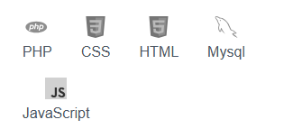
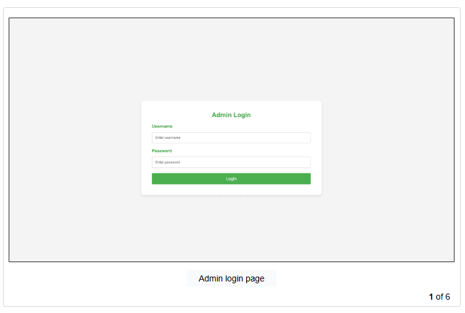
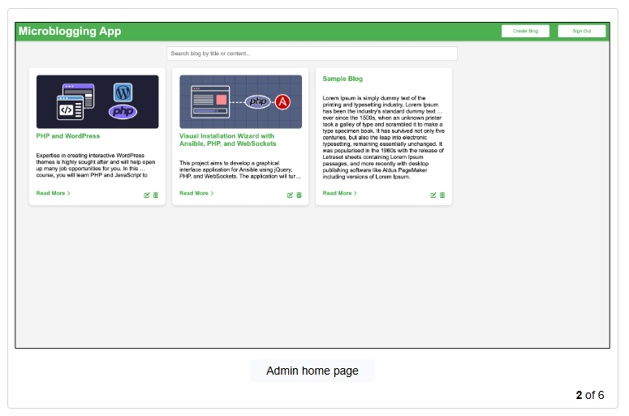
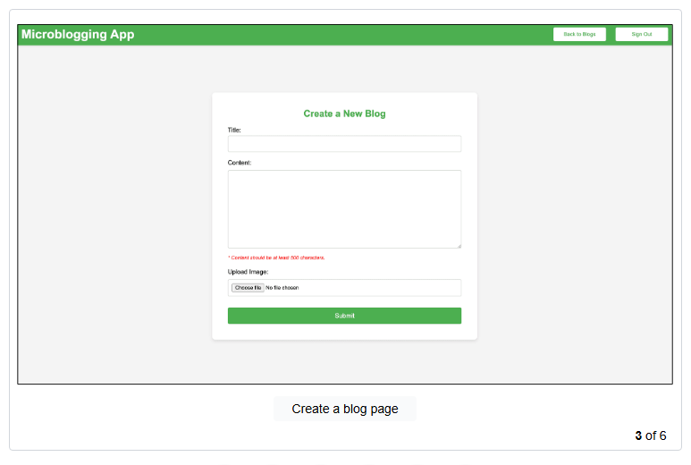
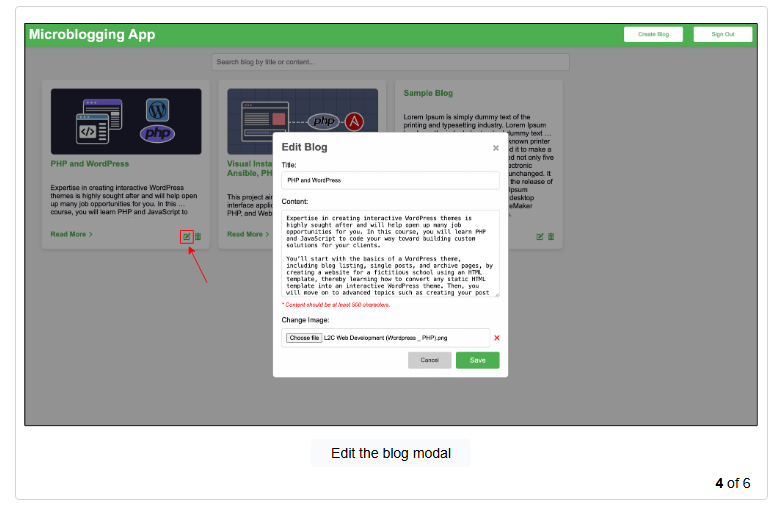
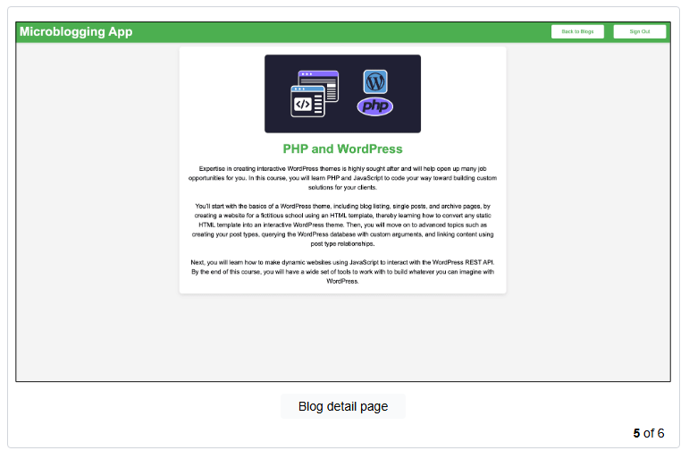
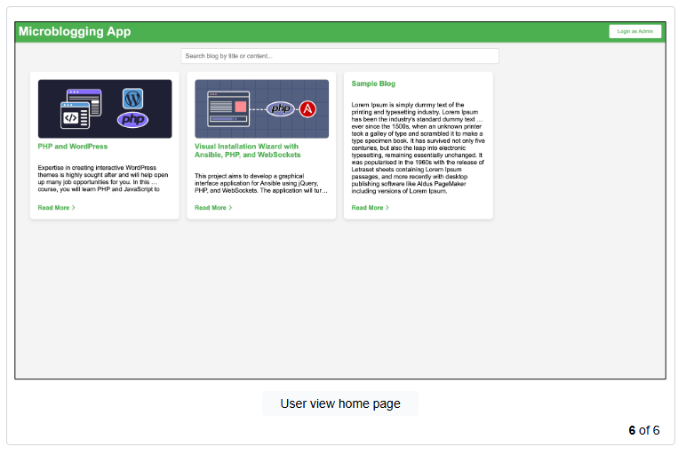

# Build a Microblogging App Using PHP, HTML, JavaScript, and CSS

# You will learn to:

- Create a login system and dashboard for the admin to efficiently manage blog content, including the creation, updation, and deletion of blog posts.

- Build a responsive frontend using HTML, CSS, and JavaScript that displays blogs and allows CRUD operations.

- Implement search functionality to allow users to easily find and access specific blog posts by title or content.

- Develop a back-end system using PHP that supports all CRUD operations for blog posts.

# Prerequisites

- Basic knowledge of PHP

- Basic knowledge of HTML, CSS, and JavsScript

- Basic knowledge of web development

# Technologies

# Project Description

In this project, we will build a personal microblogging website that allows a single admin user to manage and publish blog posts. The application will enable the admin to create, read, update, and delete blog entries, providing a platform for sharing content. Users visiting the site can view a list of blogs on the home page and access detailed views of individual blog posts. The application will also include search functionality, allowing users to find specific blogs by title or content.

The project will be built using PHP for the backend, with HTML, CSS, and JavaScript for the frontend. The backend will handle data management, including user authentication and blog operations, while the frontend will focus on rendering the user interface and interacting with the backend APIs. 

We will start by setting up the database schema and implementing the admin login functionality. We will then create API endpoints for managing blog posts, build the necessary frontend components, and apply styling to ensure a user-friendly experience. The final product will be a fully functional micro-blogging application that allows the admin to manage blog content effectively.

Here is an overview of what you will be building in this project:

# Project Tasks

## 1 Introduction

- **Task 0:** Get Started

- **Task 1:** Set Up the Database

- **Task 2:** Start the Project

## 2 Develop the Admin Login Feature

- **Task 3:** Implement Login/Logout Functionality for Admin

- **Task 4:** Build the Admin Login Page

## 3 Develop the Fetch Blog Feature

- **Task 5:** Implement Admin Controls and Header Functionality

- **Task 6:** Implement the Fetch Blog Post API

- **Task 7:** Implement the Home Page

## 4 Develop Header and Create Blog Features

- **Task 8:** Implement the Blog Creation Functionality

- **Task 9:** Implement the Blog Creation Page

## 5 Develop Update, Delete, and Edit Blog Features

- **Task 10:** Implement the Update Blog Posts API

- **Task 11:** Implement the Delete Blog Posts API

- **Task 12:** Implement Edit and Delete Blog Functionalities

## 6 Develop the Blog Details Feature

- **Task 13:** Implement API to Retrieve a Single Blog Post

- **Task 14:** Implement the Blog Details Page

Congratulations!

---

### 1. Task 0: Get Started

In this project, you aim to develop a microblogging application with an admin user who can perform CRUD (create, read, update, and delete) operations on blogs. Every other visitor to the application would only be able to read the blogs.

You will use PHP for building the backend API. An API is a set of rules and endpoints that allow different applications to communicate with each other. In this project, the API will handle requests and responses between the frontend and the database, such as retrieving or updating blog posts. You will be using MySQL as the database. On the frontend, you will use HTML, JavaScript, and CSS to create the user interface that interacts with the API and displays the data to the user.

#### Architecture 

Architecture
To start, you’ve been given a template of the web application in the /usercode/micro_blogging_app/ directory. The template contains the required files and code for your convenience. 

You’ll be modifying these files as you go through the project tasks. Please pay close attention to the provided code before modifying it.

A brief overview of the files and folders present in the /usercode/micro_blogging_app/ directory is as follows:

The /micro_blogging_app/backend/ directory contains the PHP-based backend scripts that handle server-side logic, including database interactions, authentication, and CRUD operations on blog posts. An overview of the files present in this is as follows:

The /login.php file handles user authentication by verifying login credentials.

The /logout.php file manages the user logout process.

The /db.php file contains the database connection logic.

The /blog_db.sql file provides the SQL commands needed to create the necessary tables and data in the database.

The /add_blog.php file manages the creation of new blog posts.

The /fetch_blogs.php file retrieves all blog posts from the database.

The /update_blog.php file handles the update operation for existing blog posts.

The /delete_blog.php file deletes a specific blog post based on its ID.

The /get_blog_details.php file fetches details of a specific blog post.

The /micro_blogging_app/frontend/ directory holds all the frontend files that comprise the application’s user interface. An overview of the files present in this is as follows:

The /index.html file is the main landing page of the application.

The /blog_details.html file displays a detailed view of a particular blog post.

The /create_blog.html file displays a page that contains a form for creating new blog posts.

The /login.html file serves as the login page for user authentication.

The /404.html file provides a custom 404 error page. A 404 error page is a page that will be displayed when a user goes to a route or page that is not defined in the application.

The /header.html file is a shared header component used across various pages.

The /styles.css file is the main stylesheet for styling the frontend pages.

The /script.js file is the main JavaScript file that handles client-side interactions.

The /script_header.js file manages header interactions.

The /script_login.js file handles the login page interactions.

The /script_blog_details.js file handles interactions on the blog details page.

The /script_create_blog.js file manages interactions on the create blog page.

The /micro_blogging_app/uploads/ directory contains images and other media files uploaded by users or for use in blog posts.