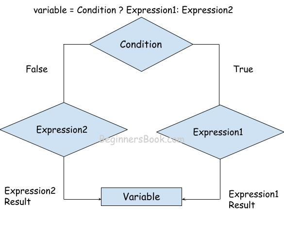
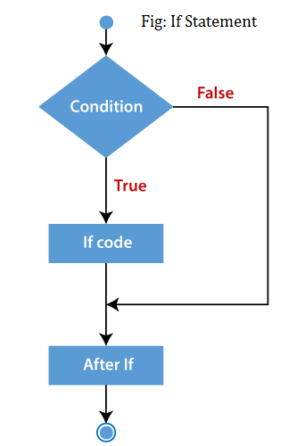
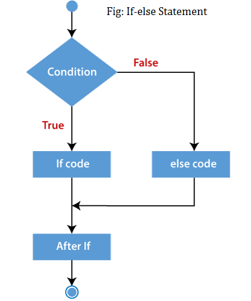
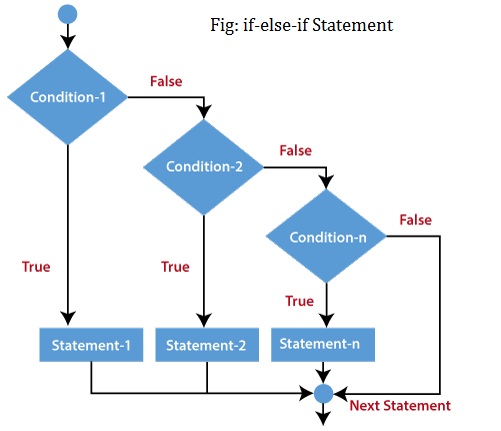
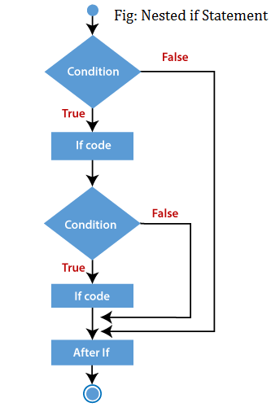
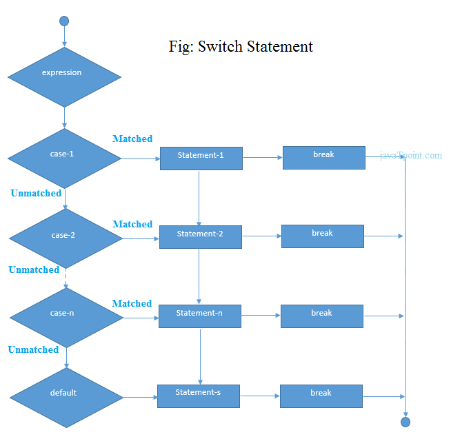
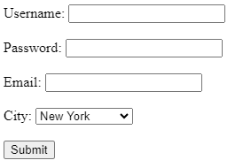

## Introduction to PHP
----

<br>
<div style="text-align:center">

<p style="text-align:center">
Rasmus Lerdorf
<p>
<p>(The Creator of PHP)</p>
</div>


# 1.1 Overview of PHP

## What is PHP?

PHP, which stands for **PHP: Hypertext Preprocessor**, is a widely-used open-source server-side scripting language primarily designed for web development. PHP code is embedded within HTML, making it a powerful tool for creating dynamic and interactive web pages.

## Evolution of PHP: From PHP 1 to PHP 8

PHP has evolved significantly since its inception in 1994, adapting to the needs of developers and the changing landscape of web development. Here is a detailed look at the evolution of PHP through its major versions.

## PHP 1: PHP/FI (1995)

- **Initial Release**: PHP/FI (Personal Home Page / Forms Interpreter) was developed by Rasmus Lerdorf in 1994 and released publicly in 1995.
- **Features**: Initially created as a set of Common Gateway Interface (CGI) binaries written in C, PHP/FI provided basic functionality for building simple dynamic web applications, such as guest books.
- **Usage**: It could interpret form submissions and embed dynamic content into web pages, but it lacked many features found in modern versions of PHP.

## PHP 2: PHP/FI 2 (1997)

- **Enhancements**: PHP/FI 2 was a significant improvement over the initial release, adding support for more complex data types and basic templating.
- **Introduction of Scripting**: It introduced a primitive scripting language syntax, making it more versatile for developers to build dynamic web applications.
- **Growing Popularity**: By the time PHP/FI 2 was released, it was installed on about 1% of all domains on the internet.

## PHP 3 (1998)

- **Major Overhaul**: PHP 3, released in 1998, was a complete rewrite of PHP/FI by Andi Gutmans and Zeev Suraski. This version laid the foundation for PHP as we know it today.
- **New Features**: 
  - Introduced a more extensible and modular architecture.
  - Added support for a wide variety of databases.
  - Introduced the `zend` scripting engine.
- **Widespread Adoption**: PHP 3 gained rapid popularity due to its simplicity, flexibility, and ease of use, becoming the first widely adopted version of PHP.

## PHP 4 (2000)

- **Powered by Zend Engine 1.0**: PHP 4, released in 2000, was built on the Zend Engine 1.0, which provided significant performance improvements and stability.
- **New Features**:
  - Improved support for HTTP sessions.
  - Introduction of output buffering.
  - Enhanced security features.
  - Better resource handling and more robust error handling.
- **Enterprise Adoption**: The release of PHP 4 saw increased adoption by enterprise-level companies, which started using PHP for more substantial and more complex applications.

## PHP 5 (2004)

- **Powered by Zend Engine II**: PHP 5, released in 2004, introduced the Zend Engine II, which brought enhanced performance and introduced the object-oriented programming (OOP) model in PHP.
- **New Features**:
  - Comprehensive support for OOP, including constructors, destructors, and exception handling.
  - Introduction of the PHP Data Objects (PDO) extension for database access.
  - Improved XML support with the SimpleXML and DOM extensions.
  - Introduction of the `mysqli` extension for MySQL databases.
- **Object-Oriented Programming**: PHP 5's support for OOP made it more appealing for developers looking to build complex, scalable applications.

## PHP 6 (Unreleased)

- **Goal**: PHP 6 aimed to bring native Unicode support to PHP, making it easier to develop international applications.
- **Challenges**: The project faced significant difficulties due to performance issues and complexities in implementing Unicode support across all PHP features.
- **Outcome**: PHP 6 was never officially released. Many of its features were later backported into PHP 5.3, while others were abandoned or deferred.

## PHP 7 (2015)

- **Revolutionary Performance**: PHP 7, released in 2015, was a major milestone that introduced the Zend Engine 3.0 (often called PHP-NG, or "Next Generation"). This version brought substantial performance improvements, with some applications running up to twice as fast as in PHP 5.6.
- **New Features**:
  - Introduction of scalar type declarations and return type declarations.
  - Introduction of the `null coalescing operator` (`??`).
  - Introduction of anonymous classes and spaceship operator (`<=>`).
  - Removal of deprecated features and old, unsupported SAPIs and extensions.
- **Memory Usage**: PHP 7 also reduced memory consumption, making it more efficient for large-scale applications.

## PHP 8 (2020)

- **Latest Release**: PHP 8, released in November 2020, builds upon the improvements of PHP 7, introducing new features and performance enhancements.
- **New Features**:
  - **Just-In-Time (JIT) Compilation**: Provides significant performance improvements by compiling PHP bytecode into machine code at runtime.
  - **Union Types**: Allow functions to accept multiple types for a single parameter.
  - **Attributes**: Provide a way to add metadata to classes, methods, properties, etc., replacing PHPDoc annotations in many cases.
  - **Match Expression**: A more concise and expressive alternative to `switch` statements.
  - **Named Arguments**: Allow passing arguments to a function based on the parameter name rather than the order.
  - **Constructor Property Promotion**: Reduces boilerplate code when initializing class properties.
  - **Error Handling Improvements**: Improved error handling and diagnostics, including consistent type errors and the `@` error control operator's usage.
- **Improved Type System**: PHP 8 continues to enhance the type system, making it more robust and helpful for developers in catching errors early.

## Conclusion

From its humble beginnings as a simple set of tools for creating personal web pages to becoming one of the most widely used server-side scripting languages globally, PHP has undergone significant transformations. Each major version has introduced new features, improved performance, and expanded the language's capabilities, helping PHP adapt to modern web development needs. Today, PHP remains a powerful tool for building dynamic and scalable web applications, supported by a large community and a rich ecosystem of frameworks and tools.

PHP 8 represents the latest evolution of the language, bringing powerful new features and optimizations that make PHP development faster, more secure, and more expressive. As PHP continues to evolve, it remains a popular choice for developers worldwide, powering millions of websites and applications across the internet.


## Features of PHP

- **Open Source**: PHP is free to use and its source code is publicly available, encouraging contributions from a large community of developers.
  
- **Cross-Platform Compatibility**: PHP runs on various platforms, including Windows, Linux, macOS, and Unix, making it versatile for different environments.

- **Easy Integration**: PHP easily integrates with HTML and supports a wide range of databases such as MySQL, PostgreSQL, Oracle, and SQLite.

- **Server-Side Scripting**: PHP code is executed on the server before being sent to the user's browser, ensuring security and efficiency.

- **Flexibility**: PHP supports various databases, web servers, and platforms, making it suitable for a wide range of web applications.

- **Rich Library Support**: PHP offers a vast collection of built-in libraries and extensions to simplify tasks such as file handling, database management, and data encryption.

- **Object-Oriented Programming (OOP)**: PHP supports OOP, which helps in building complex, reusable components, making code easier to manage and maintain.

# Why PHP?

PHP has been a popular choice for web development for over two decades. Here are some reasons why PHP continues to be widely used:

## Popularity and Community Support

### 1. Extensive Community Support

- **Large Developer Community**: PHP has a vast community of developers who contribute to the language's development, create frameworks and libraries, and provide support through forums, blogs, and tutorials. This makes it easy to find solutions to problems and best practices.
- **Rich Ecosystem**: The PHP ecosystem includes a wide range of libraries, frameworks (like Laravel, Symfony, and CodeIgniter), and tools that help developers build robust and scalable applications more efficiently.
- **Comprehensive Documentation**: PHP has well-maintained and detailed documentation, which is continuously updated. This documentation is available in multiple languages and serves as an excellent resource for both beginners and experienced developers.

### 2. Popularity

- **Widespread Adoption**: PHP powers over 75% of websites that use a server-side programming language, including popular platforms like WordPress, Joomla, and Drupal. Its widespread use has created a large demand for PHP developers in the job market.
- **Support from Major Hosting Providers**: Most web hosting providers support PHP by default, making it easy for developers to deploy PHP applications without needing special configurations or additional costs.
- **Versatility**: PHP is highly versatile and can be used to develop various types of applications, from simple scripts to complex enterprise-level applications. Its ability to easily integrate with different databases and front-end technologies makes it a flexible choice for developers.

### 3. Continuous Evolution

- **Regular Updates**: The PHP language is actively developed and regularly updated with new features, performance improvements, and security enhancements. This ensures that PHP remains relevant and competitive with other modern programming languages.
- **Adaptability to Modern Web Development**: PHP has evolved to support modern web development practices, including improved object-oriented programming, error handling, and the adoption of new language features like type declarations and just-in-time (JIT) compilation.

### 4. Open Source

- **Cost-Effective**: PHP is free to use, which makes it a cost-effective solution for businesses and individuals looking to develop web applications. There are no licensing fees, and the open-source nature of PHP allows developers to customize and extend it as needed.

### 5. Ease of Learning

- **Beginner-Friendly**: PHP's syntax is relatively simple and easy to learn, especially for those new to programming. This has made it a popular choice for beginners looking to start their journey into web development.
- **Extensive Learning Resources**: Due to its popularity, there is a wealth of learning resources available for PHP, including tutorials, courses, books, and videos that cater to all skill levels.

## Conclusion

PHP's popularity and strong community support make it an attractive choice for web developers. Its extensive ecosystem, ease of use, versatility, and regular updates ensure that PHP continues to be a relevant and powerful tool for building dynamic web applications. Whether you are a beginner or an experienced developer, PHP offers a robust platform to build web applications efficiently and effectively.

# Use Cases and Examples

## Popular Websites Using PHP

### 🌐 **WordPress**

- **Description**: WordPress is the most popular content management system (CMS) globally, powering over 40% of all websites. It provides an easy-to-use interface for creating and managing websites and blogs.
- **Website**: [wordpress.org](https://wordpress.org)
- **Icon**:<br/>

### 🛒 **Magento**

- **Description**: Magento is a powerful open-source e-commerce platform known for its flexibility and scalability. It is used by many large retailers to manage online stores.
- **Website**: [magento.com](https://magento.com)
- **Icon**: <br/>

### 📚 **Drupal**

- **Description**: Drupal is another popular open-source CMS used for building complex websites and applications. It is known for its robustness and flexibility in handling various types of content.
- **Website**: [drupal.org](https://www.drupal.org)
- **Icon**:<br/>

### 🏢 **Joomla**

- **Description**: Joomla is a user-friendly CMS used for building websites and online applications. It offers a range of features and extensions for customizing and managing content.
- **Website**: [joomla.org](https://www.joomla.org)
- **Icon**: <br/>

### 📰 **The Huffington Post**

- **Description**: The Huffington Post, now known as HuffPost, is a major news and blog site. It uses PHP to handle dynamic content and large volumes of traffic.
- **Website**: [huffpost.com](https://www.huffpost.com)
- **Icon**: <br/>

### 🎵 **Spotify**

- **Description**: Spotify, a leading music streaming service, uses PHP for various components of its web platform to deliver music content to millions of users worldwide.
- **Website**: [spotify.com](https://www.spotify.com)
- **Icon**:<br/>

### 🏥 **Flickr**

- **Description**: Flickr, a popular photo-sharing service, uses PHP to manage and deliver large amounts of user-generated content efficiently.
- **Website**: [flickr.com](https://www.flickr.com)
- **Icon**: <br/>

### 🚀 **Slack**

- **Description**: Slack, a widely used team collaboration and messaging tool, uses PHP to handle various aspects of its web application, including real-time messaging and integrations.
- **Website**: [slack.com](https://slack.com)
- **Icon**: <br/>
### 🏆 **Twitch**

- **Description**: Twitch, a leading live-streaming platform for gamers and content creators, utilizes PHP for various components of its website, including user management and content delivery.
- **Website**: [twitch.tv](https://www.twitch.tv)
- **Icon**: <br/>

### 🏡 **Zillow**

- **Description**: Zillow, a popular real estate and rental marketplace, uses PHP to handle its dynamic content and user interactions on its platform.
- **Website**: [zillow.com](https://www.zillow.com)
- **Icon**: <br/>

### 🎓 **MIT OpenCourseWare**

- **Description**: MIT OpenCourseWare provides free online courses and materials from the Massachusetts Institute of Technology. The site uses PHP to manage and deliver educational content.
- **Website**: [ocw.mit.edu](https://ocw.mit.edu)
- **Icon**: <br/>


# PHP vs Other Server-Side Languages

## PHP vs Python

### 🔍 **PHP**

- **Strengths**:
  - **Web-Focused**: PHP was designed specifically for web development, making it a strong choice for building dynamic web pages and applications.
  - **Wide Adoption**: Widely used in web hosting environments, with many popular content management systems (CMS) like WordPress, Joomla, and Drupal built on PHP.
  - **Ease of Deployment**: Most web servers and hosting providers support PHP out of the box.

- **Use Cases**:
  - Ideal for web development and creating content management systems.
  - Great for building server-side scripts and integrating with various databases.

### 🐍 **Python**

- **Strengths**:
  - **Versatility**: Python is a general-purpose language with extensive libraries for web development, data analysis, machine learning, and more.
  - **Readable Syntax**: Known for its clean and readable syntax, which enhances productivity and maintainability.
  - **Frameworks**: Popular frameworks like Django and Flask offer robust features for web development.

- **Use Cases**:
  - Best suited for applications requiring data processing, automation, and integration with AI or machine learning.
  - Excellent choice for web applications where readability and development speed are priorities.

## PHP vs Ruby on Rails

### 🔍 **PHP**

- **Strengths**:
  - **Flexibility**: PHP offers flexibility in coding styles and approaches, accommodating a variety of development needs.
  - **Community**: Large community with extensive resources, plugins, and frameworks.

- **Use Cases**:
  - Suitable for building websites and web applications, particularly with existing PHP frameworks or CMS.

### 💎 **Ruby on Rails**

- **Strengths**:
  - **Convention Over Configuration**: Rails follows the principle of "convention over configuration," which speeds up development by reducing the number of decisions developers need to make.
  - **Integrated Tools**: Rails provides a comprehensive suite of tools and libraries, making it easy to build feature-rich applications quickly.

- **Use Cases**:
  - Ideal for rapid development of web applications and startups looking to build MVPs (Minimum Viable Products) quickly.
  - Great for applications requiring a strong focus on developer productivity and clean code.

## PHP vs JavaScript (Node.js)

### 🔍 **PHP**

- **Strengths**:
  - **Server-Side Scripting**: Well-suited for server-side scripting with strong integration into web servers and databases.
  - **Established Ecosystem**: Mature ecosystem with many libraries and tools for web development.

- **Use Cases**:
  - Perfect for traditional server-side web development tasks and integrating with existing web technologies.

### 🟢 **JavaScript (Node.js)**

- **Strengths**:
  - **Unified Language**: Node.js allows developers to use JavaScript for both server-side and client-side development, streamlining the development process.
  - **Asynchronous Processing**: Built on an event-driven, non-blocking I/O model, making it ideal for building scalable and high-performance applications.

- **Use Cases**:
  - Best for building real-time applications, such as chat applications or live data streaming services.
  - Ideal for applications requiring high concurrency and performance, with a unified language stack.

## PHP vs ASP.NET

### 🔍 **PHP**

- **Strengths**:
  - **Open Source**: Free to use and deploy, with extensive community support and documentation.
  - **Platform Independence**: Runs on various platforms, including Linux and Windows.

- **Use Cases**:
  - Suitable for a wide range of web applications, from small websites to large-scale applications.

### 🖥️ **ASP.NET**

- **Strengths**:
  - **Integration with Microsoft Technologies**: Works seamlessly with other Microsoft products and services, providing a robust framework for enterprise applications.
  - **Performance**: High performance with features like just-in-time (JIT) compilation and native integration with the .NET ecosystem.

- **Use Cases**:
  - Ideal for building enterprise-level applications, intranet solutions, and applications that need to integrate with other Microsoft services.
  - Great for applications requiring a structured, enterprise-oriented development environment.

# Setting Up the PHP Environment

## 🌐 **Installing PHP**

Getting started with PHP involves setting up your environment. Here's a step-by-step guide to installing PHP on different operating systems:

### 🖥️ **Installing PHP on Windows**

1. **Download PHP**:
   - Visit the [official PHP downloads page](https://windows.php.net/download/) to get the latest PHP version.
   - Choose the **Thread Safe** version if you are using Apache or the **Non-Thread Safe** version for other servers like IIS.

2. **Extract the Files**:
   - Download the ZIP file and extract it to a directory, for example, `C:\php`.

3. **Configure PHP**:
   - Rename `php.ini-development` to `php.ini`.
   - Open `php.ini` with a text editor and configure necessary settings (e.g., setting the `extension_dir`).

4. **Update System PATH**:
   - Add the PHP directory (`C:\php`) to your system PATH environment variable to run PHP commands from anywhere.

5. **Verify Installation**:
   - Open Command Prompt and type `php -v` to check if PHP is correctly installed and working.

### 🍏 **Installing PHP on Mac**

1. **Using Homebrew**:
   - **Install Homebrew** (if not already installed): Open Terminal and run the following command:
     ```bash
     /bin/bash -c "$(curl -fsSL https://raw.githubusercontent.com/Homebrew/install/HEAD/install.sh)"
     ```
   - **Install PHP**: Run the following command to install PHP using Homebrew:
     ```bash
     brew install php
     ```

2. **Verify Installation**:
   - After installation, check PHP version by running:
     ```bash
     php -v
     ```

### 🐧 **Installing PHP on Linux**

1. **Using Package Manager**:
   - **For Debian/Ubuntu-based Systems**:
     - Open Terminal and update package list:
       ```bash
       sudo apt-get update
       ```
     - Install PHP:
       ```bash
       sudo apt-get install php
       ```

   - **For Red Hat/CentOS-based Systems**:
     - Open Terminal and install PHP:
       ```bash
       sudo yum install php
       ```

2. **Verify Installation**:
   - Check the installed PHP version by running:
     ```bash
     php -v
     ```

### 🛠️ **Configuration Tips**

- **Adjust `php.ini`**: Depending on your project needs, you might need to adjust settings in `php.ini`, such as `max_execution_time`, `memory_limit`, and `upload_max_filesize`.
- **Restart Server**: If you're using a web server like Apache or Nginx, restart it after making changes to the PHP configuration to apply the new settings.

# Setting Up a Local Server

Setting up a local server is essential for developing and testing web applications on your own machine. Here's a guide to three popular local server solutions and an introduction to the LAMP stack.

## 🚀 **Installing and Configuring XAMPP**

### 🌟 **What is XAMPP?**
XAMPP is a free and open-source cross-platform web server solution that includes Apache, MySQL, PHP, and Perl. It simplifies the setup process for a local server environment.

### 🛠️ **Installation Steps**:
1. **Download XAMPP**:
   - Go to the [XAMPP website](https://www.apachefriends.org/index.html).
   - Download the version compatible with your operating system (Windows, macOS, or Linux).

2. **Install XAMPP**:
   - Run the installer and follow the installation wizard.
   - Choose the components you want to install (Apache, MySQL, PHP, etc.).

3. **Start the Server**:
   - Open the XAMPP Control Panel.
   - Start the Apache and MySQL services by clicking "Start" next to each service.

4. **Verify Installation**:
   - Open your web browser and go to `http://localhost/`.
   - You should see the XAMPP welcome page indicating that the server is running.

## 🌐 **Installing and Configuring WAMP**

### 🌟 **What is WAMP?**
WAMP stands for Windows, Apache, MySQL, and PHP. It is a Windows-based solution for setting up a local server environment.

### 🛠️ **Installation Steps**:
1. **Download WAMP**:
   - Visit the [WAMP website](http://www.wampserver.com/en/).
   - Download the latest version compatible with your Windows OS.

2. **Install WAMP**:
   - Run the installer and follow the setup instructions.
   - Choose the installation directory and components.

3. **Start the Server**:
   - Launch WAMP from the Start Menu.
   - The WAMP icon in the system tray should turn green, indicating that the server is running.

4. **Verify Installation**:
   - Open your browser and navigate to `http://localhost/`.
   - You should see the WAMP server home page, confirming that everything is set up correctly.

## 🍏 **Installing and Configuring MAMP**

### 🌟 **What is MAMP?**
MAMP is a free, open-source local server solution for macOS and Windows. It includes Apache, MySQL, and PHP.

### 🛠️ **Installation Steps**:
1. **Download MAMP**:
   - Go to the [MAMP website](https://www.mamp.info/en/).
   - Download the latest version for macOS or Windows.

2. **Install MAMP**:
   - Run the installer and follow the on-screen instructions.
   - Choose the components and destination folder.

3. **Start the Server**:
   - Open the MAMP application.
   - Click "Start Servers" to launch Apache and MySQL.

4. **Verify Installation**:
   - Open your browser and go to `http://localhost:8888/`.
   - You should see the MAMP start page, which confirms that your server is running.

## 🖥️ **Introduction to LAMP Stack (Linux, Apache, MySQL, PHP)**

### 🌟 **What is LAMP?**
LAMP is an acronym for Linux, Apache, MySQL, and PHP. It is a popular stack used to build and deploy web applications on a Linux operating system.

### 🔧 **Components**:
1. **Linux**: The operating system that serves as the foundation of the LAMP stack.
2. **Apache**: The web server software that handles HTTP requests and serves web pages.
3. **MySQL**: The database management system used to store and manage data.
4. **PHP**: The server-side scripting language that interacts with Apache and MySQL to create dynamic web content.

### 🛠️ **Setting Up LAMP**:
1. **Install Linux**: Choose a Linux distribution like Ubuntu or CentOS and install it on your server.
2. **Install Apache**:
   - Use the package manager to install Apache (`sudo apt install apache2` for Ubuntu).
3. **Install MySQL**:
   - Install MySQL server using the package manager (`sudo apt install mysql-server` for Ubuntu).
4. **Install PHP**:
   - Install PHP and required modules (`sudo apt install php libapache2-mod-php php-mysql` for Ubuntu).
5. **Configure Apache**:
   - Edit the Apache configuration files to support PHP (`/etc/apache2/mods-enabled/dir.conf`).
6. **Verify Installation**:
   - Create a PHP info file (`/var/www/html/info.php`) with `<?php phpinfo(); ?>` to check the PHP configuration.

# Configuring PHP

## 🛠️ Editing the `php.ini` File

The `php.ini` file is the main configuration file for PHP. It controls various settings that affect PHP's behavior. Here’s how to edit it effectively:

### 🔧 **Locating the `php.ini` File**

- **Default Locations**:
  - **Linux/Mac**: `/etc/php/7.x/cli/php.ini` or `/etc/php/7.x/apache2/php.ini`
  - **Windows**: `C:\Program Files\PHP\php.ini` or `C:\Windows\php.ini`

- **Find the File**: Use `phpinfo()` function to locate the loaded configuration file by creating a `phpinfo.php` file with the following content:
  ```php
  <?php phpinfo(); ?>
      Access this file through your browser, and look for the Loaded Configuration File section.   

### ✍️ Editing the File


- **1.Open the File: Use a text editor like Notepad++ (Windows) or nano/vi (Linux) to open php.ini.**
- **2.Make Changes: Modify settings as needed. For example:**
   
  ```
  - To change the upload file size limit

       upload_max_filesize = 10M

  - To set the default timezone:

       date.timezone = "America/New_York"

- **3.Save and Restart: After editing, save the file and restart your web server (e.g., Apache or Nginx) to apply changes.**

## 🔍 Understanding PHP Configuration Settings

PHP configuration settings control various aspects of how PHP operates. Here are some key settings:

### 🧩 Basic Settings

```
- memory_limit: Controls the maximum amount of memory a script can use.

     memory_limit = 128M

- max_execution_time: Sets the maximum time (in seconds) a script is allowed to run.

     max_execution_time = 30

- post_max_size: Defines the maximum size of POST data that PHP will accept.

     post_max_size = 8M
```

### 🔐 Security Settings

```
display_errors: Controls whether errors are displayed to users. This should be set to Off in production environments to avoid exposing sensitive information.

    display_errors = Off

expose_php: Determines whether PHP version is exposed in HTTP headers. It’s often set to Off for security reasons.

    expose_php = Off

```

## 🚨 Configuring Error Reporting and Display Errors

Proper error reporting and handling are crucial for debugging and maintaining your PHP applications.

### 📈 Error Reporting
```
    1. Enable Error Reporting: Set the error_reporting directive to control which errors    are reported.

        error_reporting = E_ALL
     
    This setting reports all types of errors, including notices, warnings, and fatal errors.

    2. Modify at Runtime: You can also set error reporting in your script for testing purposes:

        <?php
            error_reporting(E_ALL);
            ini_set('display_errors', 1);
        ?>
```

###  🛑 Display Errors

- **Display Errors in Development:**
  For development environments, you may want to display errors directly on the page. 
  ```
     display_errors = On
  ``` 
- **Disable Display Errors in Production:**
    For production environments, it's safer to log errors to a file rather than displaying them to users.
   ```
     display_errors = Off
     log_errors = On
     error_log = /path/to/php_error.log
   ```

## 1.3 Writing and Running Your First PHP Script

### 🌟 Embedding PHP in HTML

#### 📜 **Basic PHP Tags**

PHP scripts are embedded within HTML using the following tags:
```php
<?php
// PHP code goes here
?>
```
<li> Opening Tag: <?php — Indicates the start of a PHP script.</li>
<li> Closing Tag: ?> — Marks the end of a PHP script (optional in many cases)</li>

#### 🔖 Short Tags and Their Usage

Short tags offer a more concise way to embed PHP code:

```
<? // PHP code goes here ?>
```

#### 🗂️ PHP Syntax Basics

🅰️ Case Sensitivity

<li><b>Variables:</b> PHP variable names are case-sensitive. For example, $variable and $Variable are different variables.</li>
<li><b>Functions and Keywords:</b> PHP function names and keywords are case-insensitive. For example, `echo`, `Echo`, and `ECHO` are all valid.</li>

💬 Comments in PHP
Comments are crucial for documenting your code. PHP supports two types of comments:

<li>
    <b>Single-Line Comments:</b>
    
    
     // This is a single-line comment
    
   
</li>
   
<li>
    <b>Multi-Line Comments :</b>
    
    /*
    * This is a multi-line comment
    * It spans multiple lines
    */

</li>

## 🚀 Executing PHP Scripts 

### 🌐 Running PHP Scripts in the Browser
<ol>
<li>
Save Your Script: Save your PHP file with a .php extension, for example, index.php.
</li>
<li>
Set Up a Local Server: Use a local server environment like XAMPP, WAMP, or MAMP.
</li>
<li>
Access via Browser: Navigate to http://localhost/index.php to view your PHP script in action.
</li>
</ol>

### 💻 Command-Line Execution of PHP Scripts

<ol>
<li><b>Open Terminal:</b> Access the command-line interface (CLI).</li>
<li>
    <b>Run the Script:</b> Execute your PHP script using the php command:

      php /path/to/your/script.php 
    
<li><b>View Output:</b> The output of your script will be displayed in the terminal.</li>
</ol>


# 2. Basic PHP Concepts

## 🧩 2.1 Variables and Data Types

### 📦 2.1.1 Declaring Variables

In PHP, variables are essential for storing and manipulating data. Let’s dive into how to declare and initialize them effectively.

### 🖋️ **Rules for Variable Naming**

When naming variables in PHP, adhere to the following rules:

- **Start with a Dollar Sign**: All PHP variables begin with the dollar sign (`$`).
  ```php
  $variableName;
- **Begin with a Letter or Underscore:**: Variable names must start with a letter (a-z, A-Z) or an underscore (_), but not a number.
  ```php
  $myVariable;     // Valid
  $_myVariable;    // Valid
  $1myVariable;    // Invalid
- **Followed by Letters, Numbers, or Underscores:**: After the initial character, variable names can include letters, numbers, and underscores.
  ```php 
  $variable1;       // Valid
  $variable_name;   // Valid
  $VariableName;    // Valid

- **Case Sensitivity:**: PHP variable names are case-sensitive. $Variable and $variable are different variables.
    ```php
    $Variable = "Hello";
    $variable = "World";

- **No Spaces:**: Spaces are not allowed in variable names. Use underscores or camelCase instead.
  ```php
    $my_variable;      // Valid
    $myVariable;       // Valid

🌟 Initializing Variables

Initialization of variables involves assigning them an initial value. This is crucial for avoiding errors and ensuring that variables have meaningful data from the start.

- **Basic Assignment:**: 
  ```php
    $greeting = "Hello, World!";
- **Multiple Initializations:**: 
  ```php
    $name = "Alice";
    $age = 25;
    $isStudent = true;

    In this example:
        $name is a string.
        $age is an integer.
        $isStudent is a boolean.
- **Dynamic Assignment:**: 
Variables can also be assigned values dynamically based on conditions or computations.
  ```php
    $number = 10;
    $result = $number * 5;  // $result will be 50

### 🎨 Example
Here’s a complete example demonstrating variable declaration and initialization in PHP:

```php
<?php
// Declaring and initializing variables
$firstName = "John";
$lastName = "Doe";
$age = 30;
$isEmployed = true;

// Outputting the values
echo "Name: " . $firstName . " " . $lastName . "<br>";
echo "Age: " . $age . "<br>";
echo "Employed: " . ($isEmployed ? "Yes" : "No");
?>
```
## 📊 2.1.2 PHP Data Types

Understanding PHP data types is crucial for effective programming. PHP supports several data types, which can be categorized into scalar types, compound types, and special types.

### 🔢 Scalar Types

Scalar types represent single values. They are the most basic data types in PHP.

### 1. **String** 💬

- **Definition**: A sequence of characters enclosed in single (`'`) or double (`"`) quotes.
- **Example**:
  ```php
  $greeting = "Hello, World!";
  ```
- **Features:**
    - **1. Can include letters, numbers, and special characters.**
    - **2. Supports various string operations like concatenation and interpolation.**

### 2. **Integer** 🔢

- **Definition: Whole numbers without any decimal points.**
- **Example:**
    ```php
    $age = 25;
    ```
- **Features:**
    Often used in conditional statements and loops.

### 🗂️ Compound Types

Compound types are used to store multiple values in a single variable.

### **1. Array 🗃️**
- **Definition:** A collection of values indexed by keys.
- **Example:**
  ```php
     $colors = array("Red", "Green", "Blue");
- **Features**
  - Can be indexed (numeric) or associative (key-value pairs).
  - Supports various functions to manipulate and access elements. 

### **2. Object 🧩**
- **Definition:** An instance of a class that can contain properties and methods.
- **Example:**
  ```php
    class Person{
    public $name;
    public function greet() {
        return "Hello, " . $this->name;
    }
  }
  $person = new Person();
  $person->name = "John";
  echo $person->greet();

- **Features**
  - Enables object-oriented programming.
  - Supports encapsulation, inheritance, and polymorphism.

### **3.Callable 📞**
- **Definition:** A type that represents a callable function or method.
- **Example:**
  ```php
    function sayHello(){
    return "Hello!";
   }
   $function = "sayHello";
   echo $function(); // Calls sayHello() function

- **Features**
  - Can be a function name, an array with an object and method name, or a closure.
  - Useful for dynamic function calls and callback functions.

### 🔮 Special Types

Special types have unique roles and characteristics.

### **1. NULL 🚫**
- **Definition:** Represents a variable with no value.
- **Example:**
  ```php
    $var = NULL;

- **Features**
  - Often used to signify an absent or undefined value.
  - Checking for NULL can help in conditional logic.

### **2. Resource 🗄️**
- **Definition:** A special variable that holds a reference to an external resource, like a database connection.
- **Example:**
  ```php
    $connection = mysqli_connect("localhost", "user", "password", "database");


- **Features**
  - Typically used for handling file operations, database connections, etc.
  - Cannot be directly manipulated like other data types.

🌈 Conclusion
PHP’s data types are essential for defining and manipulating variables effectively. Scalar types are fundamental for single values, compound types are used for collections and objects, and special types handle unique cases. Understanding these types is key to mastering PHP programming.

--

##  🎨 ** 2.1.3 Type Juggling and Type Casting in PHP**

PHP, being a loosely typed language, provides flexibility with variable types and how they can be manipulated. This is due to PHP's dynamic type system that automatically converts data types based on the context in which a variable is used. Understanding **Type Juggling** (implicit conversion) and **Type Casting** (explicit conversion) is crucial for writing effective PHP code. Let's explore these concepts in detail!

### 🌀 **Implicit Type Conversion (Type Juggling)**

**Type Juggling** refers to the automatic conversion of data types by PHP. When a variable is used in different contexts, PHP implicitly changes its type to match the required operation.

#### 🔍 **How Implicit Type Conversion Works**

Implicit type conversion occurs in various scenarios:

- **Arithmetic Operations**: When a string that contains numeric data is used in arithmetic operations, PHP converts the string to a number.
  ```php
  $a = "10";  // $a is a string
  $b = $a + 5; // $b is now 15 (integer)

    In this example, the string "10" is converted to an integer 10 to perform the addition.
- **String Concatenation:**:When using the . operator to concatenate strings, numbers are converted to strings.
    ```php
    $x = 10;
    $y = " apples";
    echo $x . $y; // Output: "10 apples"

    Here, the integer 10 is converted to the string "10" for concatenation.
- **Boolean Context:**:Variables are converted to boolean values when evaluated in conditions.
    ```php
    $var = "0";
    if ($var) {
        echo "This will not print.";  // "0" is treated as false
    }


    In this example, the string "0" is treated as false in the conditional statement.

### 📝 Examples of Type Juggling in Different Contexts

- **Array and String Context:**
  ```php
     $array = [1, 2, 3];
     $string = "Array: " . $array; // Warning: Array to string conversion
     echo $string; // Output: "Array: Array"
   ```
    When attempting to concatenate an array with a string, PHP converts the array to the string "Array".
- **Comparison Context:**
  ```php
     $x = 0;
     $y = "hello";
     if ($x == $y) {
       echo "Equal"; // This prints because both are considered false
     }
   ```
     In loose comparisons (==), PHP converts both 0 and "hello" to boolean false.

### 🎯 Explicit Type Casting

Explicit **Type Casting** is a method to manually convert a variable from one type to another. This ensures that a variable is of a specific type before proceeding with an operation, providing more control over data types.

#### 🚀 How to Perform Explicit Type Casting

To explicitly cast a variable to a different type, prefix the variable with the desired type in parentheses:

- **(int)** or **(integer)**: Converts to an integer.
- **(bool)** or **(boolean)**: Converts to a boolean.
- **(float)** or **(double)** or **(real)**: Converts to a floating-point number.
- **(string)**: Converts to a string.
- **(array)**: Converts to an array.
- **(object)**: Converts to an object.

#### 📝 Examples of Type Casting

- **Casting a String to an Integer:**
  ```php
     $str = "42.3";
     $num = (int) $str;  // $num becomes 42 (integer)
     echo $num; // Output: 42
   ```
    The string "42.3" is converted to the integer 42, truncating the decimal part.
- **Casting a Float to a Boolean:**
  ```php
     $val = 0.0;
     $bool = (bool) $val;  // $bool is false
     echo $bool ? 'True' : 'False'; // Output: False
   ```
   A float value of 0.0 is cast to false as a boolean.
- **Casting an Integer to a String:**
  ```php
     $number = 123;
     $string = (string) $number;  // $string becomes "123"
     echo $string; // Output: "123"

## 🧰 Understanding gettype() and settype() Functions

PHP provides built-in functions gettype() and settype() for inspecting and manipulating variable types.

### 📊 gettype() Function

The **gettype()** function returns the type of a variable as a string. This is useful for debugging and type-checking purposes.

**Example Usage of gettype():**
```php
$var = 3.14;
echo gettype($var);  // Output: double
```
In this example, gettype($var) returns double since $var is a floating-point number.

### 🛠️ settype() Function
The settype() function changes the type of a variable. Unlike casting, which does not modify the original variable, settype() directly alters the variable's type.
**Example Usage of settype():**
```php
$var = "123";
settype($var, "integer");  // $var is now an integer (123)
echo $var; // Output: 123
```
Here, the variable $var was originally a string "123" but was changed to an integer using settype().

### 💡 Practical Examples

- **Using gettype():**
```php
$data = false;
echo "The type of data is: " . gettype($data);  // Output: The type of data is: boolean
```
This example uses gettype() to determine that $data is a boolean.

- **Using settype():**
```php
$num = "45.67";
settype($num, "float");  // $num is now a float
echo gettype($num);  // Output: double
echo $num; // Output: 45.67
```

# 2.2 Operators in PHP

- **Arithmetic Operators**  
  - Basic operations: `+`, `-`, `*`, `/`, `%`
  - Understanding operator precedence
- **Assignment Operators**  
  - Basic assignment: `=`
  - Compound assignment: `+=`, `-=`, `*=`, etc.
- **Comparison Operators**  
  - Basic comparison: `==`, `!=`, `>`, `<`, `>=`, `<=`
  - Identical and not identical: `===`, `!==`
  - Null coalescing operator: `??`
- **Logical Operators**  
  - Basic logical operators: `&&`, `||`, `!`
  - Short-circuit evaluation
- **String Operators**  
  - Concatenation operator: `.`
  - Concatenation assignment: `.=` 

---
## 🎯 **Operators in PHP**

Operators are essential tools in PHP for performing various operations. Understanding these operators is crucial for writing efficient and effective PHP code. Let's explore the different types of operators in PHP!

---

## ➕ **Arithmetic Operators**

Arithmetic operators are used for performing mathematical calculations. 

| **Operator** | **Description**        | **Example**         |
|--------------|------------------------|---------------------|
| `+`          | Addition               | `$a + $b`           |
| `-`          | Subtraction            | `$a - $b`           |
| `*`          | Multiplication         | `$a * $b`           |
| `/`          | Division               | `$a / $b`           |
| `%`          | Modulus (remainder)    | `$a % $b`           |

### 📊 **Understanding Operator Precedence**

Operator precedence determines how operators are parsed concerning each other. Operators with higher precedence are evaluated first.

For example:  
```php
$result = 5 + 3 * 2;  // Output: 11 (Multiplication first, then addition)
```
##  📥 Assignment Operators

Assignment operators are used to assign values to variables.

| **Operator**  | **Description**           | **Example**                   |
|---------------|---------------------------|-------------------------------|
| `=`           | Assignment                |`$x = 5`                       |
| `+=`          | Addition Assignment       |`$x += 3 (same as $x = $x + 3)`|
| `-=`          | Subtraction  Assignment   |`$x -= 3 (same as $x = $x-3)`  |
| `*=`          | Multiplication  Assignment|`$x *= 3 (same as $x = $x * 3)`|
| `/=`          | Division Assignment       |`$x /= 3 (same as $x = $x / 3)`|

## 🔍 Comparison Operators

Comparison operators are used to compare two values.

| **Operator**  | **Description**                 | **Example**           |
|---------------|---------------------------------|-----------------------|
|==	            |Equal	                          |5 == 5 (true)          |
|!=	            |Not equal	                      |5 != 3 (true)          |
|>	            |Greater than	                    |5 > 3 (true)           |
|<	            |Less than	                      |3 < 5 (true)           |
|>=	            |Greater than or equal to	        |5 >= 5 (true)          |
|<=	            |Less than or equal to	          |3 <= 5 (true)          |
|===	          |Identical (Equal and same type)  |5 === "5" (false)      |
|!==	          |Not identical	                  |5 !== "5" (true)       |
|??	            |Null coalescing	                |$x = $y ?? 'default'   |

## 🔗 Logical Operators

Logical operators are used to combine conditional statements.

| **Operator**  | **Description**                 | **Example**             |
|---------------|---------------------------------|-------------------------|
|`&&`           |Logical AND	                    |(5 > 3) && (2 < 4) (true)|
|`\|\|`         |Logical OR	                      |5 \|\| 3 (true)          |
|`!`            |Logical NOT	                    |!(5 > 3) (false)         |

### 💡 Short-circuit Evaluation

Logical operators use short-circuit evaluation, which means the second operand is not evaluated if the result can already be determined from the first operand.

```
$result = (5 > 3) && ($x = 2); // If the first expression is false, $x is never set
```

## 📝 String Operators

String operators are used to manipulate and concatenate strings.

| **Operator**  | **Description**         | **Example**                                               |
|---------------|-------------------------|-----------------------------------------------------------|
|`.`            |Concatenation            |'Hello' . ' World!' = 'Hello World!'                       |
|`.=`           |Concatenation Assignment |$txt = 'Hello'; $txt .= ' World!'; ($txt is 'Hello World!')|
|


# 2.3 🌟 Control Structures 🌟

- **Conditional Statements**  
  - 1. Conditional Operator `expr1 ? expr2 : expr3 `
  - 2. `if`
  - 3. `if-else`
  - 4. `elseif` vs. `else if`
  - 5. `nested if`
  - 6. `switch-case`

- **Looping Structures**  
  - 1. `while` loop and `do-while` loop
  - 2. `for` loop and `foreach` loop
  - 3. Understanding loop control: `break` and `continue`

- **Alternative Syntax for Control Structures**  
  - Understanding and using alternative syntax for templating


## 🧩 Conditional Statements

Conditional statements are fundamental for decision-making in programming. They allow you to execute different blocks of code based on specific conditions.

### 1. Conditional Operator: `expr1 ? expr2 : expr3`

The **conditional operator** (ternary operator) is a concise way to perform conditional logic. It evaluates a condition and returns one of two values based on whether the condition is true or false.

**Syntax:**
```php
$result = (condition) ? value_if_true : value_if_false;
```
Example:
```php
$age = 18;
$status = ($age >= 18) ? "Adult" : "Minor";
echo $status; // Output: Adult
```
Flow Chart:<br/>
   

Example :

#### Scenario: Determine if a user is eligible for a senior citizen discount.

```php
$age = 65;
$discount = ($age >= 60) ? "Eligible for discount" : "Not eligible for discount";
echo $discount; // Output: Eligible for discount
```
### 2. if
PHP if statement allows conditional execution of code. It is executed if condition is true.

If statement is used to executes the block of code exist inside the if statement only if the specified condition is true.

Syntax :

```php
if(condition){  
//code to be executed  
}  
```
Flowchart:<br/>


Example :

```php
  <?php  
$num=12;  
if($num<100){  
echo "$num is less than 100";  
}  
?> 
``` 
### 3. if-else 

The if-else statement evaluates a condition and executes one block of code if the condition is true, and another block if it is false. Nesting if-else allows for more complex decision-making.

Syntax:

```php
if (condition) {
    // code to execute if condition is true
} else {
    // code to execute if condition is false
}
```
Flow Chart:<br/>




Example-01:

```php
$temperature = 30;

if ($temperature > 25) {
    echo "It's hot outside!";
} else {
    echo "It's cool outside.";
}

```
Example-02:

#### Scenario: Determine the discount based on a purchase amount.

```php
$purchaseAmount = 150;

if ($purchaseAmount > 100) {
    $discount = 20;
} else {
    $discount = 5;
}

echo "Discount: $discount%";
```

### 4. `elseif` vs. `else if`

**elseif** and **else if** are functionally similar but elseif is generally preferred for its readability and compactness.

Syntax:
```php
if (condition1) {
    // code
} elseif (condition2) {
    // code
} else {
    // code
}
```
Flowchart :




Example-01:

```php
$grade = 85;

if ($grade >= 90) {
    echo "Grade A";
} elseif ($grade >= 80) {
    echo "Grade B";
} elseif ($grade >= 70) {
    echo "Grade C";
} else {
    echo "Grade D";
}
```

Example-02 :

#### Scenario: Assign a performance rating based on sales figures.

```php
$sales = 5000;

if ($sales >= 10000) {
    $rating = "Excellent";
} elseif ($sales >= 5000) {
    $rating = "Good";
} elseif ($sales >= 2000) {
    $rating = "Average";
} else {
    $rating = "Needs Improvement";
}

echo "Performance: $rating";

```

### 5. `nested if`

The nested if statement contains the if block inside another if block. The inner if statement executes only when specified condition in outer if statement is true.

Syntax:

```php
if (condition) {    
//code to be executed if condition is true   
if (condition) {    
//code to be executed if condition is true    
}    
}   
```
Flowchart: <br/>



Example:

```php
<?php  
    $age = 23;  
    $nationality = "Indian";  
    //applying conditions on nationality and age  
    if ($nationality == "Indian")  
    {  
        if ($age >= 18) {  
            echo "Eligible to give vote";  
        }  
        else {    
            echo "Not eligible to give vote";  
        }  
    }  
?>  
```

### 6. Switch-case

The switch-case  is used to execute one block of code among multiple options. It’s ideal when dealing with multiple values of a single variable.

Syntax:

```php
switch (variable) {
    case value1:
        // code
        break;
    case value2:
        // code
        break;
    default:
        // code
}
```
Example:

```php
$day = 'Tuesday';

switch ($day) {
    case 'Monday':
        echo "Start of the week.";
        break;
    case 'Tuesday':
        echo "Second day of the week.";
        break;
    case 'Friday':
        echo "Almost weekend!";
        break;
    default:
        echo "Mid-week or weekend.";
}
```

Flow Chart:



Example-01:

Scenario: Determine the type of a beverage based on its code.

```php
$beverageCode = 'T';

switch ($beverageCode) {
    case 'C':
        echo "Coffee";
        break;
    case 'T':
        echo "Tea";
        break;
    case 'J':
        echo "Juice";
        break;
    default:
        echo "Unknown beverage";
}
```

Example-02 :

Scenario: Determine the day of the week and respond accordingly.

```php
$dayOfWeek = 'Wednesday';

switch ($dayOfWeek) {
    case 'Monday':
        echo "Meeting day.";
        break;
    case 'Wednesday':
        echo "Work on project.";
        break;
    case 'Friday':
        echo "Prepare for the weekend.";
        break;
    default:
        echo "Regular working day.";
}
```

## 🔄 Looping Structures

Loops allow you to execute a block of code repeatedly. Here’s a look at the different looping structures in PHP.

### 1. while Loop

 **while Loop:** Executes a block of code as long as the specified condition is true.

 **Syntax:**

 ```php
 while (condition) {
    // code to execute
}
```
**Example:**
```php
$i = 1;
while ($i <= 5) {
    echo $i++;
}
```

### do-while Loop

**do-while Loop:** Executes a block of code at least once before checking the condition.

**Syntax:**
```php
do {
    // code to execute
} while (condition);
```
**Example-01:**
```php
$i = 1;
do {
    echo $i++;
} while ($i <= 5);

```

**Example-02:**

Scenario: Print numbers from 1 to 5 using while and do-while loops.

```php
// while loop
$i = 1;
while ($i <= 5) {
    echo $i++;
}

// do-while loop
$i = 1;
do {
    echo $i++;
} while ($i <= 5);
```

### for Loop 

for Loop: Used for a known number of iterations.

**Syntax:**
```php
for (initialization; condition; increment) {
    // code to execute
}
```
**Example:**
```php
for ($i = 1; $i <= 5; $i++) {
    echo $i;
}
```
### foreach Loop: 

    foreach Loop Specifically designed for iterating over arrays.

**Syntax:**
```php
foreach (array as $value) {
    // code to execute
}
```
**Example-01:**
```php
$colors = ['red', 'green', 'blue'];
foreach ($colors as $color) {
    echo $color;
}
```
**Example-02:**
**Scenario:** Iterate through an array of user names and display them.
```php
$userNames = ['Alice', 'Bob', 'Charlie'];

foreach ($userNames as $name) {
    echo "Hello, $name!";
}
```

## Understanding Loop Control: break and continue

break exits the loop prematurely, while continue skips the rest of the current iteration and proceeds with the next one.

### Syntax for break:

```php
while (condition) {
    if (break_condition) {
        break;
    }
    // code
}
```
### Syntax for continue:

```php
while (condition) {
    if (continue_condition) {
        continue;
    }
    // code
}
```
### Example

```php
// break example
for ($i = 1; $i <= 5; $i++) {
    if ($i == 3) {
        break;
    }
    echo $i; // Output: 1 2
}

// continue example
for ($i = 1; $i <= 5; $i++) {
    if ($i == 3) {
        continue;
    }
    echo $i; // Output: 1 2 4 5
}
```
#### Scenario: Find the first even number greater than 5 and stop the loop.

```php
for ($i = 1; $i <= 10; $i++) {
    if ($i % 2 == 0 && $i > 5) {
        echo $i;
        break;
    }
}
```

## 📝 Alternative Syntax for Control Structures

Alternative syntax is useful when mixing PHP with HTML, particularly in templates. It enhances readability and separates PHP code from HTML.

**Syntax for if-else:**
```php
  <?php if (condition): ?>
      <!-- HTML code here -->
  <?php else: ?>
      <!-- Alternative HTML code here -->
  <?php endif; ?>
```

**Syntax for foreach:**
```php
  <?php foreach ($array as $item): ?>
      <!-- HTML code here -->
  <?php endforeach; ?>
```
**Example-01:**
```php
  <?php if ($isLoggedIn): ?>
      <p>Welcome, <?= $username ?>!</p>
  <?php else: ?>
      <p>Please <a href="login.php">log in</a>.</p>
  <?php endif; ?>
```
**Example-02:**

**Scenario:** Display user profile information if logged in, otherwise prompt for login.

```php
  <?php
  $isLoggedIn = true;
  $username = 'JohnDoe';
  ?>

  <?php if ($isLoggedIn): ?>
      <h1>Hello, <?= $username ?>!</h1>
      <p>Welcome back to your dashboard.</p>
  <?php else: ?>
      <p>Please <a href="login.php">log in</a> to continue.</p>
  <?php endif; ?>
```

# 🌟 Functions in PHP: A Comprehensive Guide

  - **Defining Functions**  
      - Function declaration and calling
      - Function arguments and return values
  - **Advanced Function Concepts**  
      - Default argument values
      - Variable-length argument lists using `...$args`
      - Understanding pass by value vs pass by reference
  - **Scope and Lifetime of Variables**  
      - Local, global, and static scope
      - Superglobals: `$_GET`, `$_POST`, `$_SESSION`, etc.
  - **Anonymous Functions and Closures**  
      - Defining and using anonymous functions
      - Binding variables to closures using `use`

## 🚀 2.4 Functions

Functions are reusable pieces of code that perform a specific task. They help in organizing code into logical blocks, making it more readable, maintainable, and reusable.

### 📝 Defining Functions

#### 📌 Function Declaration and Calling

A **function** is defined using the `function` keyword followed by the function name and a set of parentheses `()`. Function names should be meaningful, indicating the task they perform.

**Syntax:**
```php
function functionName() {
    // Code to be executed
}
```
**Calling a Function:**

```php
functionName(); // This executes the code inside the function
```
**Example:**
```php
function sayHello() {
    echo "Hello, World!";
}

sayHello(); // Output: Hello, World!
```

### 📌 Function Arguments and Return Values

Functions can take arguments (also known as parameters) to work with data and return values after processing them.

**Syntax:**
```php
  function functionName($arg1, $arg2) {
      // Code to process arguments
      return $result; // Returns a value
  }
```
**Example-01:**
```php
  function add($a, $b) {
      return $a + $b;
  }

  echo add(3, 5); // Output: 8
```
**Example-02:**

**Scenario:** Calculate the area of a rectangle using a function.

```php
  function calculateArea($length, $width) {
      return $length * $width;
  }

  echo calculateArea(5, 10); // Output: 50
```
### 🔍 Advanced Function Concepts

#### 📌 Default Argument Values

You can define default values for function arguments. If no value is passed when the function is called, the default value is used.

**Syntax:**
```php
  function greet($name = "Guest") {
      echo "Hello, $name!";
  }

  greet(); // Output: Hello, Guest!
  greet("Alice"); // Output: Hello, Alice!
```
#### 📌 Variable-Length Argument Lists using ...$args

PHP allows you to pass a variable number of arguments to a function using the ... operator.

**Syntax:**
```php
  function sum(...$numbers) {
      $total = 0;
      foreach ($numbers as $number) {
          $total += $number;
      }
      return $total;
  }

  echo sum(1, 2, 3, 4); // Output: 10
```
**Example:**

**Scenario:** Create a function to concatenate multiple strings.
```php
  function concatenateStrings(...$strings) {
      return implode(" ", $strings);
  }

  echo concatenateStrings("PHP", "is", "fun!"); // Output: PHP is fun!
```

#### 📌 Understanding Pass by Value vs Pass by Reference

By default, PHP passes arguments by value, meaning the original variable is not modified. You can pass by reference using the & symbol to allow the function to modify the original variable.

**Pass by Value Example:**
```php
  function addOne($number) {
      $number++;
  }

  $num = 5;
  addOne($num);
  echo $num; // Output: 5
```

#### Pass by Reference Example:

```php
function addOne(&$number) {
    $number++;
}

$num = 5;
addOne($num);
echo $num; // Output: 6
```

### 🌐 Scope and Lifetime of Variables

#### 📌 Local, Global, and Static Scope

**Local Variables:** Defined inside a function and not accessible outside.

**Global Variables:** Defined outside any function and accessible globally. Use the global keyword to access them inside functions.

**Static Variables:** Retain their value between function calls.

**Examples:**
```php
  // Global scope
  $globalVar = "I am global";

  function testScope() {
      // Local scope
      $localVar = "I am local";
      
      global $globalVar;
      echo $globalVar; // Output: I am global
  }

  testScope();
  echo $localVar; // Error: Undefined variable $localVar

  function staticVarExample() {
      static $count = 0;
      $count++;
      echo $count;
  }

  staticVarExample(); // Output: 1
  staticVarExample(); // Output: 2
```
#### 📌 Superglobals: $_GET, $_POST, $_SESSION, etc.

Superglobals are built-in variables in PHP that are always accessible, regardless of scope. They include $_GET, $_POST, $_SESSION, $_COOKIE, and more, often used to handle user input and session management.

**Example:**

```php
    // Using $_GET to capture query string parameters
    echo $_GET['username'];

    // Using $_POST to capture form data
    echo $_POST['email'];

    // Using $_SESSION to store session data
    session_start();
    $_SESSION['user'] = "JohnDoe";
    echo $_SESSION['user']; // Output: JohnDoe
```

### 🔒 Anonymous Functions and Closures

#### 📌 Defining and Using Anonymous Functions

Anonymous functions (also called closures) are functions without a name. They are often used as callback functions or when you need a quick, one-time-use function.

**Syntax:**
```php
  $greet = function($name) {
      echo "Hello, $name!";
  };

  $greet("World"); // Output: Hello, World!
```
#### 📌 Binding Variables to Closures using use

You can bind variables from the parent scope to an anonymous function using the use keyword.

**Syntax:**
```php
  $message = "Hello";

  $example = function($name) use ($message) {
      echo "$message, $name!";
  };

  $example("Alice"); // Output: Hello, Alice!
```
**Example:**

**Scenario:** Create a function to generate a personalized greeting message using closures.

```php
  function createGreeting($greeting) {
      return function($name) use ($greeting) {
          return "$greeting, $name!";
      };
  }

  $helloGreeting = createGreeting("Hello");
  echo $helloGreeting("John"); // Output: Hello, John!

  $goodbyeGreeting = createGreeting("Goodbye");
  echo $goodbyeGreeting("John"); // Output: Goodbye, John!
```


# 3. 📝 Working with Data in PHP

## 📊 3.1 Arrays

Arrays are fundamental data structures in PHP that allow you to store multiple values in a single variable. Arrays can hold various data types, including numbers, strings, and even other arrays. Let's explore the different types of arrays and the array functions available in PHP.

### 📌 Types of Arrays

1. **Indexed Arrays**: Arrays with numeric indices.
2. **Associative Arrays**: Arrays with named keys.
3. **Multidimensional Arrays**: Arrays containing one or more arrays.

#### 1. Indexed Arrays: Numeric Indices

Indexed arrays use numeric indices starting from 0 by default. These are useful for storing a list of items.

**Syntax:**
```php
  $fruits = array("Apple", "Banana", "Orange");
  // OR using short syntax
  $fruits = ["Apple", "Banana", "Orange"];
```
**Example:**
```php
  $colors = ['Red', 'Green', 'Blue'];
  echo $colors[0]; // Output: Red
```

**Case Study:** 

**Scenario:** Store a list of fruits and display each one.
```php
$fruits = ["Apple", "Banana", "Orange"];
foreach ($fruits as $fruit) {
    echo $fruit . "<br>";
}
```
#### 2. Associative Arrays: Named Keys

Associative arrays use named keys that you assign to them. This type of array is useful when you want to store key-value pairs.

**Syntax:**
```php
  $person = array("name" => "John", "age" => 30, "city" => "New York");
  // OR using short syntax
  $person = ["name" => "John", "age" => 30, "city" => "New York"];
```
**Case Study:**

**Scenario:** Store and display information about a person.
```php
  $person = ["name" => "John", "age" => 30, "city" => "New York"];
  echo "Name: " . $person["name"] . "<br>";
  echo "Age: " . $person["age"] . "<br>";
  echo "City: " . $person["city"];
```
#### 3. Multidimensional Arrays: Arrays of Arrays
Multidimensional arrays contain other arrays as their elements. This is useful for storing complex data structures.

**Syntax:**

```php
    $matrix = array(
        array(1, 2, 3),
        array(4, 5, 6),
        array(7, 8, 9)
    );

    $departments = [
        'HR' => ['Alice', 'Bob'],
        'IT' => ['Charlie', 'Dave']
    ];

    $students = array(
    array("John", 18, "A"),
    array("Alice", 17, "B"),
    array("Bob", 19, "A")
    );
    // OR using short syntax
    $students = [
        ["John", 18, "A"],
        ["Alice", 17, "B"],
        ["Bob", 19, "A"]
    ];
```

**Example:** Store and display information about multiple students.

```php
 $students = [
    ["John", 18, "A"],
    ["Alice", 17, "B"],
    ["Bob", 19, "A"]
];

foreach ($students as $student) {
    echo "Name: " . $student[0] . ", Age: " . $student[1] . ", Grade: " . $student[2] . "<br>";
}
```
### ⚙️ Array Functions

PHP provides a variety of functions to manipulate arrays. Here’s a look at some of the most commonly used ones.

#### 1. Creating Arrays: array(), Short Array Syntax []
- **array():** Creates an array.
- Short array syntax []: A shorthand way to create an array.

- **Example:**
  ```php
     $animals = array('Cat', 'Dog', 'Elephant'); // Using array()
     $cars = ['Toyota', 'Honda', 'Ford']; // Using short syntax
  ```
- **Case Study:** Scenario: Create an array of colors and print each color.
  ```php
    $colors = ["Red", "Green", "Blue"];
    foreach ($colors as $color) {
        echo $color . "<br>";
    }
  ```
#### 2. Adding/Removing Elements : array_push(), array_pop(), array_shift(), array_unshift()
- **array_push():** Adds one or more elements to the end of an array.
- **array_pop():** Removes the last element of an array.
- **array_shift():** Removes the first element of an array.
- **array_unshift():** Adds one or more elements to the beginning of an array.

- **Syntax:**
  ```php
      array_push($array, $value1, $value2, ...);
      array_pop($array);
      array_shift($array);
      array_unshift($array, $value1, $value2, ...);
  ```
- **Example:**
  ```php
    $numbers = [1, 2, 3];
    array_push($numbers, 4); // $numbers is now [1, 2, 3, 4]
    array_pop($numbers); // $numbers is now [1, 2, 3]

    array_shift($numbers); // $numbers is now [2, 3]
    array_unshift($numbers, 0); // $numbers is now [0, 2, 3]
  ```

- **Case Study:**

  **Scenario:** Manage a list of colors by adding and removing elements.
  ```php
     $colors = ["Red", "Green", "Blue"];

    // Adding elements
    array_push($colors, "Yellow");
    array_unshift($colors, "Pink");

    // Removing elements
    array_pop($colors);
    array_shift($colors);

    foreach ($colors as $color) {
        echo $color . "<br>";
    }
  ```

#### 3. Array Traversal : foreach, array_map()

- **foreach:** Loops through an array.
- **array_map():** Applies a callback function to each element of an array.
- **Syntax:**
  ```php
     foreach ($array as $value) {
       // code to execute
    }
    $newArray = array_map('callbackFunction', $array);
  ```
- **Example:** 
  ```php
     $colors = ['red', 'green', 'blue'];

     foreach ($colors as $color) {
          echo $color;
     }

    $numbers = [1, 2, 3];
    $squares = array_map(fn($n) => $n * $n, $numbers); // [1, 4, 9]
  ``` 
- **Case Study:** 
  **Scenario:** Convert a list of prices to include tax.
  ```php
    $prices = [100, 200, 300];
    $pricesWithTax = array_map(function($price) {
       return $price * 1.2;
    }, $prices);
  ```
  **Scenario:** Traverse an array of numbers and double each value using array_map().
  ```php
   $numbers = [1, 2, 3, 4, 5];

  // Traversal using foreach
  foreach ($numbers as $number) {
      echo $number . "<br>";
  }

  // Doubling each value using array_map
  $doubled = array_map(function($n) {
      return $n * 2;
  }, $numbers);

  foreach ($doubled as $double) {
      echo $double . "<br>";
  }
  ```
#### 4. Array Search Functions : in_array(), array_search(), array_key_exists()
 
- **in_array():** Checks if a value exists in an array.
- **array_search():** Searches the array for a value and returns the first corresponding key if successful.
- **array_key_exists():**  Checks if the specified key exists in the array.
- **Syntax:**
  ```php
     if (in_array("value", $array)) {
    // code
  }

  $key = array_search("value", $array);

  if (array_key_exists("key", $array)) {
    // code
  }
  ```
- **Example:**

  ```php
    $fruits = ['apple', 'banana', 'cherry'];

    if (in_array('banana', $fruits)) {
        echo 'Banana is in the list!';
    }

    $key = array_search('cherry', $fruits); // $key is 2

    $user = ['username' => 'johndoe'];
    if (array_key_exists('username', $user)) {
        echo 'User exists!';
    }
  ```

- **Case Study:**
  
  **Scenario:** Check if a product is in stock.

  ```php
    $products = ['laptop', 'mouse', 'keyboard'];

    if (in_array('mouse', $products)) {
        echo 'Mouse is available!';
    } else {
        echo 'Mouse is out of stock!';
    }
  ```

  **Scenario:** Search for a specific fruit in an array and check if it exists.

  ```php
   $fruits = ["Apple", "Banana", "Orange"];

  // in_array example
  if (in_array("Banana", $fruits)) {
    echo "Banana is in the array.<br>";
  }

  // array_search example
  $key = array_search("Orange", $fruits);
  if ($key !== false) {
    echo "Orange is at index: " . $key . "<br>";
  }

  // array_key_exists example
  if (array_key_exists(0, $fruits)) {
    echo "Index 0 exists in the array and contains: " . $fruits[0];
  }
  ```

#### 5. Array Sorting Functions:sort(), asort(), ksort(), usort()
- **sort():** Sorts an indexed array in ascending order.
- **asort():** Sorts an associative array in ascending order, according to the value.
- **ksort():** Sorts an associative array in ascending order, according to the key.
- **usort():** Sorts an array by values using a user-defined comparison function.
- **Syntax:** 
  ```php
  sort($array);
  asort($array);
  ksort($array);
  usort($array, 'comparisonFunction');

  ```
- **Example:** 
  ```php
  $numbers = [4, 2, 8, 6];
  sort($numbers); // $numbers is now [2, 4, 6, 8]

  $ages = ['Peter' => 35, 'John' => 25, 'Anna' => 45];
  asort($ages); // $ages is now ['John' => 25, 'Peter' => 35, 'Anna' => 45]
  ksort($ages); // $ages is now ['Anna' => 45, 'John' => 25, 'Peter' => 35]

  $products = [
      ['name' => 'Laptop', 'price' => 1000],
      ['name' => 'Tablet', 'price' => 500]
  ];
  usort($products, function($a, $b) {
      return $a['price'] <=> $b['price'];
  });

  ```
- **Case Study:** 

  **Scenario:** Sort a list of employees by their age.

  ```php
    $employees = [
     ['name' => 'John', 'age' => 28],
     ['name' => 'Jane', 'age' => 32],
     ['name' => 'Dave', 'age' => 25]
    ];

    usort($employees, function($a, $b) {
    return $a['age'] <=> $b['age'];
    });
  ```

## 📜 3.2 Strings in PHP

Strings are one of the most commonly used data types in PHP. This guide provides a detailed exploration of string creation, formatting, functions, and encoding.

### 🏗️ String Creation and Formatting

#### 1. Single Quotes vs. Double Quotes

In PHP, strings can be defined using either single quotes or double quotes. The choice affects how the string is processed.

**Single Quotes (`'`):**  
- Strings enclosed in single quotes are treated as literal strings.  
- Variables inside single quotes are not evaluated.  
- Special characters like `\n` are not parsed.

**Syntax:**
```php
$string = 'This is a string in single quotes.';
```
**Example:**
```php
$name = 'John';
echo 'Hello, $name'; // Output: Hello, $name
```

**Double Quotes ("):**  
- Strings enclosed in double quotes allow variable interpolation and escape sequences. 
- Variables inside double quotes are evaluated.
- Special characters like \n are parsed.

**Syntax:**
```php
$string = "This is a string in double quotes.";
```
**Example:**
```php
$name = 'John';
echo "Hello, $name"; // Output: Hello, John
```

**Case Study:** 

**Scenario:** You need to construct a greeting message using a user's name.

```php
  $userName = "Alice";
  echo 'Welcome, ' . $userName . '!'; // Output: Welcome, Alice!
  echo "Welcome, $userName!"; // Output: Welcome, Alice!
```
#### 2. Heredoc and Nowdoc Syntax

**Heredoc:**
Heredoc provides a way to define large blocks of text. It behaves like double-quoted strings but is more convenient for multi-line text.

**Syntax:**
```php
$heredoc = <<<EOT
This is a heredoc string.
It supports variables like $variable and escape sequences.
EOT;
```
**Example:**
```php
$name = 'Bob';
$heredoc = <<<EOT
Hello, $name!
Welcome to the Heredoc example.
EOT;

echo $heredoc;
// Output:
// Hello, Bob!
// Welcome to the Heredoc example.
```
**Nowdoc:**
Nowdoc is similar to Heredoc but behaves like single-quoted strings. It does not parse variables or escape sequences.

**Syntax:**
```php
$nowdoc = <<<'EOT'
This is a nowdoc string.
Variables like $variable are not parsed.
EOT;
```
**Example:**

```php
  $nowdoc = <<<'EOT'
  Hello, $name!
  This is a Nowdoc example.
  EOT;

  echo $nowdoc;
  // Output:
  // Hello, $name!
  // This is a Nowdoc example.
```

## 🛠️ String Functions

### 1. Finding and Extracting Substrings

**a. strlen()**
Returns the length of a string.

**Syntax:**
```php
$length = strlen($string);
```
**Example:**
```php
echo strlen("Hello, World!"); // Output: 13
```

**b. strpos()**
Finds the position of the first occurrence of a substring in a string.

**Syntax:**
```php
$position = strpos($string, $substring);
```
**Example:**
```php
$position = strpos("Hello, World!", "World");
echo $position; // Output: 7
```
**c. substr()**
Returns a portion of a string.

**Syntax:**
```php
$substring = substr($string, $start, $length);
```
**Example:**
```php
$substring = substr("Hello, World!", 7, 5);
echo $substring; // Output: World
```

**Case Study:**

**Scenario:** Extract the domain name from a URL.
```php
  $url = "https://www.example.com/path";
  $start = strpos($url, "www.") + 4;
  $length = strpos($url, "/", $start) - $start;
  $domain = substr($url, $start, $length);
  echo $domain; // Output: example.com
```

### 2. Modifying Strings

**a. str_replace()**
Replaces all occurrences of a search string with a replacement string.

**Syntax:**
```php
$newString = str_replace($search, $replace, $subject);
```
**Example:**
```php
echo str_replace("World", "PHP", "Hello, World!"); // Output: Hello, PHP!
```

**b. strtolower()**
Converts a string to lowercase.

**Syntax:**
```php
$lowercase = strtolower($string);
```
**Example:**
```php
echo strtolower("HELLO, WORLD!"); // Output: hello, world!
```

**c. strtoupper()**
Converts a string to uppercase.

**Syntax:**
```php
$uppercase = strtoupper($string);
```
**Example:**
```php
echo strtoupper("hello, world!"); // Output: HELLO, WORLD!
```

**d. ucfirst()**
Capitalizes the first character of a string.
**Syntax:**
```php
$capitalized = ucfirst($string);
```
**Example:**
```php
echo ucfirst("hello, world!"); // Output: Hello, world!
```
**Case Study:**
**Scenario:** Clean up and format user input for display.
```php
$userInput = "   HeLLo, WoRLD!  ";
$cleanInput = trim($userInput); // Remove extra spaces
$formattedInput = ucfirst(strtolower($cleanInput)); // Capitalize first letter
echo $formattedInput; // Output: Hello, world!
```

### 3. Splitting and joining 

**a. explode()**
The `explode()` function in PHP is used to split a string by a specified delimiter into an array of substrings.

**Syntax:**

```php
array explode ( string $delimiter , string $string [, int $limit = PHP_INT_MAX ] )
```
- **$delimiter:** The boundary string to split by.
- **$string:** The input string.
- **$limit:** (Optional) If specified, the number of array elements returned will be limited to this number.

- **Example :**

```php
    <?php
        $string = "apple,banana,cherry";
        $array = explode(",", $string);
        print_r($array);
    ?>
```

- **Output:**

```php
  Array
  (
      [0] => apple
      [1] => banana
      [2] => cherry
  )
```

**b. implode: Joining Strings** 

The implode() function is used to join array elements into a single string, separated by a specified delimiter.

**Syntax:**

```php
   string implode ( string $glue , array $pieces )
```
- **$glue:** The delimiter to use between the array elements.
- **$pieces:** The array of strings to join.

**Example:**
```php
   <?php
    $array = ["apple", "banana", "cherry"];
    $string = implode(", ", $array);
    echo $string;
    ?>
```
**output:**
```php
   apple, banana, cherry
```
### 3. Regular expressions

**a. preg_match()**

The preg_match() function searches a string for a pattern defined by a regular expression and returns whether a match was found.

**Syntax:**
```php
int preg_match ( string $pattern , string $subject [, array &$matches [, int $flags = 0 [, int $offset = 0 ]]] )
```
- **$pattern:** The pattern to search for, as a string.
- **$subject:** The input string.
- **$matches:** (Optional) If matches are found, the results are stored in this array.
- **$flags:** (Optional) Flags to modify the match behavior.
- **$offset:** (Optional) The search offset.

**Example:**
```php
<?php
  $string = "The quick brown fox jumps over the lazy dog.";
  $pattern = "/quick/";
  if (preg_match($pattern, $string)) {
      echo "Match found!";
  } else {
      echo "No match found.";
  }
  ?>
```

**b. preg_replace()**
The preg_replace() function performs a search and replace using a regular expression.
**Syntax:**
```php
mixed preg_replace ( mixed $pattern , mixed $replacement , mixed $subject [, int $limit = -1 [, int &$count ]] )
```
- **$pattern:** The pattern to search for, as a string or array of strings.
- **$replacement:** The replacement string or array of strings.
- **$subject:**  The input string or array of strings.
- **$limit:** (Optional) The maximum possible replacements for each pattern in each subject string.
- **$count:** (Optional) If specified, this variable will be filled with the number of replacements done.

**Example:** 
```php
  <?php
  $string = "The quick brown fox jumps over the lazy dog.";
  $pattern = "/fox/";
  $replacement = "cat";
  $newString = preg_replace($pattern, $replacement, $string);
  echo $newString;
  ?>
```
**Output:**
```php
  The quick brown cat jumps over the lazy dog.
```

### 4. String Encoding and Decoding

String encoding and decoding are crucial for data transmission and storage, especially when dealing with non-ASCII characters or binary data.

#### Encoding : base64_encode() 
**Syntax:**

```php
string base64_encode ( string $data )
```
-**$data: The data to encode.**

**Example:**
```php
  <?php
  $data = "Hello, World!";
  $encodedData = base64_encode($data);
  echo $encodedData;
  ?>
```

**Output:**

```php
SGVsbG8sIFdvcmxkIQ==
```


#### Decoding : base64_decode()

The base64_decode() function decodes data encoded in base64.

**Syntax:**

```php
string base64_decode ( string $data [, bool $strict = false ] )
```
-**$data: The encoded data.**
-**$strict: (Optional) If set to true, the function will return false if the input contains characters outside the base64 alphabet.**

**Example:**
```php
  <?php
  $encodedData = "SGVsbG8sIFdvcmxkIQ==";
  $decodedData = base64_decode($encodedData);
  echo $decodedData;
  ?>
```

**Output:**

```php
  Hello, World!
```

#### Case Studies

**Case Study 1: Splitting and Joining CSV Data**

Scenario: You are working on a web application that allows users to upload CSV files containing product data. You need to split the CSV string into individual records for processing and then join them back into a string for storage.

```php
  <?php
    $csvData = "product1,10,100\nproduct2,20,200\nproduct3,30,300";
    $rows = explode("\n", $csvData);

    foreach ($rows as $row) {
        $columns = explode(",", $row);
        print_r($columns); // Process each column
    }

    $newCsvData = implode("\n", $rows);
    echo $newCsvData;
  ?>
```

**Output:**

```
    Array
    (
        [0] => product1
        [1] => 10
        [2] => 100
    )
    Array
    (
        [0] => product2
        [1] => 20
        [2] => 200
    )
    Array
    (
        [0] => product3
        [1] => 30
        [2] => 300
    )
    product1,10,100
    product2,20,200
    product3,30,300
```
**Case Study 2: Validating and Sanitizing User Input**

Scenario: You are developing a user registration form. You need to validate that the username only contains alphanumeric characters and replace any invalid characters with an underscore.

**Solution:**
```php
  <?php
  $username = "user@name!2024";
  $pattern = "/[^a-zA-Z0-9]/";
  $replacement = "_";
  $sanitizedUsername = preg_replace($pattern, $replacement, $username);
  echo $sanitizedUsername;
  ?>
```
**Output:**

```
user_name_2024
```

**Case Study 3: Securely Transmitting Data**

**Scenario:** You need to send sensitive data, such as a password reset link, via email. To avoid issues with special characters, you decide to encode the data.

**Solution:**

```php
    <?php
    $data = "user@example.com|token123";
    $encodedData = base64_encode($data);

    // Transmission...

    $decodedData = base64_decode($encodedData);
    echo $decodedData;
    ?>
```
**Output:**
```php
user@example.com|token123
```


# 3.3 Working with Forms

- **Form Handling Basics**  
  - HTML forms and form attributes
  - Retrieving form data using `$_GET` and `$_POST`
- **Data Validation and Sanitization**  
  - Validating user input
  - Sanitizing input to prevent injection attacks
- **Handling File Uploads**  
  - Understanding file upload process
  - Validating and processing file uploads using `$_FILES`
- **Preventing Form Resubmission**  
  - Using Post/Redirect/Get (PRG) pattern
  - Implementing CSRF protection

---------------
## **3.3.1 Form Handling Basics**  
   ### 3.3.1.1. HTML forms and form attributes

HTML forms are used to collect user input. The data collected can be sent to a server for processing.

### Syntax
```html
<form action="submit_form.php" method="post">
  <!-- Form elements go here -->
</form>
```

- **action:** URL of the server where the form data is sent.

- **method:** Specifies the HTTP method to use (GET or POST)

#### Form Elements
Common HTML form elements include:

- **1. Input Element** 
  ```html
  <input type="text" name="username" placeholder="Enter your name">
  ```
  - **type:** Defines the type of input (e.g., text,password, email, etc.).
  - **name:**  Specifies a unique name for the input.
  - **placeholder:**  Shows a short hint describing the expected input.


- **2. Label Element** 
  ```html
  <label for="email">Email:</label>
  <input type="email" id="email" name="email">
  ```
  - **for:** Links the label to the corresponding input field using the id.
  
- **3.  Select Element (Dropdown)** 
  ```html
    <label for="city">Choose a city:</label>
    <select id="city" name="city">
      <option value="NY">New York</option>
      <option value="SF">San Francisco</option>
    </select>
  ```
  - **select:** Creates a dropdown list.
  - **option:** Defines options in the dropdown.
 
- **4.  Textarea Element** 
  ```html
    <label for="message">Message:</label>
    <textarea id="message" name="message" rows="4" cols="50"></textarea>
  ```
  - **textarea** Creates a multi-line text input field.

#### Form Attributes 

- **1. action Attribute** 
  ```html
  <form action="/submit_data.php">
  ```
  - Specifies where to send the form data when it is submitted.
  
- **2. method Attribute** 
  ```html
    <form method="post">
  ```
  - Specifies the HTTP method to use (GET or POST).
    
    **GET:** Sends data via URL parameters (less secure, limited data size).

    **POST:** Sends data in the request body (more secure, no size limitation)

- **3. target Attribute** 
  ```html
    <form action="/submit_data.php" target="_blank">
  ```
  - Specifies where to display the response after submitting the form
    
    **_self (default):**  The same tab.

    **_blank:**  A new tab or window.

- **4. enctype Attribute** 
  ```html
    <form action="/upload_file.php" method="post" enctype="multipart/form-data">
  ```
  - Specifies how the form data should be encoded when submitting it to the server:
    
    - application/x-www-form-urlencoded (default).
    - multipart/form-data: Used for file uploads.
    - text/plain: Sends the data without encoding.

- **5. autocomplete Attribute** 
  ```html
    <form action="/submit_form.php" autocomplete="on">
  ```
  - Enables or disables form input suggestions:
    
    - on: Enables autocomplete.
    - off: Disables autocomplete.


#### Input Tag Attributes

- **1. value Attribute** 
  ```html
    <input type="text" name="username" value="John Doe">
  ```
  - Sets a default value for the input field.

- **2. required Attribute** 
  ```html
   <input type="email" name="email" required>
  ```
  - Makes the input field mandatory.

- **3. readonly Attribute** 
  ```html
   <input type="text" name="username" value="John Doe" readonly>
  ```
  - Makes the input field non-editable.

- **4. disabled Attribute** 
  ```html
  <input type="text" name="username" disabled>
  ```
  - Disables the input field.

- **5. maxlength Attribute** 
  ```html
  <input type="text" name="username" maxlength="10">
  ```
  - Limits the number of characters in the input field.

### Example: A Complete HTML Form

```html
   <form action="/submit_form.php" method="post">
    <label for="username">Username:</label>
    <input type="text" id="username" name="username" required><br><br>
  
    <label for="password">Password:</label>
    <input type="password" id="password" name="password" required><br><br>
  
    <label for="email">Email:</label>
    <input type="email" id="email" name="email"><br><br>
  
    <label for="city">City:</label>
    <select id="city" name="city">
      <option value="NY">New York</option>
      <option value="SF">San Francisco</option>
    </select><br><br>
  
    <input type="submit" value="Submit">
</form>
```


#### References
- [MDN Web Docs - HTML Forms](https://developer.mozilla.org/en-US/docs/Learn/Forms)

- [W3Schools - HTML Forms](https://www.w3schools.com/)

### 3.3.1.2. Retrieving form data using `$_GET`, `$_POST` and `$_REQUEST`
-----

**1. Retrieving Form Data Using $_GET**

`$_GET` is a PHP superglobal variable used to collect form data after submitting an HTML form with the `GET` method. The form data is sent through the URL, which can be seen by users.

### Example: Using `$_GET`

### HTML Form
```html
<form action="get_example.php" method="get">
  <label for="username">Username:</label>
  <input type="text" id="username" name="username">
  <input type="submit" value="Submit">
</form>
```
**PHP Script (get_example.php)**
```php
  <?php
    if (isset($_GET['username'])) {
      $username = $_GET['username'];
      echo "Username: " . htmlspecialchars($username, ENT_QUOTES, 'UTF-8');
    }
  ?>
```
#### Key Points:
- Form data is appended to the URL as query parameters, e.g., get_example.php?username=JohnDoe.
- Useful for bookmarking and sharing links.
- Not secure for sensitive data (passwords, personal information).

**2. Retrieving Form Data Using $_POST**

`$_POST` is another PHP superglobal used to collect form data after submitting an HTML form with the POST method. Form data is sent through the HTTP request body, not visible in the URL.

`Example: Using $_POST`

**HTML Form**
```html
<form action="post_example.php" method="post">
  <label for="email">Email:</label>
  <input type="email" id="email" name="email">
  <input type="submit" value="Submit">
</form>
```
**PHP Script (post_example.php)**
```php
<?php
if (isset($_POST['email'])) {
  $email = $_POST['email'];
  echo "Email: " . htmlspecialchars($email, ENT_QUOTES, 'UTF-8');
}
?>
```
#### Key Points:
- Data is sent securely in the request body.
- No data is displayed in the URL.
- Suitable for forms that contain sensitive data like passwords, emails, etc.

**2. Retrieving Form Data Using $_POST**

`$_POST` is another PHP superglobal used to collect form data after submitting an HTML form with the POST method. Form data is sent through the HTTP request body, not visible in the URL.

`Example: Using $_POST`

**HTML Form**
```html
<form action="post_example.php" method="post">
  <label for="email">Email:</label>
  <input type="email" id="email" name="email">
  <input type="submit" value="Submit">
</form>
```
**PHP Script (post_example.php)**
```php
<?php
if (isset($_POST['email'])) {
  $email = $_POST['email'];
  echo "Email: " . htmlspecialchars($email, ENT_QUOTES, 'UTF-8');
}
?>
```

**3. Retrieving Form Data Using `$_REQUEST`**

`$_REQUEST` is a PHP superglobal that collects data from both $_GET and $_POST requests, as well as from cookies. It can be used when you do not know in advance which method will be used.

`Example: Using $_REQUEST`

**HTML Form**
```html
<form action="request_example.php" method="post">
  <label for="age">Age:</label>
  <input type="number" id="age" name="age">
  <input type="submit" value="Submit">
</form>
```
**PHP Script (request_example.php)**
```php
<?php
if (isset($_REQUEST['age'])) {
  $age = $_REQUEST['age'];
  echo "Age: " . htmlspecialchars($age, ENT_QUOTES, 'UTF-8');
}
?>
```
#### Key Points:
- `$_REQUEST` checks both `$_GET` and `$_POST` data.
- Convenient when you don’t want to specify which method is used.
- `Note:` It is less secure because it includes all input, including from cookies.


### Comparison of $_GET, $_POST, and $_REQUEST

## Comparison of `$_GET`, `$_POST`, and `$_REQUEST`

| Method    | Data Visibility      | Data Size Limit | Usage                                 | Security |
|-----------|----------------------|-----------------|---------------------------------------|----------|
| `$_GET`   | Visible in URL        | Limited (approx. 2000 characters) | Retrieving non-sensitive data (e.g., search queries) | Low (data in URL) |
| `$_POST`  | Hidden in request body| Unlimited        | Retrieving sensitive data (e.g., login forms) | High (data not in URL) |
| `$_REQUEST` | Combination of both `$_GET`, `$_POST`, and cookies | Same as `$_GET` and `$_POST` | Convenience, but less secure due to cookie inclusion | Varies |

## **3.3.2 Data Validation and Sanitization** 
Data validation and sanitization are essential steps in ensuring that user input is safe and correct before processing. They help in protecting applications from potential security vulnerabilities like SQL injection, cross-site scripting (XSS), and more.
  
## 3.3.2.1 Data Validation

**Data Validation** is the process of verifying that user input meets the expected criteria (e.g., correct format, type, range). Validation helps to ensure that users enter the correct type of data, preventing invalid or malicious input from being processed.

### Why Validation is Important:
- Prevents incorrect data entry (e.g., entering text in a numeric field).
- Helps protect against malicious input (e.g., SQL injection, XSS).
- Improves data quality and consistency.

### Types of Validation:

- **Client-side Validation**: Performed by the browser using JavaScript or HTML5 attributes (e.g., `required`, `maxlength`). While convenient, it can be bypassed, so it's not sufficient alone.
  
- **Server-side Validation**: Performed on the server using a programming language like PHP. This is essential since client-side validation can be easily bypassed.

### Example: Server-side Validation in PHP

```php
if ($_SERVER["REQUEST_METHOD"] == "POST") {
    if (empty($_POST["name"])) {
        echo "Name is required.";
    } elseif (!preg_match("/^[a-zA-Z ]*$/", $_POST["name"])) {
        echo "Only letters and white space allowed.";
    }
}
```
**Explanation:**
- **empty():** Checks if the field is empty.
- **preg_match():** Validates that only letters and spaces are allowed in the name field.

### Basic Validation using `filter_var()`
`filter_var()` is a versatile PHP function that validates and sanitizes user input.

#### **Common Filters:**

1. **`FILTER_VALIDATE_EMAIL`**: Validates email addresses.
2. **`FILTER_VALIDATE_INT`**: Validates if the input is an integer.
3. **`FILTER_VALIDATE_URL`**: Validates a URL.
4. **`FILTER_VALIDATE_FLOAT`**: Validates a float value.

#### **Example: Validating an Email**
```php
$email = "user@example.com";

if (filter_var($email, FILTER_VALIDATE_EMAIL)) {
    echo "Valid email!";
} else {
    echo "Invalid email!";
}
```

#### Validating Integers
Using FILTER_VALIDATE_INT ensures that the input is a valid integer.
#### **Example:**
```php
$age = "25";

if (filter_var($age, FILTER_VALIDATE_INT)) {
    echo "Valid age!";
} else {
    echo "Invalid age!";
}
```
You can also use min_range and max_range options to check ranges.
#### **Example: Validating Integer Range**
```php
$age = 30;
$options = array(
    "options" => array(
        "min_range" => 18,
        "max_range" => 60
    )
);

if (filter_var($age, FILTER_VALIDATE_INT, $options)) {
    echo "Valid age!";
} else {
    echo "Invalid age!";
}
```
#### Validating URLs
The FILTER_VALIDATE_URL filter checks if the given input is a valid URL.

**Example:**
```php
 $url = "https://www.example.com";

if (filter_var($url, FILTER_VALIDATE_URL)) {
    echo "Valid URL!";
} else {
    echo "Invalid URL!";
}
```


 ### 3.3.2.2  Sanitizing input to prevent injection attacks

 #### Data Sanitization in PHP

Data sanitization is a crucial process in securing web applications. It ensures that user inputs are cleaned and safe to process, store, or display, preventing potential attacks such as SQL injection, cross-site scripting (XSS), and code injection. This guide walks through data sanitization techniques in PHP, using modern features.

---

#### **1. Why is Data Sanitization Important?**

User inputs can contain malicious code that may harm your web application or database. Sanitizing data:

- Removes or modifies dangerous characters from input.
- Ensures that user inputs are safe to process.
- Protects the application from attacks like SQL injection and XSS.

Without proper sanitization, attackers can exploit vulnerabilities in your application to steal data or harm users.

---

#### **2. Common Attacks Prevented by Sanitization**

1. **SQL Injection**: Malicious SQL queries injected into input fields, potentially manipulating the database.
2. **Cross-Site Scripting (XSS)**: Malicious scripts are injected into the browser to execute in a user’s context.
3. **Remote Code Injection**: Injecting malicious PHP code that the server executes.

---

#### **3. Built-in PHP Functions for Data Sanitization**

PHP provides several built-in functions to sanitize data effectively. Below are common functions with examples:

### **3.1. `htmlspecialchars()`**

- Prevents Cross-Site Scripting (XSS) by converting special characters like <, >, and & into HTML entities.

#### **Syntax:**
```php
htmlspecialchars(string $string, int $flags = ENT_COMPAT, ?string $encoding = null, bool $double_encode = true): string
```
- **Flags:** Use ENT_QUOTES to escape both single and double quotes.
- **Encoding:** UTF-8 is the most recommended for most applications.

**Example:**
```php
$input = "<script>alert('XSS');</script>";
$safe_input = htmlspecialchars($input, ENT_QUOTES, 'UTF-8');
echo $safe_input;

// Output: &lt;script&gt;alert(&#039;XSS&#039;);&lt;/script&gt;
```
### **3.2. `strip_tags()`**

Removes HTML and PHP tags from a string.

#### **Syntax:**
```php
strip_tags(string $string, ?string $allowed_tags = null): string

```
- **Allowed Tags:**  You can specify which tags are allowed to remain in the string.


**Example:**
```php
$input = "<p>This is a <b>test</b> string.</p>";
$safe_input = strip_tags($input, '<p>');
echo $safe_input;

// Output: <p>This is a test string.</p>
```

### **3.3. `filter_var()`**
Sanitizes or validates various data formats using filters. The filter_var() function can sanitize strings, emails, URLs, and more.

#### **Syntax:**
```php
filter_var(mixed $value, int $filter, array|int $options = 0): mixed
```
**Common Filters:**
- `FILTER_SANITIZE_STRING:` Removes HTML tags.
- `FILTER_SANITIZE_EMAIL:` Removes illegal characters from an email address.
- `FILTER_SANITIZE_URL:` Removes illegal characters from a URL.


**Example:**
```php
$input = "john.doe@example.com";
$safe_email = filter_var($input, FILTER_SANITIZE_EMAIL);
echo $safe_email;

// Output: john.doe@example.com
```
#### **3. Practical Examples**

#### **3.1. Sanitizing Form Inputs**
Here’s a step-by-step guide for sanitizing a form input:
**Step 1: Create a simple form**
```php
 <form method="POST" action="">
    Name: <input type="text" name="name">
    Email: <input type="email" name="email">
    <button type="submit">Submit</button>
</form>
```
**Step 2: Sanitize the form input**
```php
  if ($_SERVER["REQUEST_METHOD"] == "POST") {
    // Sanitizing the name
    $name = htmlspecialchars($_POST['name'], ENT_QUOTES, 'UTF-8');
    
    // Sanitizing the email
    $email = filter_var($_POST['email'], FILTER_SANITIZE_EMAIL);

    echo "Sanitized Name: " . $name;
    echo "Sanitized Email: " . $email;
}
```

#### **3.2. Sanitizing Array Data**

For cases where you receive an array of input data (e.g., multiple fields), you can loop through the array and sanitize each value:

```php
 $input = [
    'name' => "<b>John</b>",
    'email' => "john.doe@example.com<script>",
    'age' => "30"
];

// Sanitize each input value
$sanitized_input = array_map(function($value) {
    return htmlspecialchars($value, ENT_QUOTES, 'UTF-8');
}, $input);

print_r($sanitized_input);
// Output: Array ( [name] => &lt;b&gt;John&lt;/b&gt; [email] => john.doe@example.com&lt;script&gt; [age] => 30 )
```

#### **3.3. Using Prepared Statements for SQL Injection Prevention**

While sanitization helps prevent XSS, you must also protect your application from SQL Injection by using prepared statements.

**Step 1: Establish a database connection**
```php
  $pdo = new PDO('mysql:host=localhost;dbname=test', 'username', 'password');
```

**Step 2: Use prepared statements to handle input data safely**

```php
$stmt = $pdo->prepare("INSERT INTO users (name, email) VALUES (:name, :email)");
$stmt->execute([
    'name' => $_POST['name'],
    'email' => $_POST['email']
]);
```
This method ensures that even if an attacker tries to inject malicious SQL code, it will not be executed, as the input is treated as a parameter.

## Validation and Sanitization Combined

Below is a practical example of combining validation and sanitization in PHP for handling a contact form submission:

```php
   <?php
if ($_SERVER["REQUEST_METHOD"] == "POST") {
    $name = $email = "";
    $errors = [];

    // Validate name
    if (empty($_POST["name"])) {
        $errors[] = "Name is required.";
    } elseif (!preg_match("/^[a-zA-Z ]*$/", $_POST["name"])) {
        $errors[] = "Only letters and white space allowed in the name.";
    } else {
        $name = htmlspecialchars($_POST["name"], ENT_QUOTES, 'UTF-8');
    }

    // Validate email
    if (empty($_POST["email"])) {
        $errors[] = "Email is required.";
    } elseif (!filter_var($_POST["email"], FILTER_VALIDATE_EMAIL)) {
        $errors[] = "Invalid email format.";
    } else {
        $email = htmlspecialchars($_POST["email"], ENT_QUOTES, 'UTF-8');
    }

    // If no errors, process the form data
    if (empty($errors)) {
        echo "Thank you, " . $name . ". Your email (" . $email . ") has been submitted.";
    } else {
        foreach ($errors as $error) {
            echo "<p>" . $error . "</p>";
        }
    }
}
?>

```
## Advanced Techniques for Validation and Sanitization
PHP 7.4+ brings several new features that improve validation and sanitization workflows.

**Typed Properties (PHP 7.4+)***

Typed properties ensure that variables hold values of a specific type, which improves the validation process.

**Example**
```php
class User {
    public string $name;
    public int $age;
}

$user = new User();
$user->name = htmlspecialchars($_POST['name'], ENT_QUOTES, 'UTF-8');
$user->age = filter_var($_POST['age'], FILTER_SANITIZE_NUMBER_INT);
```
**Arrow Functions (PHP 7.4+) for Sanitization**
Arrow functions allow shorter syntax for anonymous functions, useful for sanitizing arrays of data.
```php
$input = ["<script>", "john@example.com"];
$safe_input = array_map(fn($value) => htmlspecialchars($value, ENT_QUOTES, 'UTF-8'), $input);

print_r($safe_input);
// Output: Array ( [0] => &lt;script&gt; [1] => john@example.com )
```

## Best Practices for Data Validation and Sanitization

1. Always validate and sanitize both on the client and server sides.
2. Use `filter_var()` for validation and sanitization: It provides a wide range of built-in filters for different data types.
3. Escape output using `htmlspecialchars()`: This prevents XSS attacks.
4. Use prepared statements for database queries to prevent SQL injection.
5. Sanitize array inputs with `array_map()`: This applies sanitization to each element of the array.
6. Leverage PHP 7+ features such as `typed properties` and `arrow functions` for more concise and type-safe code.
## **3.3.3 Handling File Uploads**  
  ### 3.3.3.1 Understanding file upload process
  ### 3.3.3.2 Validating and processing file uploads using `$_FILES`
## **3.3.4 Preventing Form Resubmission**  
   ### 3.3.4.1 Using Post/Redirect/Get (PRG) pattern
   ### 3.3.4.2 Implementing CSRF protection

# 3.4 File Handling
- **Working with Files**  
  - Opening files: `fopen()`, `fread()`, `fwrite()`, `fclose()`
  - Reading files: `file_get_contents()`
  - Writing to files: `file_put_contents()`
  - File locking and unlocking: `flock()`
- **File Information and Operations**  
  - Checking file existence: `file_exists()`
  - File permissions and attributes: `chmod()`, `chown()`, `fileperms()`
  - Renaming, copying, and deleting files: `rename()`, `copy()`, `unlink()`
- **Working with Directories**  
  - Creating and removing directories: `mkdir()`, `rmdir()`
  - Reading directory contents: `opendir()`, `readdir()`, `scandir()`
  - Navigating directories: `chdir()`, `getcwd()`


## 4. Object-Oriented PHP

### 4.1 Introduction to OOP in PHP
- **Basic Concepts**  
  - Understanding classes and objects
  - Properties and methods in classes
  - Creating and using objects
- **Advanced OOP Features**  
  - Constructors and destructors
  - Understanding `__construct()` and `__destruct()`
  - Visibility: Public, private, and protected properties/methods
- **Static Methods and Properties**  
  - Understanding static context
  - Defining and using static methods and properties

### 4.2 Inheritance and Polymorphism
- **Inheritance Basics**  
  - Extending classes using `extends`
  - Overriding methods and properties
- **Abstract Classes and Interfaces**  
  - Defining and using abstract classes
  - Implementing interfaces
  - Multiple inheritance using interfaces
- **Traits and Namespaces**  
  - Reusing code with traits
  - Avoiding name collisions with namespaces

### 4.3 Error Handling in OOP
- **Exception Handling**  
  - Understanding `try`, `catch`, `finally`
  - Throwing exceptions using `throw`
  - Custom exception classes
- **PHP Error Handling Mechanisms**  
  - Using `set_error_handler()` and `set_exception_handler()`

## 5. Working with Databases

### 5.1 Introduction to Databases
- **Basic Concepts**  
  - Introduction to relational databases
  - Overview of SQL: Structured Query Language
- **Using MySQL with PHP**  
  - Introduction to MySQL and MariaDB
  - Installing and configuring MySQL
  - Connecting to MySQL using `mysqli` and `PDO`
- **CRUD Operations**  
  - Creating databases and tables
  - Inserting, updating, deleting, and selecting data
  - Using `mysqli_query()`, `mysqli_fetch_assoc()`, and related functions

### 5.2 PHP Data Objects (PDO)
- **Introduction to PDO**  
  - PDO vs. `mysqli`: Pros and cons
  - Establishing a connection using PDO
- **Executing Queries**  
  - Using prepared statements to prevent SQL injection
  - Binding parameters using `bindParam()` and `bindValue()`
  - Executing and fetching results
- **Advanced PDO**  
  - Using transactions in PDO
  - Handling errors with PDO exceptions

### 5.3 Advanced Database Handling
- **Stored Procedures and Functions**  
  - Creating and calling stored procedures
  - Using stored functions in queries
- **Database Security**  
  - Securing database connections
  - Implementing best practices for SQL injection prevention
- **Database Optimization**  
  - Understanding indexing and keys
  - Query optimization techniques


## 6. Working with Sessions and Cookies

### 6.1 Sessions in PHP
- **Introduction to Sessions**  
  - What is a session?
  - Creating and managing sessions in PHP
  - Session variables and session IDs
- **Advanced Session Management**  
  - Custom session handlers
  - Securing sessions: Preventing session fixation and hijacking
  - Session timeout and regeneration

### 6.2 Cookies in PHP
- **Introduction to Cookies**  
  - What is a cookie?
  - Creating and reading cookies in PHP
  - Setting cookie expiration and paths
- **Using Cookies for State Management**  
  - Implementing "Remember Me" functionality
  - Securing cookies: Using HttpOnly and Secure flags

## 7. File Uploads and Downloads

### 7.1 Uploading Files
- **Basic File Upload Handling**  
  - Understanding `$_FILES` array
  - Validating and processing file uploads
- **Advanced File Uploads**  
  - Handling multiple file uploads
  - Using AJAX for asynchronous file uploads
  - Managing large file uploads: Chunked uploads

### 7.2 Downloading Files
- **Basic File Download Handling**  
  - Setting appropriate headers for file download
  - Reading and outputting file contents
- **Securing File Downloads**  
  - Preventing unauthorized access to files
  - Implementing download restrictions

## 8. AJAX with PHP

### 8.1 Introduction to AJAX
- **What is AJAX?**
  - Asynchronous JavaScript and XML
  - Understanding the benefits of AJAX
- **AJAX vs. Traditional Web Applications**
  - Comparison of AJAX with traditional page reloads
  - Use cases for AJAX in modern web development

### 8.2 Implementing AJAX in PHP
- **AJAX with XMLHttpRequest**
  - Creating an XMLHttpRequest object
  - Sending requests to the server
  - Handling server responses and updating the DOM
- **AJAX with jQuery**
  - Simplifying AJAX with jQuery
  - Using `$.ajax()`, `$.get()`, and `$.post()`
  - Handling JSON and XML responses

### 8.3 Advanced AJAX Techniques
- **AJAX File Uploads**
  - Uploading files using AJAX
  - Progress bars and user feedback
- **Handling AJAX Errors**
  - Detecting and handling errors in AJAX requests
  - Implementing retry mechanisms
- **Security Considerations in AJAX**
  - Preventing CSRF attacks in AJAX requests
  - Validating and sanitizing user input