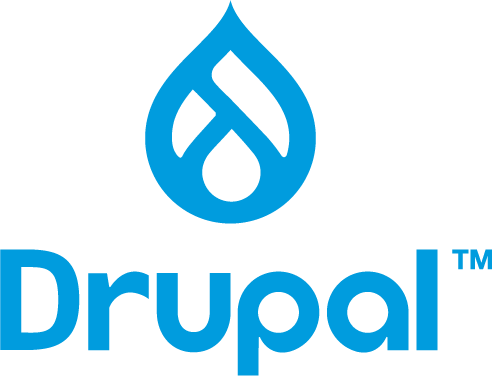

<h2 id="covertfollowingmarkdownintohtmlformatwithbeautifuleyecatchingtutorialpageintroductiontophp">Covert following mark down into html format with beautiful ,eye catching tutorial page,## Introduction to PHP</h2>

<p><br></p>

<div style="text-align:center">
<center><center>
<p style="text-align:center">
Rasmus Lerdorf
<p>
<p>(The Creator of PHP)</p>
</div>

<h1 id="11overviewofphp">1.1 Overview of PHP</h1>

<h2 id="whatisphp">What is PHP?</h2>

<p>PHP, which stands for <strong>PHP: Hypertext Preprocessor</strong>, is a widely-used open-source server-side scripting language primarily designed for web development. PHP code is embedded within HTML, making it a powerful tool for creating dynamic and interactive web pages.</p>

<h2 id="evolutionofphpfromphp1tophp8">Evolution of PHP: From PHP 1 to PHP 8</h2>

<p>PHP has evolved significantly since its inception in 1994, adapting to the needs of developers and the changing landscape of web development. Here is a detailed look at the evolution of PHP through its major versions.</p>

<h2 id="php1phpfi1995">PHP 1: PHP/FI (1995)</h2>

<ul>
<li><strong>Initial Release</strong>: PHP/FI (Personal Home Page / Forms Interpreter) was developed by Rasmus Lerdorf in 1994 and released publicly in 1995.</li>

<li><strong>Features</strong>: Initially created as a set of Common Gateway Interface (CGI) binaries written in C, PHP/FI provided basic functionality for building simple dynamic web applications, such as guest books.</li>

<li><strong>Usage</strong>: It could interpret form submissions and embed dynamic content into web pages, but it lacked many features found in modern versions of PHP.</li>
</ul>

<h2 id="php2phpfi21997">PHP 2: PHP/FI 2 (1997)</h2>

<ul>
<li><strong>Enhancements</strong>: PHP/FI 2 was a significant improvement over the initial release, adding support for more complex data types and basic templating.</li>

<li><strong>Introduction of Scripting</strong>: It introduced a primitive scripting language syntax, making it more versatile for developers to build dynamic web applications.</li>

<li><strong>Growing Popularity</strong>: By the time PHP/FI 2 was released, it was installed on about 1% of all domains on the internet.</li>
</ul>

<h2 id="php31998">PHP 3 (1998)</h2>

<ul>
<li><strong>Major Overhaul</strong>: PHP 3, released in 1998, was a complete rewrite of PHP/FI by Andi Gutmans and Zeev Suraski. This version laid the foundation for PHP as we know it today.</li>

<li><strong>New Features</strong>: 


<ul>
<li>Introduced a more extensible and modular architecture.</li>

<li>Added support for a wide variety of databases.</li>

<li>Introduced the <code>zend</code> scripting engine.</li></ul>
</li>

<li><strong>Widespread Adoption</strong>: PHP 3 gained rapid popularity due to its simplicity, flexibility, and ease of use, becoming the first widely adopted version of PHP.</li>
</ul>

<h2 id="php42000">PHP 4 (2000)</h2>

<ul>
<li><strong>Powered by Zend Engine 1.0</strong>: PHP 4, released in 2000, was built on the Zend Engine 1.0, which provided significant performance improvements and stability.</li>

<li><strong>New Features</strong>:


<ul>
<li>Improved support for HTTP sessions.</li>

<li>Introduction of output buffering.</li>

<li>Enhanced security features.</li>

<li>Better resource handling and more robust error handling.</li></ul>
</li>

<li><strong>Enterprise Adoption</strong>: The release of PHP 4 saw increased adoption by enterprise-level companies, which started using PHP for more substantial and more complex applications.</li>
</ul>

<h2 id="php52004">PHP 5 (2004)</h2>

<ul>
<li><strong>Powered by Zend Engine II</strong>: PHP 5, released in 2004, introduced the Zend Engine II, which brought enhanced performance and introduced the object-oriented programming (OOP) model in PHP.</li>

<li><strong>New Features</strong>:


<ul>
<li>Comprehensive support for OOP, including constructors, destructors, and exception handling.</li>

<li>Introduction of the PHP Data Objects (PDO) extension for database access.</li>

<li>Improved XML support with the SimpleXML and DOM extensions.</li>

<li>Introduction of the <code>mysqli</code> extension for MySQL databases.</li></ul>
</li>

<li><strong>Object-Oriented Programming</strong>: PHP 5's support for OOP made it more appealing for developers looking to build complex, scalable applications.</li>
</ul>

<h2 id="php6unreleased">PHP 6 (Unreleased)</h2>

<ul>
<li><strong>Goal</strong>: PHP 6 aimed to bring native Unicode support to PHP, making it easier to develop international applications.</li>

<li><strong>Challenges</strong>: The project faced significant difficulties due to performance issues and complexities in implementing Unicode support across all PHP features.</li>

<li><strong>Outcome</strong>: PHP 6 was never officially released. Many of its features were later backported into PHP 5.3, while others were abandoned or deferred.</li>
</ul>

<h2 id="php72015">PHP 7 (2015)</h2>

<ul>
<li><strong>Revolutionary Performance</strong>: PHP 7, released in 2015, was a major milestone that introduced the Zend Engine 3.0 (often called PHP-NG, or "Next Generation"). This version brought substantial performance improvements, with some applications running up to twice as fast as in PHP 5.6.</li>

<li><strong>New Features</strong>:


<ul>
<li>Introduction of scalar type declarations and return type declarations.</li>

<li>Introduction of the <code>null coalescing operator</code> (<code>??</code>).</li>

<li>Introduction of anonymous classes and spaceship operator (<code>&lt;=&gt;</code>).</li>

<li>Removal of deprecated features and old, unsupported SAPIs and extensions.</li></ul>
</li>

<li><strong>Memory Usage</strong>: PHP 7 also reduced memory consumption, making it more efficient for large-scale applications.</li>
</ul>

<h2 id="php82020">PHP 8 (2020)</h2>

<ul>
<li><strong>Latest Release</strong>: PHP 8, released in November 2020, builds upon the improvements of PHP 7, introducing new features and performance enhancements.</li>

<li><strong>New Features</strong>:


<ul>
<li><strong>Just-In-Time (JIT) Compilation</strong>: Provides significant performance improvements by compiling PHP bytecode into machine code at runtime.</li>

<li><strong>Union Types</strong>: Allow functions to accept multiple types for a single parameter.</li>

<li><strong>Attributes</strong>: Provide a way to add metadata to classes, methods, properties, etc., replacing PHPDoc annotations in many cases.</li>

<li><strong>Match Expression</strong>: A more concise and expressive alternative to <code>switch</code> statements.</li>

<li><strong>Named Arguments</strong>: Allow passing arguments to a function based on the parameter name rather than the order.</li>

<li><strong>Constructor Property Promotion</strong>: Reduces boilerplate code when initializing class properties.</li>

<li><strong>Error Handling Improvements</strong>: Improved error handling and diagnostics, including consistent type errors and the <code>@</code> error control operator's usage.</li></ul>
</li>

<li><strong>Improved Type System</strong>: PHP 8 continues to enhance the type system, making it more robust and helpful for developers in catching errors early.</li>
</ul>

<h2 id="conclusion">Conclusion</h2>

<p>From its humble beginnings as a simple set of tools for creating personal web pages to becoming one of the most widely used server-side scripting languages globally, PHP has undergone significant transformations. Each major version has introduced new features, improved performance, and expanded the language's capabilities, helping PHP adapt to modern web development needs. Today, PHP remains a powerful tool for building dynamic and scalable web applications, supported by a large community and a rich ecosystem of frameworks and tools.</p>

<p>PHP 8 represents the latest evolution of the language, bringing powerful new features and optimizations that make PHP development faster, more secure, and more expressive. As PHP continues to evolve, it remains a popular choice for developers worldwide, powering millions of websites and applications across the internet.</p>

<h2 id="featuresofphp">Features of PHP</h2>

<ul>
<li><p><strong>Open Source</strong>: PHP is free to use and its source code is publicly available, encouraging contributions from a large community of developers.</p></li>

<li><p><strong>Cross-Platform Compatibility</strong>: PHP runs on various platforms, including Windows, Linux, macOS, and Unix, making it versatile for different environments.</p></li>

<li><p><strong>Easy Integration</strong>: PHP easily integrates with HTML and supports a wide range of databases such as MySQL, PostgreSQL, Oracle, and SQLite.</p></li>

<li><p><strong>Server-Side Scripting</strong>: PHP code is executed on the server before being sent to the user's browser, ensuring security and efficiency.</p></li>

<li><p><strong>Flexibility</strong>: PHP supports various databases, web servers, and platforms, making it suitable for a wide range of web applications.</p></li>

<li><p><strong>Rich Library Support</strong>: PHP offers a vast collection of built-in libraries and extensions to simplify tasks such as file handling, database management, and data encryption.</p></li>

<li><p><strong>Object-Oriented Programming (OOP)</strong>: PHP supports OOP, which helps in building complex, reusable components, making code easier to manage and maintain.</p></li>
</ul>

<h1 id="whyphp">Why PHP?</h1>

<p>PHP has been a popular choice for web development for over two decades. Here are some reasons why PHP continues to be widely used:</p>

<h2 id="popularityandcommunitysupport">Popularity and Community Support</h2>

<h3 id="1extensivecommunitysupport">1. Extensive Community Support</h3>

<ul>
<li><strong>Large Developer Community</strong>: PHP has a vast community of developers who contribute to the language's development, create frameworks and libraries, and provide support through forums, blogs, and tutorials. This makes it easy to find solutions to problems and best practices.</li>

<li><strong>Rich Ecosystem</strong>: The PHP ecosystem includes a wide range of libraries, frameworks (like Laravel, Symfony, and CodeIgniter), and tools that help developers build robust and scalable applications more efficiently.</li>

<li><strong>Comprehensive Documentation</strong>: PHP has well-maintained and detailed documentation, which is continuously updated. This documentation is available in multiple languages and serves as an excellent resource for both beginners and experienced developers.</li>
</ul>

<h3 id="2popularity">2. Popularity</h3>

<ul>
<li><strong>Widespread Adoption</strong>: PHP powers over 75% of websites that use a server-side programming language, including popular platforms like WordPress, Joomla, and Drupal. Its widespread use has created a large demand for PHP developers in the job market.</li>

<li><strong>Support from Major Hosting Providers</strong>: Most web hosting providers support PHP by default, making it easy for developers to deploy PHP applications without needing special configurations or additional costs.</li>

<li><strong>Versatility</strong>: PHP is highly versatile and can be used to develop various types of applications, from simple scripts to complex enterprise-level applications. Its ability to easily integrate with different databases and front-end technologies makes it a flexible choice for developers.</li>
</ul>

<h3 id="3continuousevolution">3. Continuous Evolution</h3>

<ul>
<li><strong>Regular Updates</strong>: The PHP language is actively developed and regularly updated with new features, performance improvements, and security enhancements. This ensures that PHP remains relevant and competitive with other modern programming languages.</li>

<li><strong>Adaptability to Modern Web Development</strong>: PHP has evolved to support modern web development practices, including improved object-oriented programming, error handling, and the adoption of new language features like type declarations and just-in-time (JIT) compilation.</li>
</ul>

<h3 id="4opensource">4. Open Source</h3>

<ul>
<li><strong>Cost-Effective</strong>: PHP is free to use, which makes it a cost-effective solution for businesses and individuals looking to develop web applications. There are no licensing fees, and the open-source nature of PHP allows developers to customize and extend it as needed.</li>
</ul>

<h3 id="5easeoflearning">5. Ease of Learning</h3>

<ul>
<li><strong>Beginner-Friendly</strong>: PHP's syntax is relatively simple and easy to learn, especially for those new to programming. This has made it a popular choice for beginners looking to start their journey into web development.</li>

<li><strong>Extensive Learning Resources</strong>: Due to its popularity, there is a wealth of learning resources available for PHP, including tutorials, courses, books, and videos that cater to all skill levels.</li>
</ul>

<h2 id="conclusion-1">Conclusion</h2>

<p>PHP's popularity and strong community support make it an attractive choice for web developers. Its extensive ecosystem, ease of use, versatility, and regular updates ensure that PHP continues to be a relevant and powerful tool for building dynamic web applications. Whether you are a beginner or an experienced developer, PHP offers a robust platform to build web applications efficiently and effectively.</p>

<h1 id="usecasesandexamples">Use Cases and Examples</h1>

<h2 id="popularwebsitesusingphp">Popular Websites Using PHP</h2>

<h3 id="wordpress">🌐 <strong>WordPress</strong></h3>

<ul>
<li><strong>Description</strong>: WordPress is the most popular content management system (CMS) globally, powering over 40% of all websites. It provides an easy-to-use interface for creating and managing websites and blogs.</li>

<li><strong>Website</strong>: <a href="https://wordpress.org">wordpress.org</a></li>

<li><strong>Icon</strong>:<br/></li>
</ul>

<h3 id="magento">🛒 <strong>Magento</strong></h3>

<ul>
<li><strong>Description</strong>: Magento is a powerful open-source e-commerce platform known for its flexibility and scalability. It is used by many large retailers to manage online stores.</li>

<li><strong>Website</strong>: <a href="https://magento.com">magento.com</a></li>

<li><strong>Icon</strong>: <br/></li>
</ul>

<h3 id="drupal">📚 <strong>Drupal</strong></h3>

<ul>
<li><strong>Description</strong>: Drupal is another popular open-source CMS used for building complex websites and applications. It is known for its robustness and flexibility in handling various types of content.</li>

<li><strong>Website</strong>: <a href="https://www.drupal.org">drupal.org</a></li>

<li><strong>Icon</strong>:<br/></li>
</ul>

<h3 id="joomla">🏢 <strong>Joomla</strong></h3>

<ul>
<li><strong>Description</strong>: Joomla is a user-friendly CMS used for building websites and online applications. It offers a range of features and extensions for customizing and managing content.</li>

<li><strong>Website</strong>: <a href="https://www.joomla.org">joomla.org</a></li>

<li><strong>Icon</strong>: <br/></li>
</ul>

<h3 id="thehuffingtonpost">📰 <strong>The Huffington Post</strong></h3>

<ul>
<li><strong>Description</strong>: The Huffington Post, now known as HuffPost, is a major news and blog site. It uses PHP to handle dynamic content and large volumes of traffic.</li>

<li><strong>Website</strong>: <a href="https://www.huffpost.com">huffpost.com</a></li>

<li><strong>Icon</strong>: <br/></li>
</ul>

<h3 id="spotify">🎵 <strong>Spotify</strong></h3>

<ul>
<li><strong>Description</strong>: Spotify, a leading music streaming service, uses PHP for various components of its web platform to deliver music content to millions of users worldwide.</li>

<li><strong>Website</strong>: <a href="https://www.spotify.com">spotify.com</a></li>

<li><strong>Icon</strong>:<br/></li>
</ul>

<h3 id="flickr">🏥 <strong>Flickr</strong></h3>

<ul>
<li><strong>Description</strong>: Flickr, a popular photo-sharing service, uses PHP to manage and deliver large amounts of user-generated content efficiently.</li>

<li><strong>Website</strong>: <a href="https://www.flickr.com">flickr.com</a></li>

<li><strong>Icon</strong>: <br/></li>
</ul>

<h3 id="slack">🚀 <strong>Slack</strong></h3>

<ul>
<li><strong>Description</strong>: Slack, a widely used team collaboration and messaging tool, uses PHP to handle various aspects of its web application, including real-time messaging and integrations.</li>

<li><strong>Website</strong>: <a href="https://slack.com">slack.com</a></li>

<li><strong>Icon</strong>: <br/></li>
</ul>

<h3 id="twitch">🏆 <strong>Twitch</strong></h3>

<ul>
<li><strong>Description</strong>: Twitch, a leading live-streaming platform for gamers and content creators, utilizes PHP for various components of its website, including user management and content delivery.</li>

<li><strong>Website</strong>: <a href="https://www.twitch.tv">twitch.tv</a></li>

<li><strong>Icon</strong>: <br/></li>
</ul>

<h3 id="zillow">🏡 <strong>Zillow</strong></h3>

<ul>
<li><strong>Description</strong>: Zillow, a popular real estate and rental marketplace, uses PHP to handle its dynamic content and user interactions on its platform.</li>

<li><strong>Website</strong>: <a href="https://www.zillow.com">zillow.com</a></li>

<li><strong>Icon</strong>: <br/></li>
</ul>

<h3 id="mitopencourseware">🎓 <strong>MIT OpenCourseWare</strong></h3>

<ul>
<li><strong>Description</strong>: MIT OpenCourseWare provides free online courses and materials from the Massachusetts Institute of Technology. The site uses PHP to manage and deliver educational content.</li>

<li><strong>Website</strong>: <a href="https://ocw.mit.edu">ocw.mit.edu</a></li>

<li><strong>Icon</strong>: <br/></li>
</ul>

<h1 id="phpvsotherserversidelanguages">PHP vs Other Server-Side Languages</h1>

<h2 id="phpvspython">PHP vs Python</h2>

<h3 id="php">🔍 <strong>PHP</strong></h3>

<ul>
<li><p><strong>Strengths</strong>:</p>

<ul>
<li><strong>Web-Focused</strong>: PHP was designed specifically for web development, making it a strong choice for building dynamic web pages and applications.</li>

<li><strong>Wide Adoption</strong>: Widely used in web hosting environments, with many popular content management systems (CMS) like WordPress, Joomla, and Drupal built on PHP.</li>

<li><strong>Ease of Deployment</strong>: Most web servers and hosting providers support PHP out of the box.</li></ul></li>

<li><p><strong>Use Cases</strong>:</p>

<p><ul>
<li>Ideal for web development and creating content management systems.</li></p>

<p><li>Great for building server-side scripts and integrating with various databases.</li></ul>

<p></p>

<p></li>
</ul></p></p>

<h3 id="python">🐍 <strong>Python</strong></h3>

<ul>
<li><p><strong>Strengths</strong>:</p>

<ul>
<li><strong>Versatility</strong>: Python is a general-purpose language with extensive libraries for web development, data analysis, machine learning, and more.</li>

<li><strong>Readable Syntax</strong>: Known for its clean and readable syntax, which enhances productivity and maintainability.</li>

<li><strong>Frameworks</strong>: Popular frameworks like Django and Flask offer robust features for web development.</li></ul></li>

<li><p><strong>Use Cases</strong>:</p>

<p><ul>
<li>Best suited for applications requiring data processing, automation, and integration with AI or machine learning.</li></p>

<p><li>Excellent choice for web applications where readability and development speed are priorities.</li></ul>

<p></p>

<p></li>
</ul></p></p>

<h2 id="phpvsrubyonrails">PHP vs Ruby on Rails</h2>

<h3 id="php-1">🔍 <strong>PHP</strong></h3>

<ul>
<li><p><strong>Strengths</strong>:</p>

<ul>
<li><strong>Flexibility</strong>: PHP offers flexibility in coding styles and approaches, accommodating a variety of development needs.</li>

<li><strong>Community</strong>: Large community with extensive resources, plugins, and frameworks.</li></ul></li>

<li><p><strong>Use Cases</strong>:</p>

<p><ul>
<li>Suitable for building websites and web applications, particularly with existing PHP frameworks or CMS.</li></ul>

<p></p>

<p></li>
</ul></p></p>

<h3 id="rubyonrails">💎 <strong>Ruby on Rails</strong></h3>

<ul>
<li><p><strong>Strengths</strong>:</p>

<ul>
<li><strong>Convention Over Configuration</strong>: Rails follows the principle of "convention over configuration," which speeds up development by reducing the number of decisions developers need to make.</li>

<li><strong>Integrated Tools</strong>: Rails provides a comprehensive suite of tools and libraries, making it easy to build feature-rich applications quickly.</li></ul></li>

<li><p><strong>Use Cases</strong>:</p>

<p><ul>
<li>Ideal for rapid development of web applications and startups looking to build MVPs (Minimum Viable Products) quickly.</li></p>

<p><li>Great for applications requiring a strong focus on developer productivity and clean code.</li></ul>

<p></p>

<p></li>
</ul></p></p>

<h2 id="phpvsjavascriptnodejs">PHP vs JavaScript (Node.js)</h2>

<h3 id="php-2">🔍 <strong>PHP</strong></h3>

<ul>
<li><p><strong>Strengths</strong>:</p>

<ul>
<li><strong>Server-Side Scripting</strong>: Well-suited for server-side scripting with strong integration into web servers and databases.</li>

<li><strong>Established Ecosystem</strong>: Mature ecosystem with many libraries and tools for web development.</li></ul></li>

<li><p><strong>Use Cases</strong>:</p>

<p><ul>
<li>Perfect for traditional server-side web development tasks and integrating with existing web technologies.</li></ul>

<p></p>

<p></li>
</ul></p></p>

<h3 id="javascriptnodejs">🟢 <strong>JavaScript (Node.js)</strong></h3>

<ul>
<li><p><strong>Strengths</strong>:</p>

<ul>
<li><strong>Unified Language</strong>: Node.js allows developers to use JavaScript for both server-side and client-side development, streamlining the development process.</li>

<li><strong>Asynchronous Processing</strong>: Built on an event-driven, non-blocking I/O model, making it ideal for building scalable and high-performance applications.</li></ul></li>

<li><p><strong>Use Cases</strong>:</p>

<p><ul>
<li>Best for building real-time applications, such as chat applications or live data streaming services.</li></p>

<p><li>Ideal for applications requiring high concurrency and performance, with a unified language stack.</li></ul>

<p></p>

<p></li>
</ul></p></p>

<h2 id="phpvsaspnet">PHP vs ASP.NET</h2>

<h3 id="php-3">🔍 <strong>PHP</strong></h3>

<ul>
<li><p><strong>Strengths</strong>:</p>

<ul>
<li><strong>Open Source</strong>: Free to use and deploy, with extensive community support and documentation.</li>

<li><strong>Platform Independence</strong>: Runs on various platforms, including Linux and Windows.</li></ul></li>

<li><p><strong>Use Cases</strong>:</p>

<p><ul>
<li>Suitable for a wide range of web applications, from small websites to large-scale applications.</li></ul>

<p></p>

<p></li>
</ul></p></p>

<h3 id="aspnet">🖥️ <strong>ASP.NET</strong></h3>

<ul>
<li><p><strong>Strengths</strong>:</p>

<ul>
<li><strong>Integration with Microsoft Technologies</strong>: Works seamlessly with other Microsoft products and services, providing a robust framework for enterprise applications.</li>

<li><strong>Performance</strong>: High performance with features like just-in-time (JIT) compilation and native integration with the .NET ecosystem.</li></ul></li>

<li><p><strong>Use Cases</strong>:</p>

<p><ul>
<li>Ideal for building enterprise-level applications, intranet solutions, and applications that need to integrate with other Microsoft services.</li></p>

<p><li>Great for applications requiring a structured, enterprise-oriented development environment.</li></ul>

<p></p>

<p></li>
</ul></p></p>

<h1 id="settingupthephpenvironment">Setting Up the PHP Environment</h1>

<h2 id="installingphp">🌐 <strong>Installing PHP</strong></h2>

<p>Getting started with PHP involves setting up your environment. Here's a step-by-step guide to installing PHP on different operating systems:</p>

<h3 id="installingphponwindows">🖥️ <strong>Installing PHP on Windows</strong></h3>

<ol>
<li><p><strong>Download PHP</strong>:</p>

<ul>
<li>Visit the <a href="https://windows.php.net/download/">official PHP downloads page</a> to get the latest PHP version.</li>

<li>Choose the <strong>Thread Safe</strong> version if you are using Apache or the <strong>Non-Thread Safe</strong> version for other servers like IIS.</li></ul></li>

<li><p><strong>Extract the Files</strong>:</p>

<ul>
<li>Download the ZIP file and extract it to a directory, for example, <code>C:\php</code>.</li></ul></li>

<li><p><strong>Configure PHP</strong>:</p>

<ul>
<li>Rename <code>php.ini-development</code> to <code>php.ini</code>.</li>

<li>Open <code>php.ini</code> with a text editor and configure necessary settings (e.g., setting the <code>extension_dir</code>).</li></ul></li>

<li><p><strong>Update System PATH</strong>:</p>

<ul>
<li>Add the PHP directory (<code>C:\php</code>) to your system PATH environment variable to run PHP commands from anywhere.</li></ul></li>

<li><p><strong>Verify Installation</strong>:</p>

<p><ul>
<li>Open Command Prompt and type <code>php -v</code> to check if PHP is correctly installed and working.</li></ul></p></li>
</ol>

<h3 id="installingphponmac">🍏 <strong>Installing PHP on Mac</strong></h3>

<ol>
<li><p><strong>Using Homebrew</strong>:</p>

<ul>
<li><strong>Install Homebrew</strong> (if not already installed): Open Terminal and run the following command:
<code>bash
/bin/bash -c "$(curl -fsSL https://raw.githubusercontent.com/Homebrew/install/HEAD/install.sh)"
</code></li>

<li><strong>Install PHP</strong>: Run the following command to install PHP using Homebrew:
<code>bash
brew install php
</code></li></ul></li>

<li><p><strong>Verify Installation</strong>:</p>

<p><ul>
<li>After installation, check PHP version by running:
<code>bash
php -v
</code></li></ul></p></li>
</ol>

<h3 id="installingphponlinux">🐧 <strong>Installing PHP on Linux</strong></h3>

<ol>
<li><p><strong>Using Package Manager</strong>:</p>

<ul>
<li><p><strong>For Debian/Ubuntu-based Systems</strong>:</p>

<ul>
<li>Open Terminal and update package list:</li></ul>

<pre><code class="bash language-bash">sudo apt-get update
</code></pre>

<ul>
<li>Install PHP:</li></ul>

<pre><code class="bash language-bash">sudo apt-get install php
</code></pre></li>

<li><p><strong>For Red Hat/CentOS-based Systems</strong>:</p>

<p><ul>
<li>Open Terminal and install PHP:
<code>bash
sudo yum install php
</code></li></ul>

<p></p></li></ul></p></li>

<li><p><strong>Verify Installation</strong>:</p>

<p><ul>
<li>Check the installed PHP version by running:
<code>bash
php -v
</code></li></ul></p></li>
</ol>

<h3 id="configurationtips">🛠️ <strong>Configuration Tips</strong></h3>

<ul>
<li><strong>Adjust <code>php.ini</code></strong>: Depending on your project needs, you might need to adjust settings in <code>php.ini</code>, such as <code>max_execution_time</code>, <code>memory_limit</code>, and <code>upload_max_filesize</code>.</li>

<li><strong>Restart Server</strong>: If you're using a web server like Apache or Nginx, restart it after making changes to the PHP configuration to apply the new settings.</li>
</ul>

<h1 id="settingupalocalserver">Setting Up a Local Server</h1>

<p>Setting up a local server is essential for developing and testing web applications on your own machine. Here's a guide to three popular local server solutions and an introduction to the LAMP stack.</p>

<h2 id="installingandconfiguringxampp">🚀 <strong>Installing and Configuring XAMPP</strong></h2>

<h3 id="whatisxampp">🌟 <strong>What is XAMPP?</strong></h3>

<p>XAMPP is a free and open-source cross-platform web server solution that includes Apache, MySQL, PHP, and Perl. It simplifies the setup process for a local server environment.</p>

<h3 id="installationsteps">🛠️ <strong>Installation Steps</strong>:</h3>

<ol>
<li><p><strong>Download XAMPP</strong>:</p>

<ul>
<li>Go to the <a href="https://www.apachefriends.org/index.html">XAMPP website</a>.</li>

<li>Download the version compatible with your operating system (Windows, macOS, or Linux).</li></ul></li>

<li><p><strong>Install XAMPP</strong>:</p>

<ul>
<li>Run the installer and follow the installation wizard.</li>

<li>Choose the components you want to install (Apache, MySQL, PHP, etc.).</li></ul></li>

<li><p><strong>Start the Server</strong>:</p>

<ul>
<li>Open the XAMPP Control Panel.</li>

<li>Start the Apache and MySQL services by clicking "Start" next to each service.</li></ul></li>

<li><p><strong>Verify Installation</strong>:</p>

<p><ul>
<li>Open your web browser and go to <code>http://localhost/</code>.</li></p>

<p><li>You should see the XAMPP welcome page indicating that the server is running.</li></ul></p></li>
</ol>

<h2 id="installingandconfiguringwamp">🌐 <strong>Installing and Configuring WAMP</strong></h2>

<h3 id="whatiswamp">🌟 <strong>What is WAMP?</strong></h3>

<p>WAMP stands for Windows, Apache, MySQL, and PHP. It is a Windows-based solution for setting up a local server environment.</p>

<h3 id="installationsteps-1">🛠️ <strong>Installation Steps</strong>:</h3>

<ol>
<li><p><strong>Download WAMP</strong>:</p>

<ul>
<li>Visit the <a href="http://www.wampserver.com/en/">WAMP website</a>.</li>

<li>Download the latest version compatible with your Windows OS.</li></ul></li>

<li><p><strong>Install WAMP</strong>:</p>

<ul>
<li>Run the installer and follow the setup instructions.</li>

<li>Choose the installation directory and components.</li></ul></li>

<li><p><strong>Start the Server</strong>:</p>

<ul>
<li>Launch WAMP from the Start Menu.</li>

<li>The WAMP icon in the system tray should turn green, indicating that the server is running.</li></ul></li>

<li><p><strong>Verify Installation</strong>:</p>

<p><ul>
<li>Open your browser and navigate to <code>http://localhost/</code>.</li></p>

<p><li>You should see the WAMP server home page, confirming that everything is set up correctly.</li></ul></p></li>
</ol>

<h2 id="installingandconfiguringmamp">🍏 <strong>Installing and Configuring MAMP</strong></h2>

<h3 id="whatismamp">🌟 <strong>What is MAMP?</strong></h3>

<p>MAMP is a free, open-source local server solution for macOS and Windows. It includes Apache, MySQL, and PHP.</p>

<h3 id="installationsteps-2">🛠️ <strong>Installation Steps</strong>:</h3>

<ol>
<li><p><strong>Download MAMP</strong>:</p>

<ul>
<li>Go to the <a href="https://www.mamp.info/en/">MAMP website</a>.</li>

<li>Download the latest version for macOS or Windows.</li></ul></li>

<li><p><strong>Install MAMP</strong>:</p>

<ul>
<li>Run the installer and follow the on-screen instructions.</li>

<li>Choose the components and destination folder.</li></ul></li>

<li><p><strong>Start the Server</strong>:</p>

<ul>
<li>Open the MAMP application.</li>

<li>Click "Start Servers" to launch Apache and MySQL.</li></ul></li>

<li><p><strong>Verify Installation</strong>:</p>

<p><ul>
<li>Open your browser and go to <code>http://localhost:8888/</code>.</li></p>

<p><li>You should see the MAMP start page, which confirms that your server is running.</li></ul></p></li>
</ol>

<h2 id="introductiontolampstacklinuxapachemysqlphp">🖥️ <strong>Introduction to LAMP Stack (Linux, Apache, MySQL, PHP)</strong></h2>

<h3 id="whatislamp">🌟 <strong>What is LAMP?</strong></h3>

<p>LAMP is an acronym for Linux, Apache, MySQL, and PHP. It is a popular stack used to build and deploy web applications on a Linux operating system.</p>

<h3 id="components">🔧 <strong>Components</strong>:</h3>

<ol>
<li><strong>Linux</strong>: The operating system that serves as the foundation of the LAMP stack.</li>

<li><strong>Apache</strong>: The web server software that handles HTTP requests and serves web pages.</li>

<li><strong>MySQL</strong>: The database management system used to store and manage data.</li>

<li><strong>PHP</strong>: The server-side scripting language that interacts with Apache and MySQL to create dynamic web content.</li>
</ol>

<h3 id="settinguplamp">🛠️ <strong>Setting Up LAMP</strong>:</h3>

<ol>
<li><strong>Install Linux</strong>: Choose a Linux distribution like Ubuntu or CentOS and install it on your server.</li>

<li><strong>Install Apache</strong>:


<ul>
<li>Use the package manager to install Apache (<code>sudo apt install apache2</code> for Ubuntu).</li></ul>
</li>

<li><strong>Install MySQL</strong>:


<ul>
<li>Install MySQL server using the package manager (<code>sudo apt install mysql-server</code> for Ubuntu).</li></ul>
</li>

<li><strong>Install PHP</strong>:


<ul>
<li>Install PHP and required modules (<code>sudo apt install php libapache2-mod-php php-mysql</code> for Ubuntu).</li></ul>
</li>

<li><strong>Configure Apache</strong>:


<ul>
<li>Edit the Apache configuration files to support PHP (<code>/etc/apache2/mods-enabled/dir.conf</code>).</li></ul>
</li>

<li><strong>Verify Installation</strong>:


<ul>
<li>Create a PHP info file (<code>/var/www/html/info.php</code>) with <code>&lt;?php phpinfo(); ?&gt;</code> to check the PHP configuration.</li></ul>
</li>
</ol>

<h1 id="configuringphp">Configuring PHP</h1>

<h2 id="editingthephpinifile">🛠️ Editing the <code>php.ini</code> File</h2>

<p>The <code>php.ini</code> file is the main configuration file for PHP. It controls various settings that affect PHP's behavior. Here’s how to edit it effectively:</p>

<h3 id="locatingthephpinifile">🔧 <strong>Locating the <code>php.ini</code> File</strong></h3>

<ul>
<li><p><strong>Default Locations</strong>:</p>

<ul>
<li><strong>Linux/Mac</strong>: <code>/etc/php/7.x/cli/php.ini</code> or <code>/etc/php/7.x/apache2/php.ini</code></li>

<li><strong>Windows</strong>: <code>C:\Program Files\PHP\php.ini</code> or <code>C:\Windows\php.ini</code></li></ul></li>

<li><p><strong>Find the File</strong>: Use <code>phpinfo()</code> function to locate the loaded configuration file by creating a <code>phpinfo.php</code> file with the following content:<pre><code class="php language-php">&lt;?php phpinfo(); ?&gt;
  Access this file through your browser, and look for the Loaded Configuration File section.   &lt;/p&gt;&lt;/li&gt;
&lt;/ul&gt;

&lt;h3 id="editingthefile"&gt;✍️ Editing the File&lt;/h3&gt;

&lt;ul&gt;
&lt;li&gt;&lt;p&gt;&lt;strong&gt;1.Open the File: Use a text editor like Notepad++ (Windows) or nano/vi (Linux) to open php.ini.&lt;/strong&gt;&lt;/p&gt;&lt;/li&gt;

&lt;li&gt;&lt;p&gt;&lt;strong&gt;2.Make Changes: Modify settings as needed. For example:&lt;/strong&gt;&lt;/p&gt;

&lt;p&gt;```&lt;/p&gt;

&lt;ul&gt;
&lt;li&gt;&lt;p&gt;To change the upload file size limit&lt;/p&gt;

&lt;p&gt;upload&lt;em&gt;max&lt;/em&gt;filesize = 10M&lt;/p&gt;&lt;/li&gt;

&lt;li&gt;&lt;p&gt;To set the default timezone:&lt;/p&gt;

&lt;p&gt;date.timezone = "America/New_York"&lt;/p&gt;&lt;/li&gt;&lt;/ul&gt;&lt;/li&gt;

&lt;li&gt;&lt;p&gt;&lt;strong&gt;3.Save and Restart: After editing, save the file and restart your web server (e.g., Apache or Nginx) to apply changes.&lt;/strong&gt;&lt;/p&gt;&lt;/li&gt;
&lt;/ul&gt;

&lt;h2 id="understandingphpconfigurationsettings"&gt;🔍 Understanding PHP Configuration Settings&lt;/h2&gt;

&lt;p&gt;PHP configuration settings control various aspects of how PHP operates. Here are some key settings:&lt;/p&gt;

&lt;h3 id="basicsettings"&gt;🧩 Basic Settings&lt;/h3&gt;

<pre><code>- memory_limit: Controls the maximum amount of memory a script can use.

     memory_limit = 128M

- max_execution_time: Sets the maximum time (in seconds) a script is allowed to run.

     max_execution_time = 30

- post_max_size: Defines the maximum size of POST data that PHP will accept.

     post_max_size = 8M
</code></pre>

&lt;h3 id="securitysettings"&gt;🔐 Security Settings&lt;/h3&gt;

<pre><code>display_errors: Controls whether errors are displayed to users. This should be set to Off in production environments to avoid exposing sensitive information.

    display_errors = Off

expose_php: Determines whether PHP version is exposed in HTTP headers. It’s often set to Off for security reasons.

    expose_php = Off
</code></pre>

&lt;h2 id="configuringerrorreportinganddisplayerrors"&gt;🚨 Configuring Error Reporting and Display Errors&lt;/h2&gt;

&lt;p&gt;Proper error reporting and handling are crucial for debugging and maintaining your PHP applications.&lt;/p&gt;

&lt;h3 id="errorreporting"&gt;📈 Error Reporting&lt;/h3&gt;

<pre><code>    1. Enable Error Reporting: Set the error_reporting directive to control which errors    are reported.

        error_reporting = E_ALL

    This setting reports all types of errors, including notices, warnings, and fatal errors.

    2. Modify at Runtime: You can also set error reporting in your script for testing purposes:

        &amp;lt;?php
            error_reporting(E_ALL);
            ini_set('display_errors', 1);
        ?&amp;gt;
</code></pre>

&lt;h3 id="displayerrors"&gt;🛑 Display Errors&lt;/h3&gt;

&lt;ul&gt;
&lt;li&gt;&lt;strong&gt;Display Errors in Development:&lt;/strong&gt;
For development environments, you may want to display errors directly on the page. 
&lt;code&gt;
 display_errors = On
&lt;/code&gt; &lt;/li&gt;

&lt;li&gt;&lt;strong&gt;Disable Display Errors in Production:&lt;/strong&gt;
For production environments, it's safer to log errors to a file rather than displaying them to users.
&lt;code&gt;
 display_errors = Off
 log_errors = On
 error_log = /path/to/php_error.log
&lt;/code&gt;&lt;/li&gt;
&lt;/ul&gt;

&lt;h2 id="13writingandrunningyourfirstphpscript"&gt;1.3 Writing and Running Your First PHP Script&lt;/h2&gt;

&lt;h3 id="embeddingphpinhtml"&gt;🌟 Embedding PHP in HTML&lt;/h3&gt;

&lt;h4 id="basicphptags"&gt;📜 &lt;strong&gt;Basic PHP Tags&lt;/strong&gt;&lt;/h4&gt;

&lt;p&gt;PHP scripts are embedded within HTML using the following tags:&lt;/p&gt;

<pre><code class="php language-php">&amp;lt;?php
// PHP code goes here
?&amp;gt;
</code></pre>

&lt;p&gt;&lt;li&gt; Opening Tag: &lt;?php — Indicates the start of a PHP script.&lt;/li&gt;
&lt;li&gt; Closing Tag: ?&gt; — Marks the end of a PHP script (optional in many cases)&lt;/li&gt;&lt;/p&gt;

&lt;h4 id="shorttagsandtheirusage"&gt;🔖 Short Tags and Their Usage&lt;/h4&gt;

&lt;p&gt;Short tags offer a more concise way to embed PHP code:&lt;/p&gt;

<pre><code>&amp;lt;? // PHP code goes here ?&amp;gt;
</code></pre>

&lt;h4 id="phpsyntaxbasics"&gt;🗂️ PHP Syntax Basics&lt;/h4&gt;

&lt;p&gt;🅰️ Case Sensitivity&lt;/p&gt;

&lt;p&gt;&lt;li&gt;&lt;b&gt;Variables:&lt;/b&gt; PHP variable names are case-sensitive. For example, $variable and $Variable are different variables.&lt;/li&gt;
&lt;li&gt;&lt;b&gt;Functions and Keywords:&lt;/b&gt; PHP function names and keywords are case-insensitive. For example, &lt;code&gt;echo&lt;/code&gt;, &lt;code&gt;Echo&lt;/code&gt;, and &lt;code&gt;ECHO&lt;/code&gt; are all valid.&lt;/li&gt;&lt;/p&gt;

&lt;p&gt;💬 Comments in PHP
Comments are crucial for documenting your code. PHP supports two types of comments:&lt;/p&gt;

&lt;p&gt;&lt;li&gt;
    &lt;b&gt;Single-Line Comments:&lt;/b&gt;&lt;/p&gt;

<pre><code> // This is a single-line comment
</code></pre>

&lt;p&gt;&lt;/li&gt;&lt;/p&gt;

&lt;p&gt;&lt;li&gt;
    &lt;b&gt;Multi-Line Comments :&lt;/b&gt;&lt;/p&gt;

<pre><code>/*
* This is a multi-line comment
* It spans multiple lines
*/
</code></pre>

&lt;p&gt;&lt;/li&gt;&lt;/p&gt;

&lt;h2 id="executingphpscripts"&gt;🚀 Executing PHP Scripts&lt;/h2&gt;

&lt;h3 id="runningphpscriptsinthebrowser"&gt;🌐 Running PHP Scripts in the Browser&lt;/h3&gt;

&lt;ol&gt;
&lt;li&gt;
Save Your Script: Save your PHP file with a .php extension, for example, index.php.
&lt;/li&gt;
&lt;li&gt;
Set Up a Local Server: Use a local server environment like XAMPP, WAMP, or MAMP.
&lt;/li&gt;
&lt;li&gt;
Access via Browser: Navigate to http://localhost/index.php to view your PHP script in action.
&lt;/li&gt;
&lt;/ol&gt;

&lt;h3 id="commandlineexecutionofphpscripts"&gt;💻 Command-Line Execution of PHP Scripts&lt;/h3&gt;

&lt;ol&gt;
&lt;li&gt;&lt;b&gt;Open Terminal:&lt;/b&gt; Access the command-line interface (CLI).&lt;/li&gt;
&lt;li&gt;
    &lt;b&gt;Run the Script:&lt;/b&gt; Execute your PHP script using the php command:

      php /path/to/your/script.php 

&lt;li&gt;&lt;b&gt;View Output:&lt;/b&gt; The output of your script will be displayed in the terminal.&lt;/li&gt;
&lt;/ol&gt;

&lt;h1 id="2basicphpconcepts"&gt;2. Basic PHP Concepts&lt;/h1&gt;

&lt;h2 id="21variablesanddatatypes"&gt;🧩 2.1 Variables and Data Types&lt;/h2&gt;

&lt;h3 id="211declaringvariables"&gt;📦 2.1.1 Declaring Variables&lt;/h3&gt;

&lt;p&gt;In PHP, variables are essential for storing and manipulating data. Let’s dive into how to declare and initialize them effectively.&lt;/p&gt;

&lt;h3 id="rulesforvariablenaming"&gt;🖋️ &lt;strong&gt;Rules for Variable Naming&lt;/strong&gt;&lt;/h3&gt;

&lt;p&gt;When naming variables in PHP, adhere to the following rules:&lt;/p&gt;

&lt;ul&gt;
&lt;li&gt;&lt;p&gt;&lt;strong&gt;Start with a Dollar Sign&lt;/strong&gt;: All PHP variables begin with the dollar sign (&lt;code&gt;$&lt;/code&gt;).
</code></pre>php
$variableName;</p></li>

<li><p><strong>Begin with a Letter or Underscore:</strong>: Variable names must start with a letter (a-z, A-Z) or an underscore (<em>), but not a number.<pre><code class="php language-php">$myVariable;     // Valid
$&lt;/em&gt;myVariable;    // Valid
$1myVariable;    // Invalid&lt;/p&gt;&lt;/li&gt;

&lt;li&gt;&lt;p&gt;&lt;strong&gt;Followed by Letters, Numbers, or Underscores:&lt;/strong&gt;: After the initial character, variable names can include letters, numbers, and underscores.
</code></pre>php 
$variable1;       // Valid
$variable_name;   // Valid
$VariableName;    // Valid</p></li>

<li><p><strong>Case Sensitivity:</strong>: PHP variable names are case-sensitive. $Variable and $variable are different variables.<pre><code class="php language-php">$Variable = "Hello";
$variable = "World";&lt;/p&gt;&lt;/li&gt;

&lt;li&gt;&lt;p&gt;&lt;strong&gt;No Spaces:&lt;/strong&gt;: Spaces are not allowed in variable names. Use underscores or camelCase instead.
</code></pre>php
$my_variable;      // Valid
$myVariable;       // Valid</p></li>
</ul>

<p>🌟 Initializing Variables</p>

<p>Initialization of variables involves assigning them an initial value. This is crucial for avoiding errors and ensuring that variables have meaningful data from the start.</p>

<ul>
<li><p><strong>Basic Assignment:</strong>: <pre><code class="php language-php">$greeting = "Hello, World!";&lt;/p&gt;&lt;/li&gt;

&lt;li&gt;&lt;p&gt;&lt;strong&gt;Multiple Initializations:&lt;/strong&gt;: 
</code></pre>php
$name = "Alice";
$age = 25;
$isStudent = true;</p>

<p>In this example:
    $name is a string.
    $age is an integer.
    $isStudent is a boolean.</p></li>

<li><p><strong>Dynamic Assignment:</strong>: 
Variables can also be assigned values dynamically based on conditions or computations.<pre><code class="php language-php">$number = 10;
$result = $number * 5;  // $result will be 50&lt;/p&gt;&lt;/li&gt;
&lt;/ul&gt;

&lt;h3 id="example"&gt;🎨 Example&lt;/h3&gt;

&lt;p&gt;Here’s a complete example demonstrating variable declaration and initialization in PHP:&lt;/p&gt;

<pre><code class="php language-php">&amp;lt;?php
// Declaring and initializing variables
$firstName = "John";
$lastName = "Doe";
$age = 30;
$isEmployed = true;

// Outputting the values
echo "Name: " . $firstName . " " . $lastName . "&amp;lt;br&amp;gt;";
echo "Age: " . $age . "&amp;lt;br&amp;gt;";
echo "Employed: " . ($isEmployed ? "Yes" : "No");
?&amp;gt;
</code></pre>

&lt;h2 id="212phpdatatypes"&gt;📊 2.1.2 PHP Data Types&lt;/h2&gt;

&lt;p&gt;Understanding PHP data types is crucial for effective programming. PHP supports several data types, which can be categorized into scalar types, compound types, and special types.&lt;/p&gt;

&lt;h3 id="scalartypes"&gt;🔢 Scalar Types&lt;/h3&gt;

&lt;p&gt;Scalar types represent single values. They are the most basic data types in PHP.&lt;/p&gt;

&lt;h3 id="1string"&gt;1. &lt;strong&gt;String&lt;/strong&gt; 💬&lt;/h3&gt;

&lt;ul&gt;
&lt;li&gt;&lt;strong&gt;Definition&lt;/strong&gt;: A sequence of characters enclosed in single (&lt;code&gt;'&lt;/code&gt;) or double (&lt;code&gt;"&lt;/code&gt;) quotes.&lt;/li&gt;

&lt;li&gt;&lt;strong&gt;Example&lt;/strong&gt;:
&lt;code&gt;php
$greeting = "Hello, World!";
&lt;/code&gt;&lt;/li&gt;

&lt;li&gt;&lt;strong&gt;Features:&lt;/strong&gt;


&lt;ul&gt;
&lt;li&gt;&lt;strong&gt;1. Can include letters, numbers, and special characters.&lt;/strong&gt;&lt;/li&gt;

&lt;li&gt;&lt;strong&gt;2. Supports various string operations like concatenation and interpolation.&lt;/strong&gt;&lt;/li&gt;&lt;/ul&gt;
&lt;/li&gt;
&lt;/ul&gt;

&lt;h3 id="2integer"&gt;2. &lt;strong&gt;Integer&lt;/strong&gt; 🔢&lt;/h3&gt;

&lt;ul&gt;
&lt;li&gt;&lt;strong&gt;Definition: Whole numbers without any decimal points.&lt;/strong&gt;&lt;/li&gt;

&lt;li&gt;&lt;strong&gt;Example:&lt;/strong&gt;
&lt;code&gt;php
$age = 25;
&lt;/code&gt;&lt;/li&gt;

&lt;li&gt;&lt;strong&gt;Features:&lt;/strong&gt;
Often used in conditional statements and loops.&lt;/li&gt;
&lt;/ul&gt;

&lt;h3 id="compoundtypes"&gt;🗂️ Compound Types&lt;/h3&gt;

&lt;p&gt;Compound types are used to store multiple values in a single variable.&lt;/p&gt;

&lt;h3 id="1array"&gt;&lt;strong&gt;1. Array 🗃️&lt;/strong&gt;&lt;/h3&gt;

&lt;ul&gt;
&lt;li&gt;&lt;strong&gt;Definition:&lt;/strong&gt; A collection of values indexed by keys.&lt;/li&gt;

&lt;li&gt;&lt;strong&gt;Example:&lt;/strong&gt;
</code></pre>php
 $colors = array("Red", "Green", "Blue");</li>

<li><strong>Features</strong>


<ul>
<li>Can be indexed (numeric) or associative (key-value pairs).</li>

<li>Supports various functions to manipulate and access elements. </li></ul>
</li>
</ul>

<h3 id="2object"><strong>2. Object 🧩</strong></h3>

<ul>
<li><p><strong>Definition:</strong> An instance of a class that can contain properties and methods.</p></li>

<li><p><strong>Example:</strong><pre><code class="php language-php">class Person{
public $name;
public function greet() {
    return "Hello, " . $this-&gt;name;
}
}
$person = new Person();
$person-&gt;name = "John";
echo $person-&gt;greet();&lt;/p&gt;&lt;/li&gt;

&lt;li&gt;&lt;p&gt;&lt;strong&gt;Features&lt;/strong&gt;&lt;/p&gt;

&lt;p&gt;&lt;ul&gt;
&lt;li&gt;Enables object-oriented programming.&lt;/li&gt;&lt;/p&gt;

&lt;p&gt;&lt;li&gt;Supports encapsulation, inheritance, and polymorphism.&lt;/li&gt;&lt;/ul&gt;

&lt;p&gt;&lt;/p&gt;&lt;/li&gt;
&lt;/ul&gt;&lt;/p&gt;

&lt;h3 id="3callable"&gt;&lt;strong&gt;3.Callable 📞&lt;/strong&gt;&lt;/h3&gt;

&lt;ul&gt;
&lt;li&gt;&lt;p&gt;&lt;strong&gt;Definition:&lt;/strong&gt; A type that represents a callable function or method.&lt;/p&gt;&lt;/li&gt;

&lt;li&gt;&lt;p&gt;&lt;strong&gt;Example:&lt;/strong&gt;
</code></pre>php
function sayHello(){
return "Hello!";
}
$function = "sayHello";
echo $function(); // Calls sayHello() function</p></li>

<li><p><strong>Features</strong></p>

<p><ul>
<li>Can be a function name, an array with an object and method name, or a closure.</li></p>

<p><li>Useful for dynamic function calls and callback functions.</li></ul>

<p></p>

<p></li>
</ul></p></p>

<h3 id="specialtypes">🔮 Special Types</h3>

<p>Special types have unique roles and characteristics.</p>

<h3 id="1null"><strong>1. NULL 🚫</strong></h3>

<ul>
<li><p><strong>Definition:</strong> Represents a variable with no value.</p></li>

<li><p><strong>Example:</strong><pre><code class="php language-php">$var = NULL;&lt;/p&gt;&lt;/li&gt;

&lt;li&gt;&lt;p&gt;&lt;strong&gt;Features&lt;/strong&gt;&lt;/p&gt;

&lt;p&gt;&lt;ul&gt;
&lt;li&gt;Often used to signify an absent or undefined value.&lt;/li&gt;&lt;/p&gt;

&lt;p&gt;&lt;li&gt;Checking for NULL can help in conditional logic.&lt;/li&gt;&lt;/ul&gt;

&lt;p&gt;&lt;/p&gt;&lt;/li&gt;
&lt;/ul&gt;&lt;/p&gt;

&lt;h3 id="2resource"&gt;&lt;strong&gt;2. Resource 🗄️&lt;/strong&gt;&lt;/h3&gt;

&lt;ul&gt;
&lt;li&gt;&lt;p&gt;&lt;strong&gt;Definition:&lt;/strong&gt; A special variable that holds a reference to an external resource, like a database connection.&lt;/p&gt;&lt;/li&gt;

&lt;li&gt;&lt;p&gt;&lt;strong&gt;Example:&lt;/strong&gt;
</code></pre>php
$connection = mysqli_connect("localhost", "user", "password", "database");</p></li>

<li><p><strong>Features</strong></p>

<ul>
<li>Typically used for handling file operations, database connections, etc.</li>

<li>Cannot be directly manipulated like other data types.</li></ul></li>
</ul>

<p>🌈 Conclusion
PHP’s data types are essential for defining and manipulating variables effectively. Scalar types are fundamental for single values, compound types are used for collections and objects, and special types handle unique cases. Understanding these types is key to mastering PHP programming.</p>

<p>--</p>

<h2 id="213typejugglingandtypecastinginphp">🎨 <em>* 2.1.3 Type Juggling and Type Casting in PHP</em>*</h2>

<p>PHP, being a loosely typed language, provides flexibility with variable types and how they can be manipulated. This is due to PHP's dynamic type system that automatically converts data types based on the context in which a variable is used. Understanding <strong>Type Juggling</strong> (implicit conversion) and <strong>Type Casting</strong> (explicit conversion) is crucial for writing effective PHP code. Let's explore these concepts in detail!</p>

<h3 id="implicittypeconversiontypejuggling">🌀 <strong>Implicit Type Conversion (Type Juggling)</strong></h3>

<p><strong>Type Juggling</strong> refers to the automatic conversion of data types by PHP. When a variable is used in different contexts, PHP implicitly changes its type to match the required operation.</p>

<h4 id="howimplicittypeconversionworks">🔍 <strong>How Implicit Type Conversion Works</strong></h4>

<p>Implicit type conversion occurs in various scenarios:</p>

<ul>
<li><p><strong>Arithmetic Operations</strong>: When a string that contains numeric data is used in arithmetic operations, PHP converts the string to a number.<pre><code class="php language-php">$a = "10";  // $a is a string
$b = $a + 5; // $b is now 15 (integer)&lt;/p&gt;

&lt;p&gt;In this example, the string "10" is converted to an integer 10 to perform the addition.&lt;/p&gt;&lt;/li&gt;

&lt;li&gt;&lt;p&gt;&lt;strong&gt;String Concatenation:&lt;/strong&gt;:When using the . operator to concatenate strings, numbers are converted to strings.
</code></pre>php
$x = 10;
$y = " apples";
echo $x . $y; // Output: "10 apples"</p>

<p>Here, the integer 10 is converted to the string "10" for concatenation.</p></li>

<li><p><strong>Boolean Context:</strong>:Variables are converted to boolean values when evaluated in conditions.<pre><code class="php language-php">$var = "0";
if ($var) {
    echo "This will not print.";  // "0" is treated as false
}&lt;/p&gt;

&lt;p&gt;In this example, the string "0" is treated as false in the conditional statement.&lt;/p&gt;&lt;/li&gt;
&lt;/ul&gt;

&lt;h3 id="examplesoftypejugglingindifferentcontexts"&gt;📝 Examples of Type Juggling in Different Contexts&lt;/h3&gt;

&lt;ul&gt;
&lt;li&gt;&lt;strong&gt;Array and String Context:&lt;/strong&gt;
&lt;code&gt;php
 $array = [1, 2, 3];
 $string = "Array: " . $array; // Warning: Array to string conversion
 echo $string; // Output: "Array: Array"
&lt;/code&gt;
When attempting to concatenate an array with a string, PHP converts the array to the string "Array".&lt;/li&gt;

&lt;li&gt;&lt;strong&gt;Comparison Context:&lt;/strong&gt;
&lt;code&gt;php
 $x = 0;
 $y = "hello";
 if ($x == $y) {
   echo "Equal"; // This prints because both are considered false
 }
&lt;/code&gt;
 In loose comparisons (==), PHP converts both 0 and "hello" to boolean false.&lt;/li&gt;
&lt;/ul&gt;

&lt;h3 id="explicittypecasting"&gt;🎯 Explicit Type Casting&lt;/h3&gt;

&lt;p&gt;Explicit &lt;strong&gt;Type Casting&lt;/strong&gt; is a method to manually convert a variable from one type to another. This ensures that a variable is of a specific type before proceeding with an operation, providing more control over data types.&lt;/p&gt;

&lt;h4 id="howtoperformexplicittypecasting"&gt;🚀 How to Perform Explicit Type Casting&lt;/h4&gt;

&lt;p&gt;To explicitly cast a variable to a different type, prefix the variable with the desired type in parentheses:&lt;/p&gt;

&lt;ul&gt;
&lt;li&gt;&lt;strong&gt;(int)&lt;/strong&gt; or &lt;strong&gt;(integer)&lt;/strong&gt;: Converts to an integer.&lt;/li&gt;

&lt;li&gt;&lt;strong&gt;(bool)&lt;/strong&gt; or &lt;strong&gt;(boolean)&lt;/strong&gt;: Converts to a boolean.&lt;/li&gt;

&lt;li&gt;&lt;strong&gt;(float)&lt;/strong&gt; or &lt;strong&gt;(double)&lt;/strong&gt; or &lt;strong&gt;(real)&lt;/strong&gt;: Converts to a floating-point number.&lt;/li&gt;

&lt;li&gt;&lt;strong&gt;(string)&lt;/strong&gt;: Converts to a string.&lt;/li&gt;

&lt;li&gt;&lt;strong&gt;(array)&lt;/strong&gt;: Converts to an array.&lt;/li&gt;

&lt;li&gt;&lt;strong&gt;(object)&lt;/strong&gt;: Converts to an object.&lt;/li&gt;
&lt;/ul&gt;

&lt;h4 id="examplesoftypecasting"&gt;📝 Examples of Type Casting&lt;/h4&gt;

&lt;ul&gt;
&lt;li&gt;&lt;strong&gt;Casting a String to an Integer:&lt;/strong&gt;
&lt;code&gt;php
 $str = "42.3";
 $num = (int) $str;  // $num becomes 42 (integer)
 echo $num; // Output: 42
&lt;/code&gt;
The string "42.3" is converted to the integer 42, truncating the decimal part.&lt;/li&gt;

&lt;li&gt;&lt;strong&gt;Casting a Float to a Boolean:&lt;/strong&gt;
&lt;code&gt;php
 $val = 0.0;
 $bool = (bool) $val;  // $bool is false
 echo $bool ? 'True' : 'False'; // Output: False
&lt;/code&gt;
A float value of 0.0 is cast to false as a boolean.&lt;/li&gt;

&lt;li&gt;&lt;strong&gt;Casting an Integer to a String:&lt;/strong&gt;
</code></pre>php
 $number = 123;
 $string = (string) $number;  // $string becomes "123"
 echo $string; // Output: "123"</li>
</ul>

<h2 id="understandinggettypeandsettypefunctions">🧰 Understanding gettype() and settype() Functions</h2>

<p>PHP provides built-in functions gettype() and settype() for inspecting and manipulating variable types.</p>

<h3 id="gettypefunction">📊 gettype() Function</h3>

<p>The <strong>gettype()</strong> function returns the type of a variable as a string. This is useful for debugging and type-checking purposes.</p>

<p><strong>Example Usage of gettype():</strong></p>

<pre><code class="php language-php">$var = 3.14;
echo gettype($var);  // Output: double
</code></pre>

<p>In this example, gettype($var) returns double since $var is a floating-point number.</p>

<h3 id="settypefunction">🛠️ settype() Function</h3>

<p>The settype() function changes the type of a variable. Unlike casting, which does not modify the original variable, settype() directly alters the variable's type.
<strong>Example Usage of settype():</strong></p>

<pre><code class="php language-php">$var = "123";
settype($var, "integer");  // $var is now an integer (123)
echo $var; // Output: 123
</code></pre>

<p>Here, the variable $var was originally a string "123" but was changed to an integer using settype().</p>

<h3 id="practicalexamples">💡 Practical Examples</h3>

<ul>
<li><strong>Using gettype():</strong></li>
</ul>

<pre><code class="php language-php">$data = false;
echo "The type of data is: " . gettype($data);  // Output: The type of data is: boolean
</code></pre>

<p>This example uses gettype() to determine that $data is a boolean.</p>

<ul>
<li><strong>Using settype():</strong></li>
</ul>

<pre><code class="php language-php">$num = "45.67";
settype($num, "float");  // $num is now a float
echo gettype($num);  // Output: double
echo $num; // Output: 45.67
</code></pre>
